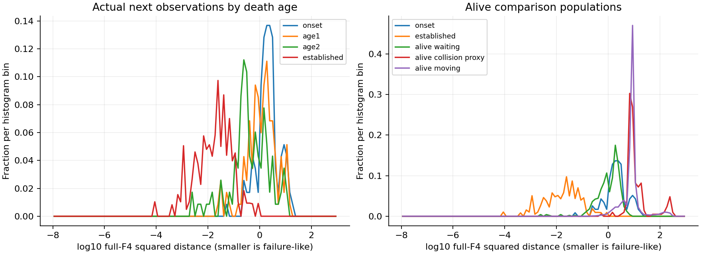
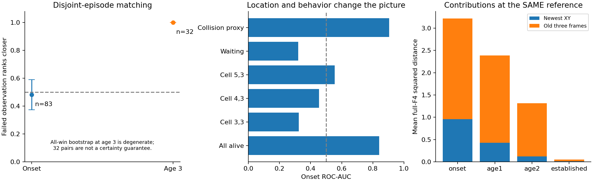
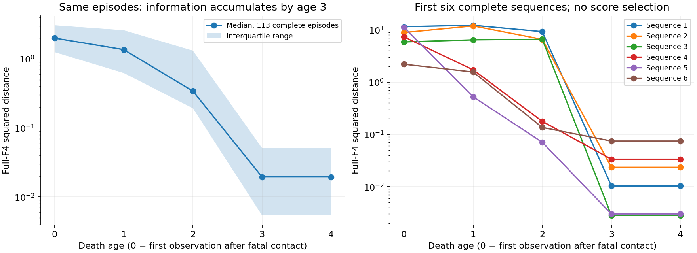
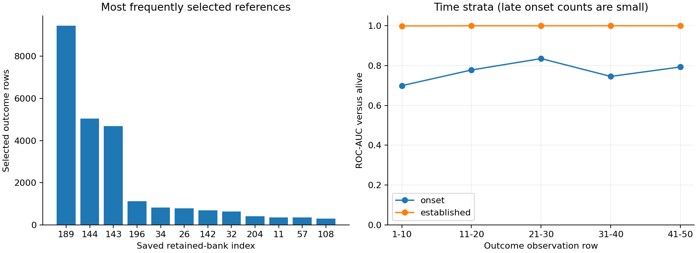

# Current PointMaze F4: recorded-outcome failure-bank ranking

**Decision: useful for established observed failure; no evidence of useful immediate onset ranking after context matching. Do not use this result to justify a one-step pessimistic ETT target.**

## What this adds

This audit evaluates the existing nearest-reference distance on actual recorded next observations with aligned evaluation-only death truth. The earlier failure-objective report studied MMD versus set distance on generated and constructed candidates, including drift and collapse. The later supervised failure-scoring report trained classifiers. Neither establishes the recorded-outcome ranking performance of this frozen distance. Their reports and the death-observability report were read before this audit. No critic diagnostic, classifier training, generated-candidate evaluation or model update is repeated.

The historical flow-plus-nearest-failure selection experiment may have been AntMaze. Its bank, normalization, representation and success rates are not used as PointMaze evidence or reconstructed here.

## Frozen artifacts and representation

- Environment: `point_two_route_swamp_windy_f4_v0`, per-cell active probability 0.30, fixed collector horizon 50 actions, 6,600 episodes with 51 stored observations.
- Dataset: `artifacts/f4_p30_server_30076/results/datasets/swamp_windy_f4_merged_s0.npz`; SHA256 `83b4e81d9fca2d66b648c9c34ccdb68196e1acf89e2ca6829e4cb198d27c322c`.
- Original current bank: `artifacts/f4_p30_server_30076/results/artifacts/swamp_windy_f4_failure_bank/failure_bank_f4_r60d40.npz`; SHA256 `1d909faaa7b93bda80635143d1b178bb7de4f21be6c2be5984d1c4391a04d616`.
- The original visible-entry pool had 1,438 entries; the curated bank file contains 256. The existing guarded ETT experiment retained 233 after excluding its 23 full-source validation episodes. This audit uses exactly those same 233 vectors in saved order. The unretained original 23 episodes are also excluded from evaluation. No entry is rebuilt, filtered using new outcomes, reweighted or replaced.
- Bank episodes and observation rows are recorded in provenance.json for both original and retained entries and checked against the actual dataset vectors. The 233 references come from 141 uniform-coverage, 12 original teacher-source and 80 blind-demonstrator episodes, as documented by the existing run.
- The bank was curated as random=0.6, deliberate=0.4 using privileged `teacher_mode` and pre-action `swamp_bits`, with death cross-checks. Visible stored vectors do not erase that selection provenance. No raw privileged fields are published by this audit.
- The shorter worktree bank path and root dataset hold stale p=0.1 artifacts. They are explicitly rejected; the verified p=0.30 downloaded artifacts are used.

The state is `[p_t,p_(t-1),p_(t-2),p_(t-3)]`, eight newest-first XY coordinates. The goal is a separate eight-coordinate tile of (8.5,3.5), constant across this dataset. The established distance scores only the state block. Goal is verified for task compatibility and used in matching, not silently added to the distance.

The score calls `ett.failure_objectives.nearest_reference` unchanged in float32: `min_f sum_j ((y_j-f_j)/std_j)^2`. The original expert-training-next-state normalizer is loaded from the guarded experiment. Its standard deviations are approximately [1.99874,0.23877,2.21035,0.23777,2.39379,0.23676,2.55499,0.23577]; its common mean cancels. Neither mean nor scale is refitted. Smaller distance ranks as more failure-like. Exact reference ties choose the first saved index; pair ranking assigns half credit to an exact score tie. There are no operating thresholds.

## Alignment, population and exclusions

The collector stores observation s_t, pre-action mask U_t and action a_t before calling step. Physics moves the point, tests the landed cell against U_t, sets absorbing death, then redraws the mask; F4 pushes the new XY afterward. The first dead observation is s_(t+1), age 0. Pre-contact history remains at ages 0/1/2; age 3 has four repeated coordinates. Death rows are reconstructed from fatal landing and masks, then checked against the per-episode death audit and independently against the established ETT labels. Neither stillness, action, reward nor source membership defines death.

Unlike the previous classifier evaluation of pre-action rows 0..49, the primary population here is actual next-state rows 1..50. The terminal next observation is valid even though its stored action is a dummy; the score never consumes that dummy action. Incoming action and displacement from row t-1 are used only for alive audit strata. Padding is excluded via episode lengths. Reset row 0 has no preceding transition and is supplementary only. Reset clears death and seeds equal frames. The environment ignores post-death actions, holds XY fixed and emits zero reward; death does not set done. The collector enforces horizon 50. Rewards and true collision flags are not stored, so no future-return or confirmed-collision analysis is fabricated.

The established 660-episode seed-0 source holdout loses 23 original-bank episodes, leaving 637 episodes and 31,850 next states. There are 117 death episodes, 4,605 dead outcomes and 27,245 alive outcomes (14.46% dead). All 637 terminal next observations are retained. No included fatal contact occurs on the final action; three death episodes are censored before age 3. Age 0/1/2/3/4 available sequence counts are 117/117/116/114/113. Censoring never creates synthetic observations.

These data are not untouched: the original actor saw all source episodes, the expert subset was previously used in nominal/diagonal/observability evaluation, and these are part of the prior classifier test population. Of the 637 included episodes, 425 appeared in the prior objective-development context set. Metrics outside those episodes are supplied but remain upstream-reused. There are no complete observed-trajectory copies of original bank episodes or duplicate complete evaluation trajectories. Known source ranges are uniform coverage [0,1200), teacher-positive [1200,6000), and blind demonstrator [6000,6600); source membership is not an expert-quality or survival label.

Alive strata overlap deliberately: waiting means incoming recorded action <=1e-7 in each coordinate; low motion means incoming displacement <=0.05; collision-compatible proxy means action norm >0.05 and displacement <=0.05; moving means displacement >0.05. Exact equal stacks after reset are separate. Action noise means zero action need not imply zero movement.

- onset: 117 rows / 117 episodes; median distance 2.0527.
- age1: 117 rows / 117 episodes; median distance 1.36136.
- age2: 116 rows / 116 episodes; median distance 0.345209.
- established: 4,255 rows / 114 episodes; median distance 0.0202354.
- alive_waiting: 497 rows / 271 episodes; median distance 1.30212.
- alive_low_motion: 1,123 rows / 474 episodes; median distance 7.0099.
- alive_collision_proxy: 208 rows / 129 episodes; median distance 8.64632.
- alive_equal_after_reset: 1 rows / 1 episodes; median distance 7.28544.
- alive_moving: 26,122 rows / 637 episodes; median distance 8.20364.

All 637 alive reset stacks have distance 5.02040; they are not failed merely because stationary. Only one alive equal stack occurs after reset, so general recognition against persistent stationary-alive states has insufficient support. Single-class strata have null ROC-AUC/AP, not invented discrimination scores.

## Overall recognition versus onset

All outcomes: ROC-AUC 0.990966, average precision 0.977258.
- onset_vs_alive: ROC-AUC 0.840608; average precision 0.028692; positive prevalence 0.428%.
- age1_vs_alive: ROC-AUC 0.884549; average precision 0.079708; positive prevalence 0.428%.
- age2_vs_alive: ROC-AUC 0.940267; average precision 0.284168; positive prevalence 0.424%.
- established_vs_alive: ROC-AUC 0.999409; average precision 0.995097; positive prevalence 13.508%.
- onset_vs_alive_waiting: ROC-AUC 0.320143; average precision 0.136367; positive prevalence 19.055%.
- established_vs_alive_waiting: ROC-AUC 0.979877; average precision 0.996397; positive prevalence 89.541%.
- onset_vs_alive_collision_proxy: ROC-AUC 0.904750; average precision 0.886624; positive prevalence 36.000%.

These aggregate metrics weight outcome rows, so prolonged death observations dominate. They are descriptive; uncertainty for the harder primary comparisons is episode-aware below. Average precision depends on prevalence and must not be compared without the reported class proportions. Actual collision labels are unavailable and the proxy populations are not spatially balanced.



## Predetermined matched comparisons

The protocol was written before any real score was calculated. For each phase take one failed observation per episode: age 0 or first established age 3. Candidate controls are alive next outcomes from another included episode, same source membership, commanded goal and newest-position cell. Require newest XY Euclidean distance <=0.25, previous XY distance <=0.5 and observation-row difference <=5. Do not match the score or the whole F4 history. Greedily process failed observations in fixed seed-93172 order and minimize the sum of the three normalized context gaps. Matching-cost ties follow original episode/row order. Each episode is used at most once, in either role, within a phase. Phases are matched separately. Controls may fail later but are alive at the scored observation.

This is approximate context adjustment, not the same hidden or causal context. Conditioning on outcome position itself restricts the question to similarly located recorded outcomes. It cannot identify ETT or eliminate behavior-mode and history differences. Each bootstrap block contains a matched pair of disjoint episodes; 1,000 fixed-seed replicates preserve episode dependence. Intervals condition on this fixed bank and matching, and do not include rematching or upstream-selection uncertainty.

- onset: 117 failed candidates, 97 have context support before reuse restrictions, 83 matched pairs (70.9% coverage), 34 unmatched. Failed outcome ranks closer in 48.19% (bootstrap interval 37.35% to 59.04%), with 0.0% ties. Mean newest/previous XY gaps 0.094/0.163; mean time gap 0.723 steps.
- established_first: 114 failed candidates, 53 have context support before reuse restrictions, 32 matched pairs (28.1% coverage), 82 unmatched. Failed outcome ranks closer in 100.00% (bootstrap interval 100.00% to 100.00%), with 0.0% ties. Mean newest/previous XY gaps 0.121/0.291; mean time gap 1.656 steps.

Onset is 40/83, consistent with chance under the fixed matching. Established failure is 32/32, but only 28.1% of eligible episodes match. The all-win bootstrap collapses to [1,1] because every resampled observed pair wins; it is not evidence of zero uncertainty or a population guarantee. This limitation is especially severe for tiny subgroup counts.

Among matched controls, onset has only 2 waiting/low-motion pairs (one win), 81 moving pairs, and zero collision-compatible pairs. Established failure has 8 waiting/low-motion pairs, 24 moving pairs and zero collision-compatible pairs; all observed pairs win. Source-specific onset accuracy is 8/18 uniform, 22/40 teacher-source and 10/25 blind-demonstrator. Established source support is only 10/21/1 pairs. Thus the harder collision question and source-general established recognition are insufficiently supported. Unmatched examples remain in descriptive metrics; tolerances were not enlarged after inspecting coverage.



## Location, history and reference reuse

Onset AUC falls from 0.8406 overall to 0.3241, 0.4538 and 0.5542 within swamp cells (3,3), (4,3) and (5,3). Waiting comparisons also reverse the apparent onset ordering (AUC 0.3201): alive waiting can be closer to the bank than newly fatal outcomes. Source and time breakdowns are in metrics.json; late time bins contain only 17, 11, 7 and 4 onset examples after the first bin of 78. These results expose strong spatial and behavior-population confounding rather than establish a universal onset signal.

Distance decomposition uses the SAME full-F4-selected reference. The old three frames contribute about 70.2%, 82.1%, 90.9% and 71.9% of total distance at ages 0,1,2 and established failure. These shares are ratios of summed contributions, not independently minimized scores and not causal attributions. A large share alone is not proof that immobility dominates: three historical frames naturally carry more coordinates. The observed temporal sequence supplies stronger evidence.

On the same 113 complete onset episodes, median distances at ages 0..4 are approximately 1.9990, 1.3614, 0.3413, 0.01949, 0.01949. Actual examples can initially increase in distance; every complete sequence is closer by age 3 than at age 0. Once all frames repeat, score no longer changes. Recognizing established failure after three additional observations cannot be called an immediately available one-step signal.



The chosen-reference newest-XY and historical component rankings are saved diagnostically. They are not alternative selected metrics: the nearest index already depends on the entire history. In particular, the high established newest-component AUC must not be interpreted as the performance of an independently chosen XY-only nearest bank. At matched onset their accuracies are 46.99% and 53.01%, respectively. Location compatibility and historical settling together explain the observed score behavior; this audit does not causally separate them.

194 of 233 references are selected. The top three indices 189, 144 and 143 account for 60.20% of all outcomes. Most selections for these references are alive rows; being the nearest reference does not imply small absolute distance or failure. reference_usage.json records every saved index, source episode/row, selection count and episode count. The bank and its frequencies remain unchanged.

There are zero exact original-bank vector matches in evaluation and no cross-bank complete-trajectory copies; removing exact bank overlaps therefore leaves the results unchanged. Repeated visible vectors account for 4,141 extra rows, largely prolonged deaths. A declared sensitivity keeps the first chronological occurrence of each exact visible vector, retaining all 114 distinct established outcomes: established-versus-alive AUC remains 0.999432, while AP falls from 0.995097 to 0.888425 as prevalence drops to 0.4167%. This changes population weighting, not the bank. No identical visible vector has conflicting alive/dead labels in this sample; this is not a general identifiability claim.



## Decision and remaining support gaps

- **Established recognition:** useful within this recorded dataset; strong overall and exact-vector sensitivity results, plus 32 successful matched pairs. Low matching coverage and sparse stationary-alive/collision support limit generalization.
- **Onset ranking:** not supported by the harder matched comparison; the high broad AUC is misleading without location/source/time controls.
- **Waiting, collision and location:** waiting is a concrete onset confounder; cell-conditioned results expose location effects. Collision-compatible descriptive metrics look strong but no matched collision pair exists, so collision-specific discrimination remains unestablished.
- **Optimization meaning:** the bank measures similarity to curated, settled histories at stored hazard locations. Direct optimization could favor location proximity or accumulated immobility without correctly ranking immediate adverse outcomes. The prior generated-candidate drift findings remain relevant context, not new results here.

Stop before any generator, ETT or policy optimization. If this signal is pursued, a multi-step observed-outcome score is more appropriate to investigate than an immediate one-step failure target, with new support for alive waiting and confirmed collisions. Onset results do not justify proceeding directly to a frozen-generator candidate-ranking study. No such follow-up is run. This audit does not validate generated counterfactual states, the historical AntMaze selection experiment, a Lipschitz condition, causal ETT identification or worst-case Q.

## Checks and reproduction

Seven focused tests passed: fatal landing/next-state alignment, horizon and stationary-alive handling, original score plus same-reference decomposition, reference tie handling, matching/reuse, metric direction/ties and episode exclusion of original versus retained bank sources. Runtime checks verify all F4 shifts, reset stacks, absorbing post-death XY, age-3 histories and agreement with existing audit labels. An independent replay reproduces primary aggregate metrics and matching exactly and checks observed scores against NumPy arithmetic. Dataset, banks, normalizers, relevant historical records and existing model files remain hash-identical. No model is trained or sampled.

An initial preflight implementation error (bank metadata not returned to the caller) was fixed before the output directory or any score was produced. It did not change the protocol, bank or evaluation population. The completed audit took 2.76 seconds, excluding later verification and reporting. Raw audit masks, teacher modes and per-row death labels are not published; only aggregate results, declared episode-set provenance and anonymous scalar sequence plots are saved.

```bash
python -m unittest scripts.test_bank_ranking
python -m ett.run_bank_ranking --out-dir artifacts/bank_ranking/f4_p30_recorded_v1
python -m scripts.check_bank_ranking --run-dir artifacts/bank_ranking/f4_p30_recorded_v1
python -m ett.report_bank_ranking --run-dir artifacts/bank_ranking/f4_p30_recorded_v1
```

Run from the PointMaze worktree and use a fresh output directory. Required files are resolved from the existing guarded config and checked by hash; absent or mismatched current data/bank files fail explicitly. No AntMaze fallback exists. The protocol, exact normalizer, source and artifact hashes, matching coverage and aggregate metrics accompany this report. No automatic commit or push is performed.
