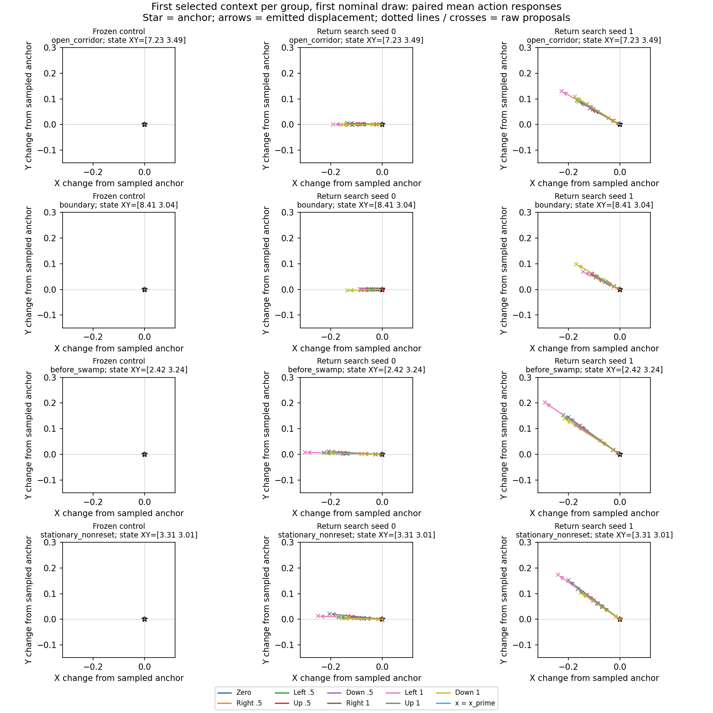
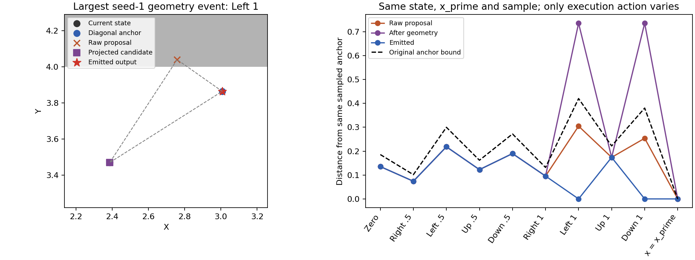
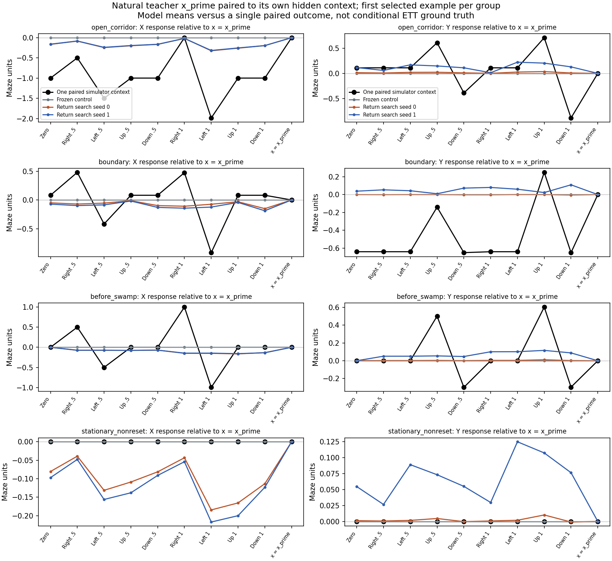
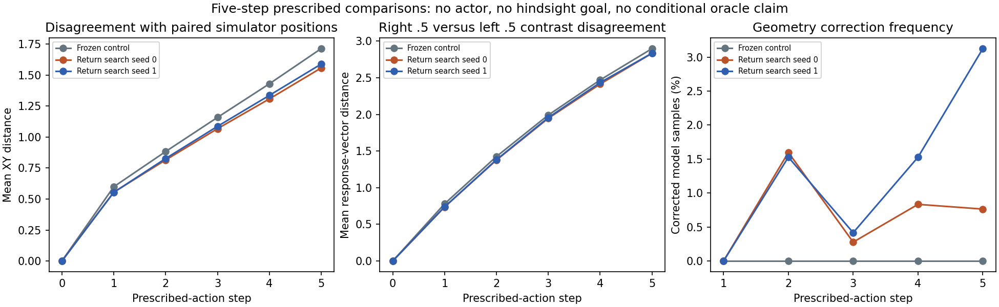

# PointMaze ETT execution-action response diagnostic

**Diagnosis: immediate action-semantics limitations and mostly common residual drift, with occasional geometry artifacts and compounding model disagreement.** The zero-residual control is exactly action-invariant in these fixed-randomness probes. Both searched models respond to x, but mainly by scaling a nearly common direction with distance from x_prime. Projection/fallback is secondary in the one-step sample. Do not start alternating actor-critic training on this evidence.

## Preserved scope and provenance

Reviewed commit and verified local/remote branch head: `03f7686a2277c684d3801a6dcb7f24bd81ea622c`, `feature/pointmaze-causal-transition`. No applicable repository AGENTS.md was found. The rollout-return, preceding MMD and nearest-set reports were read. The critic report covering `e670a33`, `6947186`, and `089f083` was read and its rejected raw score was neither recomputed nor substituted.

The objective remains exactly `L_diag + lambda * L_off`. No loss or optimization gradient is computed in this diagnostic, and no model, nominal, actor or critic is trained. The preceding return search froze the diagonal backbone and changed only six residual-head coordinates; it was not joint two-loss training. No architecture or geometry rule is changed here.

Checkpoints come from `artifacts/ett_rollout_return/residual6_s01`: `s0_lambda0.pkl` (control), `s0_lambda1.pkl` (return seed 0), and `s1_lambda1.pkl` (return seed 1). Their hashes match the saved return-search evaluation. Exact checkpoint, nominal and dataset paths and SHA-256 hashes are in `config.json`. All prior input artifacts are unchanged.

Contract: fixed-goal `point_two_route_swamp_windy_f4_v0`, p=0.30; newest-first F4 width 8; goal `(8.5,3.5)` repeated four times; action width 2 with bounds [-1,1]. Nominal conditioning remains state plus commanded goal. Horizon is 50 with no success/death early termination; this task limits prescribed continuations to five steps. No rewards are fitted or used as targets, and no hidden value enters model inputs.

Population clarification from the actual loader: the nominal fits episodes [1200,6000), generated by `make_windy_teacher`. Uniform coverage [0,1200) and blind demonstrations [6000,6600) are excluded. The collector-wide random_frac=0.2 does NOT mean 20% uniform episodes remain in this selected population. Within the selected 4,800 episodes, mode counts are forced-safe 257, immediate-shortcut 1,470, and wait-shortcut 3,073. The teacher uses a 0.05 force-safe episode coin and adds N(0,0.15^2 I) noise only to nonzero commands, then clips. This is noisy teacher behavior including failures, not uniformly optimal actions.

## Predefined probes and instrumentation

Selected 32 held-out source contexts: eight per stratum, using seed 940000, a row permutation and distinct source episodes within each stratum. Groups may share source episodes. Rules: open post-swamp corridor x in [6.2,8.2], y in (3.2,3.8); actual static-wall/boundary distance <=0.06; pre-swamp x in [2,3), y in [3,4); and fully equal observed F4 frames at non-reset timesteps. The first three strata exclude fully stationary histories. Stillness is not labeled death. Exact rows, episode IDs, histories, goals, eligible counts and rules are saved in `contexts.json`.

Two nominal x_prime draws per context (seed 950000), 64 transition draws per action (key 950001), ten actions: zero, four cardinal directions at magnitudes 0.5 and 1, and x=x_prime. Each action call has identical batch ordering, s, g, x_prime and transition key. All model arms share those inputs and keys. Prescribed actions need no clipping; out-of-bound x_prime is rejected. Boundary mass in nominal draws is its existing censored distribution.

The original `AnchoredTransition.sample` implementation is untouched. Instrumentation first calls it, then reconstructs raw network outputs, tanh directions, safe radii, raw proposals and projection/fallback stages. A repeated ordinary sampler call is bit-identical. The largest intermediate reconstruction difference is 9.54e-07 maze units (float32 JIT fusion tolerance 2e-6). Returned samples always come from the original implementation. Raw logit proposals, projected positions, emitted F4 states and corrections are retained.

All probes pass exact F4 shift, exact x=x_prime anchor identity, common anchor across actions, endpoint, per-coordinate displacement and anchor-bound checks. These explicit constraints are not full physics or causal-validity guarantees.

## Observations: action dependence versus common drift

The control has maximum execution-action effect **0.0** under fixed randomness. Its anchor is sampled at `(s,x_prime,x_prime)`; x is absent from the anchor distribution. At zero residual the emitted sample equals that anchor for every tested x.

For each fixed context/nominal draw/anchor sample, let d_a be the normalized residual direction before radius multiplication. The common-direction energy fraction is `1 - sum ||d_a - mean_a(d_a)||^2 / sum ||d_a||^2`, excluding zero-radius actions. It measures direction constancy across actions within a context, not constancy of residual magnitude or independence from context. A direction independent of action can still produce action sensitivity because the radius is `0.25 * ||x-x_prime||`.

- return_seed0: common-direction energy 99.575%; mean normalized direction [-0.4672, 0.0115]; paired +/-0.5 X response magnitude 0.09567, Y response 0.02352; candidate correction 0.000%; bound fallback 0.000%.
- return_seed1: common-direction energy 99.836%; mean normalized direction [-0.5267, 0.3209]; paired +/-0.5 X response magnitude 0.12571, Y response 0.03169; candidate correction 0.203%; bound fallback 0.203%.

Directions vary somewhat with context: seed 0 common-direction fractions span 98.35% to 99.81%. The dominant direction remains leftward for seed 0 and left/up for seed 1 across all four groups. Nonzero action derivatives alone would therefore be an inadequate success criterion.



Seed 0 has no material one-step geometry correction in this selected sample; its drift precedes geometry. Seed 1 has rare corrections in pre-swamp contexts. The ratio of geometry-response variance to emitted-action variance is 0.0310. This is not an additive attribution fraction because raw response and correction have a cross term. The selected worst geometry example proposes a point across a wall; endpoint projection returns to the current position, which would exceed the anchor radius, so final fallback returns to the anchor. The discontinuity is present but does not explain most one-step drift.



These are checkpoint-specific observations. The full residual MLP can depend on x; the result does not prove that every possible parameter setting is action-invariant or that the entire class lacks expressive capacity. The six-dimensional search and action-independent output biases are material restrictions.

## Paired simulator reference and its conditioning limits

Generated 64 fresh full teacher episodes (3200 natural transitions) with environment seed 930000 and behavior seed 930001. Teacher mode counts: {'wait_shortcut': 46, 'immediate_shortcut': 14, 'forced_safe': 4}; noisy-command clipping occurred on 259 steps. The same imported teacher, episode coin, action-noise rule, environment probability and history contract define the selected nominal source population. Fresh PRNG streams do not reproduce original dataset episodes, but use the same generating protocol. This does not prove that the fitted nominal density is exact.

Selected 15 simulator contexts by the same observable rules with selection seed 940001: four each for open, boundary and pre-swamp, and only three stationary non-reset contexts from distinct episodes. The fixed 64-episode pool contains only three eligible stationary episodes; the budget was not enlarged to fill the quota.

At every selected context, the natural noisy teacher action x_prime is generated before any intervention and remains attached to that context. Full float64 physical position, F4 frames, goal, hidden bits, absorbing flag, environment generator state, teacher generator state and teacher memo are saved in a separately labeled restoration audit. Replaying the teacher action and natural simulator transition reproduces action, observation, reward and post-step RNG state exactly. The model sees only float32 F4, goal and the two actions.

Alternative actions execute on clones of that same pre-action underlying context. The first step shares the native generator state. For later steps, normal action-noise and uniform bit-resampling slots are independently preallocated by timestep and shared across branches. This avoids RNG stream misalignment when an absorbing branch skips action noise. It preserves the simulator IID marginal noise law, while declaring a particular temporal cross-branch coupling; the coupling is not identified from offline observations.

**These are individual paired intervention outcomes, not exact conditional ETT distributions.** No independently sampled nominal x_prime is attached to an unrelated hidden simulator state. No continuous-action nearest matching, rejection approximation, or posterior averaging over all hidden contexts compatible with `(s,x_prime)` is performed. Averaging discrepancies over different selected contexts does not turn these pairs into an estimate of that conditional distribution.



- control: mean one-step action-contrast discrepancy against the individual simulator pairs 0.58576 maze units (contrast relative to x=x_prime).
- return_seed0: mean one-step action-contrast discrepancy against the individual simulator pairs 0.55397 maze units (contrast relative to x=x_prime).
- return_seed1: mean one-step action-contrast discrepancy against the individual simulator pairs 0.55489 maze units (contrast relative to x=x_prime).

The simulator often responds strongly to alternative execution actions in moving open contexts, while modeled contrasts are much smaller. Near walls and with hidden dynamics, a forward action is not universally required to move forward. The three simulator stationary contexts have zero paired action contrasts; this is an observed result for those restored contexts, not a death label inferred from the offline stationary stratum.

71.3% of these individual simulator action pairs exceed the model family's 0.25 times action-distance radius when measured around their own natural-action simulator outcome. That radius was never verified as a physical causal constant. This exposes a limitation of demanding equality under this specific coupling; it is neither a violation by the constrained model nor a reason to require every pessimistic transition to equal the true simulator.

## Five-step prescribed continuations

Each selected simulator context has three fixed action sequences: zero, right 0.5, left 0.5, repeated for five steps. The commanded goal stays fixed. These are simulator-generated intervention references, not observed-data continuations or closed-loop actor comparisons. Model step 0 uses the natural teacher x_prime; subsequent model steps sample fresh nominal x_prime at their own generated visible states. No hidden label forces modeled stationary histories to stay still. There is one future simulator noise tape per context and 32 modeled paths per action/arm.

- control: mean positional discrepancy step 1 -> step 5: 0.5991 -> 1.7139; opposing-action contrast discrepancy 0.7798 -> 2.8974; step-5 geometry corrections 0.00%.
- return_seed0: mean positional discrepancy step 1 -> step 5: 0.5549 -> 1.5578; opposing-action contrast discrepancy 0.7366 -> 2.8330; step-5 geometry corrections 0.76%.
- return_seed1: mean positional discrepancy step 1 -> step 5: 0.5542 -> 1.5892; opposing-action contrast discrepancy 0.7384 -> 2.8351; step-5 geometry corrections 3.12%.



Execution-action disagreement is already visible after one step; it is not caused only by repeated prediction or an F4 shift bug. Disagreement grows with repeated steps and geometry corrections become more frequent, especially for seed 1. Exact F4 shifting does not establish that four frames are a sufficient causal state, or distinguish transition bias from nominal misspecification under intervened state distributions. Single-context comparisons cannot resolve those questions.

## Interpretation, smallest next change, and limits

Evidence supports a combination: the control has no execution-action semantics; the fitted residual largely adds directional drift with action-distance-dependent magnitude; rare projection/fallback discontinuities occur; repeated model predictions amplify disagreement. There is no observed history-order or explicit output-bound violation. Simulator disagreement and unsupported changes in dynamics are distinct from violations of the implemented structural constraints. No new admissibility rule was invented to reject lower-return outcomes.

**Smallest justified next ablation:** freeze the two residual output-bias coordinates at zero and, if separately authorized, repeat the same small search using only the four previously selected output-weight coordinates. Keep the same initialization, two losses, sampling budget and geometry constraints, and evaluate action contrasts before interpreting return reduction. This tests whether the unrestricted output-bias directions are a principal route to common drift. It introduces a parameter-subspace restriction, not a verified physical law; the remaining random-feature weights may still produce common drift, and the zero-residual control still ignores x. It is a diagnostic ablation, not a claimed fix for causal ETT. No such ablation, new architecture, return optimization, critic training or alternation was launched here.

Do not connect this model to contrastive-agent alternating training yet. Neither exact simulator agreement nor strict worst-case Q is established or required by this diagnostic. What remains unsupported is the interpretation of the learned low-return transition as a useful action-conditioned pessimistic mechanism.

## Artifacts and reproduction

Completed five checkpoint-independent numerical tests, a small smoke, and this bounded run in 13.4s on ['cpu:0']. Contexts, seeds, hashes, eligibility counts, native restoration checks, raw proposals, anchors, corrections, emitted states and representative examples are saved. All existing checkpoints and artifacts are unchanged. No commit or push was made.

```bash
python -m scripts.test_action_response
python -m ett.run_action_response --out-dir artifacts/ett_action_response/f4_return_s01 --contexts-per-group 8 --samples 64 --sim-episodes 64 --sim-contexts-per-group 4
python -m ett.report_action_response --run-dir artifacts/ett_action_response/f4_return_s01
```

Use a fresh output directory for reruns. `*_model_probes.npz` and `*_teacher_probes.npz` have leading axes `[context (including nominal-draw replication for offline probes), execution-action index, transition sample]`. Main continuation files contain model states; observational actions are stored in separate auxiliary files. The hidden simulator restoration/audit JSON files are evaluation-only and never consumed by the model.
