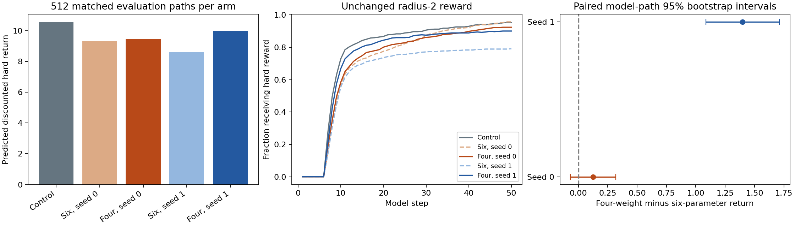
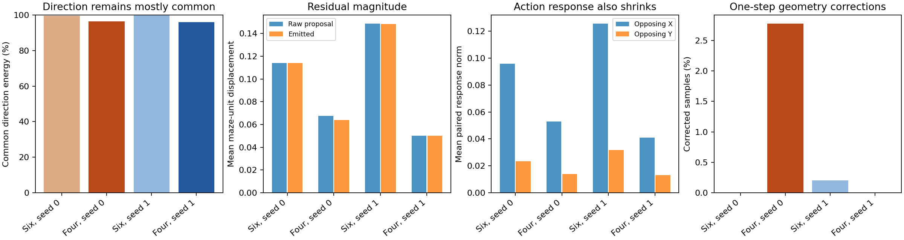
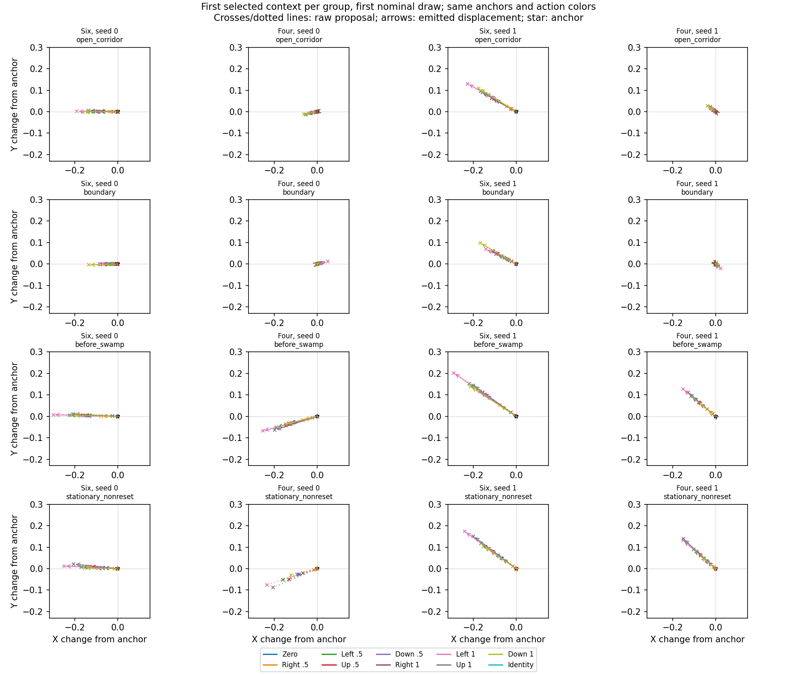
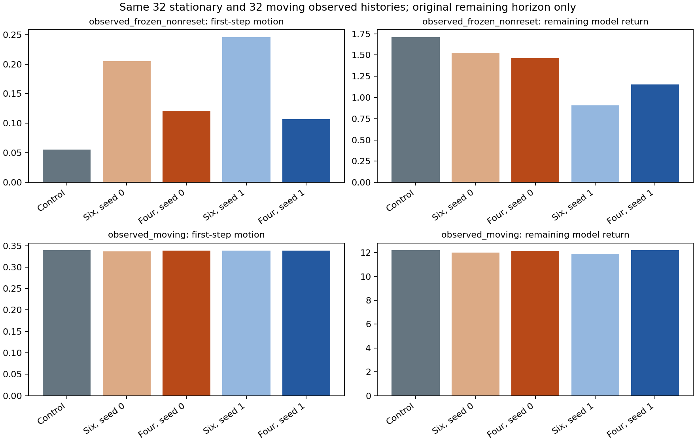

# Bounded zero-bias ETT return-search ablation

**Conclusion: removing the two output biases is insufficient.** Both four-weight searches still reduce model return and retain overwhelmingly common residual directions. Residual magnitude decreases, but opposing-action response magnitude also decreases. This is partial suppression of the previous drift mechanism, without establishing successful learning of execution-action consequences. Stop further parameter-only tuning of this restricted search and do not begin actor-critic alternation.

## Preserved experiment and exact change

Reviewed `03f7686a2277c684d3801a6dcb7f24bd81ea622c` and `b2e65ad41dc6ed60525dee646d85cace18d22a00` on `feature/pointmaze-causal-transition`. The authoritative action diagnostic is `artifacts/ett_action_response/f4_return_s01_horizon50/REPORT.md`; its over-horizon predecessor is not used. The rejected raw-critic investigation was not repeated.

Initialize from the exact original `ett_distribution_matching/f4_p30_s01_guarded/s0_L0p25_lambda0/final.pkl`, whose output head is zero. The experiment does not remove biases from an already searched checkpoint. Map four coordinates to output weights at hidden rows 0 and 32; both output biases stay exactly zero, including at perturbation points. Diagonal parameters, residual torso and unselected weights remain frozen. The network architecture and anchor bound L=0.25 are unchanged. L is an engineering restriction, not an established causal constant.

Nominal and actor are frozen and keep their state-plus-goal conditioning. The task remains fixed-goal windy PointMaze F4 at p=0.30, newest-first state width 8, commanded goal `(8.5,3.5)` tiled four times and action width 2 bounded by [-1,1]. Each step independently draws nominal x_prime and execution action x before sampling the transition. Only x is stored as the execution action.

`L_ETT = L_diag + 1.0 * E[sum_{t=0}^{49} 0.95^t r(s_{t+1})]` is minimized, with exactly two terms. The reward is the unchanged strict radius-2 indicator evaluated on generated float32 visible XY; no goal termination, shaping, bank distance or critic substitution is introduced. The fixed-task hidden death gate is outside the reward region; finite-precision boundary caveats from the previous report still apply. No hidden fields are policy or reward inputs.

**L_diag is constant, so this is restricted-search ablation, not joint two-loss training.** Train NLL -5.69614553; held-out NLL -5.79925632 for all checkpoints. This is the unchanged mixed zero-atom / raw-XY-area diagonal likelihood in nats per transition, before geometry projection. The original complete-episode split and normalizers are reused.

## Fixed budget, common randomness and reuse

Seeds 0 and 1 each run 12 iterations, four iid N(0,I4) directions, sigma=0.2, 16 complete trajectories per plus/minus perturbation, learning rate 0.1 and update L2 cap 0.2. The estimator is `mean((J_plus-J_minus)*epsilon/(2*sigma))`; the update subtracts it. It includes discrete sampling and geometry through full-return evaluation and estimates a Gaussian-smoothed parameter objective; no pathwise derivative through a hard reward is assumed. The update cap is not another loss.

Directions use weight columns 2:6 from the original seeded six-dimensional Gaussian draws. Their marginal law remains iid N(0,I4). Each plus/minus pair uses the old trajectory key `610000 + seed*10000 + iteration*100 + direction`; the matched six-parameter run uses the same keys and weight-coordinate perturbations. Removing two dimensions changes perturbation geometry and norm clipping, so this does not isolate every optimization effect.

Each new arm spends 1,536 parameter-query paths plus 208 fixed-monitor paths, exactly the old per-arm budget. The final 12th update is evaluated; no monitor or evaluation outcome selects the checkpoint or changes settings. The original zero control and six-parameter search results are reused rather than retrained. Before reuse, all 512 reset paths and all 256 continuation paths per old arm reproduce exactly from the saved checkpoints. Their full action probes also reproduce exactly. The prior zero-control parameter-query budget was the same; no extra zero-control optimization is necessary here.

Evaluation reuses keys 710001..710004, 128 complete reset paths each. These keys are independent of search perturbations, queries and monitoring; they were already inspected in preceding experiments and are not a newly untouched test set. Bootstrap intervals pair the 512 simulated paths under common randomness and capture model Monte Carlo variation only, not causal or environment uncertainty.

## Model return and reward timing

- Control: mean return 10.54357; nonzero 95.51%; mean rewarded steps 38.05; first rewarded step among reaching paths 11.03.
- Six, seed 0: mean return 9.33275; nonzero 96.48%; mean rewarded steps 35.49; first rewarded step among reaching paths 13.89.
- Four, seed 0: mean return 9.45791; nonzero 92.38%; mean rewarded steps 35.35; first rewarded step among reaching paths 12.72.
- Six, seed 1: mean return 8.60536; nonzero 79.88%; mean rewarded steps 31.64; first rewarded step among reaching paths 11.04.
- Four, seed 1: mean return 10.00154; nonzero 90.62%; mean rewarded steps 36.34; first rewarded step among reaching paths 10.67.
- Seed 0, four minus control: -1.08566, 95% interval [-1.39056, -0.7819]; four minus six: 0.12516, interval [-0.06739, 0.31796].
- Seed 1, four minus control: -0.54203, 95% interval [-0.80372, -0.28174]; four minus six: 1.39618, interval [1.08585, 1.71325].

Seed 0 retains a return reduction close to the six-parameter result; seed 1 loses much of the prior reduction. Removing biases does not eliminate the ability of the remaining weights to lower predicted return. These are model predictions, not actual environment returns.



## Direction, magnitude and geometry

Reuse the exact 32 predefined observed contexts (eight each: open corridor, boundary, pre-swamp, stationary non-reset), two saved nominal x_prime draws per context and 64 anchor draws per action. Keep s, goal, x_prime and key 950001 fixed while varying zero, opposing cardinal actions at magnitudes 0.5 and 1, and x=x_prime. Contexts are not reselected for this ablation; stationarity is not labeled death. Prescribed actions require no clipping.

Common-direction energy is `1 - sum ||d_a - mean_a d_a||^2 / sum ||d_a||^2` at each fixed context/anchor, aggregated across those groups and excluding zero-radius actions. d_a is the residual direction before multiplication by `0.25 * ||x-x_prime||`. A common direction can therefore have a nonzero action response purely through radius changes.

- Six, seed 0: common direction 99.58%; raw/emitted residual magnitude 0.11418/0.11418; opposing-X/Y response 0.09567/0.02352; projection/fallback 0.000%/0.000%; action-specific normalized-direction RMS 0.03140.
- Four, seed 0: common direction 96.49%; raw/emitted residual magnitude 0.06761/0.06395; opposing-X/Y response 0.05292/0.01400; projection/fallback 2.778%/0.000%; action-specific normalized-direction RMS 0.06406.
- Six, seed 1: common direction 99.84%; raw/emitted residual magnitude 0.14886/0.14826; opposing-X/Y response 0.12571/0.03169; projection/fallback 0.203%/0.203%; action-specific normalized-direction RMS 0.02528.
- Four, seed 1: common direction 95.97%; raw/emitted residual magnitude 0.05010/0.05010; opposing-X/Y response 0.04097/0.01316; projection/fallback 0.000%/0.000%; action-specific normalized-direction RMS 0.05306.

The drop from about 99.6-99.8% to about 96% common direction is not a sufficient improvement: the common component still dominates, and both raw residual and opposing-action response magnitudes shrink. The residual does not vanish entirely. The four-weight seed-0 mean normalized direction is left/down; seed 1 is left/up. Context-dependent random-feature weights can retain common translations without output biases. This is not evidence that the full MLP is incapable of meaningful action dependence.

There is some increased action dependence in normalized direction: action-specific direction RMS rises from 0.0314/0.0253 to 0.0641/0.0531. Thus this is not merely uniform scaling of the old direction field. Nevertheless, the common component remains dominant and the emitted opposing-action responses are weaker. Direction RMS across stochastic anchor samples is only 0.0024/0.0017; the change is not dominated by new anchor-dependent directional noise. Only 2.39%/1.44% of raw probe residuals have magnitude below 0.001. Complete disappearance is not the explanation either.



Raw and emitted samples remain distinct in the saved probes. Four-weight seed 0 now has more one-step geometry corrections than its six-parameter counterpart; those corrections do not constitute a successful action model. Inspecting only the common-direction fraction would miss this change. Control output remains exactly action-invariant under fixed randomness.



## Stationary and moving history continuations

Use the original 32 distinct-episode stationary non-reset contexts and 32 moving contexts, key 720001 and four paths per context. The actor samples x and nominal samples x_prime at each generated state; the commanded goal stays fixed. Only `50 - original timestep` transitions contribute; later padded records are inactive, and history checks count active steps only. These are observed-data starts followed by model-generated continuations, not simulator ground truth.

- Control: stationary-history first-step motion 0.05548, remaining return 1.71194; moving-history first-step motion 0.33945, remaining return 12.20154.
- Six, seed 0: stationary-history first-step motion 0.20517, remaining return 1.52447; moving-history first-step motion 0.33640, remaining return 12.01856.
- Four, seed 0: stationary-history first-step motion 0.12079, remaining return 1.46371; moving-history first-step motion 0.33892, remaining return 12.15411.
- Six, seed 1: stationary-history first-step motion 0.24591, remaining return 0.90747; moving-history first-step motion 0.33825, remaining return 11.90221.
- Four, seed 1: stationary-history first-step motion 0.10719, remaining return 1.15332; moving-history first-step motion 0.33868, remaining return 12.18870.

Removing biases moderates the increased movement from stationary histories, but both new arms still move those histories more than the control. No stationary history is silently forced to remain stationary and no hidden death labels are used. Exact F4 shift does not validate multi-step causal prediction or guarantee physical reachability.



## Interpretation and recommendation

The biases contributed to the strength of the previous drift and, for seed 1, much of the return reduction. They are not necessary for the common-direction shortcut: the remaining four weights still produce it in both seeds. A slightly lower common-direction fraction alongside weaker opposing-action responses is not evidence of learning action consequences. The effect neither disappears entirely nor becomes a well-supported action-dependent pessimistic mechanism. Dimension-dependent search geometry prevents a precise causal attribution of effect size to biases alone.

**Do not continue repeated parameter tuning in this four-/six-coordinate search family.** It remains useful as a diagnostic of how the hard-return objective can be reduced, but the present evidence does not justify using it to learn transitions for alternating contrastive-agent training. Any later work would need separately motivated execution-action structure or evidence, rather than another setting chosen to lower the same model return. No new architecture, action bound, third loss, actor-critic training or simulator-fitting requirement was introduced. Individual paired simulator outcomes from the preceding report are not exact conditional ETT ground truth and are not an equality target here. No causal validity or strict worst-case Q recovery is claimed.

## Completed checks and reproducibility

Five numerical tests and a separate one-update smoke passed. The full run took 32.5s on ['cpu:0']. Saved checkpoint verification independently reloads the original initialization, checks only rows 0/32 changed, checks exactly zero biases and unchanged diagonal likelihood/parameters, confirms exact x=x_prime sampling, and reproduces 128 saved reset paths per new checkpoint. Objective records, goal/action bounds, F4 shifts, remaining horizons and raw-versus-float64 reward indicators are checked in `verification.json`. All old input/checkpoint hashes remain unchanged. Code, configurations and evaluation artifacts are versioned; checkpoints remain local.

```bash
python -m scripts.test_bias_ablation
python -m ett.bias_ablation --out-dir artifacts/ett_bias_ablation/four_weights_s01
python -m scripts.check_bias_ablation --run-dir artifacts/ett_bias_ablation/four_weights_s01
python -m ett.report_bias_ablation --run-dir artifacts/ett_bias_ablation/four_weights_s01
```

Use a fresh output directory. `config.json` records paths, input hashes, seeds, source hashes and the fixed budget. `optimization_history.json` records all signed query returns, gradients and four-coordinate updates; perturbation arrays are saved separately. `evaluation.json` maps every reused/new artifact to its source. `four_s0.pkl` and `four_s1.pkl` stay local and Git-ignored. New rollout files separate agent actions from auxiliary observational actions.
