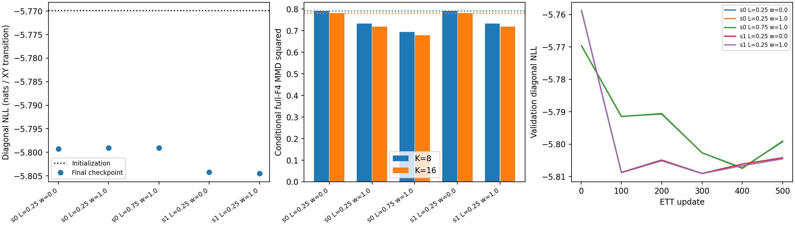
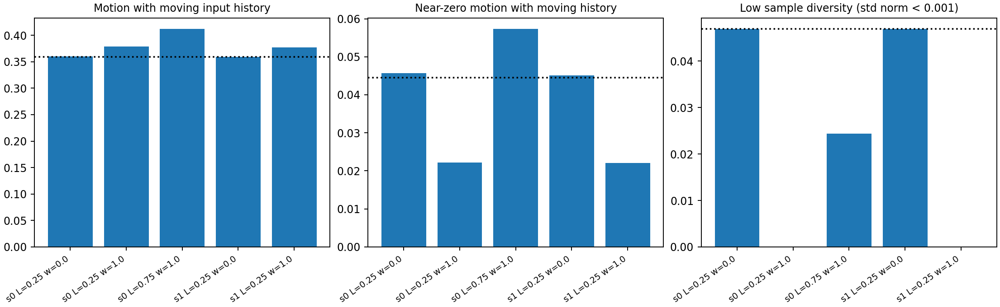
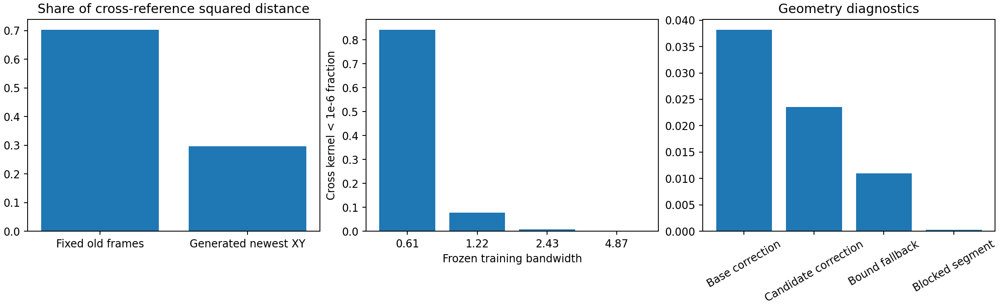
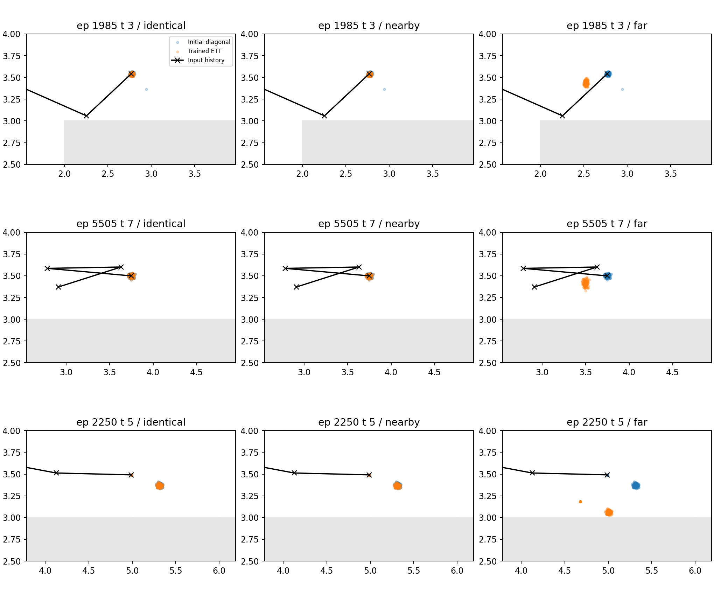

# Bounded single-step PointMaze ETT distribution matching

The bounded prototype reduced held-out full-F4 MMD without a material loss of diagonal fit. For the predeclared primary arm (seed 0, L=0.25, lambda=1.0), K=16 MMD fell from the matched diagonal-only control's 0.780705 to 0.718680; diagonal NLL was -5.799256 versus -5.799033. The second seed reproduced the direction. All final-sample bound, history-shift, and endpoint checks passed. The improvement is not predominantly freezing: moving-history motion and diversity increase at small L. On 91 previously frozen non-reset histories, however, sampled stationarity falls from 93.15% to 7.45%, despite all their recorded next positions being stationary. The larger L requires more geometry corrections. This establishes optimization of the specified surrogate, not a validated failure or counterfactual transition model.

## Scope and interpretation

This is a failure-directed transition prototype, not recovery of the true counterfactual kernel, a formally established worst-case Q function, or evidence of causal death. Only ETT parameters were updated. The nominal model and agent actor were frozen; their checkpoint files are unchanged. No actor/critic loop, critic objective, death classifier, hidden-state training input, or new failure bank was introduced.

## Verified data and initialization

- Environment: `point_two_route_swamp_windy_f4_v0`, per-cell swamp probability 0.30.
- Dataset file SHA-256: `83b4e81d9fca2d66b648c9c34ccdb68196e1acf89e2ca6829e4cb198d27c322c`.
- All 6,600 source episodes contain 50 valid transitions and a terminal observation with a dummy action. ETT diagonal fitting uses source episodes [1200,6000), including failed trajectories and absorbing rows. This teacher-generated source includes random behavior in its source metadata (`random_frac=0.2`); it is the established expert-positive source, not uniformly optimal or success-only data. Uniform coverage [0,1200) and the separately appended blind-demonstrator [6000,6600) are not diagonal fitting data.
- The inherited full-source episode split (seed 0, validation fraction 0.1) yields 4,321 expert training episodes (216,050 transitions) and 479 validation episodes (23,950 transitions). No transition split or new split was made.
- State: four newest-first XY frames, width 8. Commanded goal: tiled XY, width 8, retained even though constant. Action: width 2 in [-1,1], without extra scaling. Model contexts contain only learner-visible state, action arguments and commanded goal. Next state is a likelihood target, never an input.
- Frozen nominal model: censored five-component diagonal Gaussian action mixture, SiLU MLP 128/128, `artifacts/nominal_policy/f4_p30_expert_only_mdn_k5_s0/best.pkl`. It samples latent mixtures then clips to environment action bounds.
- Diagonal initialization: zero-displacement atom plus three diagonal Gaussian moving components, SiLU MLP 128/128, `artifacts/ett_diagonal/f4_p30_expert_zimdn_k3_s0/best.pkl`. Context and moving-delta normalizers are reused.
- Frozen action selector: `artifacts/f4_p30_server_30076/results/runs/f4_p30_sweep/p30_a0_a01_a03_s0_s1/alpha0_seed0/final.pkl`, alpha 0, seed 0, step 150000. Sample one action from its tanh Gaussian for each state, and keep it fixed across expert draws. This actor was trained on all source episodes; this is not a held-out actor evaluation.

## Failure reference provenance and leakage

The compatible p=0.30 existing bank has 256 entries; 233 remain after filtering by the established FULL-SOURCE training episode split. The bank stores `goals[256,8]`, `episode_id`, `failure_row`, `teacher_mode`, `behaviour_class`, and JSON `meta`. Its misleading `goals` field contains frozen observable F4 failure states, which are used here as next-state references.

Bank content SHA-256: `022f2d0d52cf6e0147def46cd800ae2da65e4b5592090397f606f051f6e2c7e9`. Its source-content hash is verified against the loaded dataset, and every retained vector is checked against its original observation and row. No existing bank is rewritten. All kept/removed IDs are saved in `config.json`.

The original bank first detected visible fully frozen histories in swamp cells, then its 60% random / 40% deliberate composition used privileged `teacher_mode` and `swamp_bits`. The death flag was used as a construction cross-check. This is a curated privileged training artifact, not a learner-derived failure distribution. This experiment reads those stored class names for provenance counts only; it filters solely on episode membership. Post-filter class counts: `{'deliberate': 92, 'random': 141}`. By source episode range: `{'uniform_coverage': 141, 'expert_positive_source': 12, 'appended_blind_demonstrator': 80}`. Thus the reference bank is deliberately a mixed-source training target; it is not described as expert-only. No reference episode overlaps any full-source validation episode or expert validation episode. Training-reference reuse at validation is intentional: it measures the same training-defined target, not generalization to an independent bank. Privileged construction and validation leakage are distinct issues.

## Objective, sampler, and structural guarantees

`L = L_diag + lambda_pess * L_pess` contains exactly two terms. `L_diag` is the existing mixed-measure negative log likelihood: mass at zero displacement and density with respect to raw XY maze-unit area elsewhere. Reported NLL describes the unprojected displacement distribution, not the geometry-corrected law.

For each fixed (s,x), sample K independent x_prime values from the frozen nominal model and one transition per draw. The samples have shape [B,K,8]. Full-F4 MMD is computed separately for each group and then averaged. The biased V-statistic includes generated-generated, reference-reference and cross terms, including self pairs; all 233 training references are used each update. Different states are never pooled.

Kernel normalization is fitted on expert training next states only. Four Gaussian bandwidths are `[0.608408510684967, 1.216817021369934, 2.433634042739868, 4.867268085479736]`: 0.25, 0.5, 1 and 2 times the median of 4,096 training-pair distances (seed 410). Both normalization and bandwidths stay frozen. There is no learned embedding.

The diagonal anchor is the current ETT diagonal sample at (s,x_prime,x_prime), with shared model randomness. A 64/64 SiLU residual network sees normalized [s,x,x_prime,g], action difference, and sampled anchor displacement. Its final layer starts at exactly zero. The residual is `L * ||x-x_prime||_2 * tanh(h)/sqrt(2)`. The implementation subtracts a conservative float32 margin from the radius (clamped at zero) before adding the anchor, preventing roundoff from spuriously rejecting saturated residuals. Only newest XY changes; remaining frames always equal `s[0:6]`. L has units of raw maze distance per environment-action Euclidean unit. L=0.25 and 0.75 are prototype settings, not verified causal constants.

After adding the residual, the existing one-unit per-coordinate displacement cap, global bounds, and blocked-endpoint fallback are applied. This nonconvex geometry operation may violate the anchor bound. Any such candidate is rejected in favor of the valid diagonal anchor. Identical actions take the exact anchor branch, preserving its sampling law and diagonal likelihood. This guarantees the anchored action-change bound on final emitted samples, not all-pairs action Lipschitzness. Shared model randomness does not recover hidden U.

## Gradient estimator and bounded budget

MMD uses conditional pathwise derivatives through selected Gaussian locations/scales and the residual. Categorical choices, Bernoulli atoms, clipping decisions and fallback decisions are not reparameterized. There is no straight-through or score-function estimator. Consequently this is a biased partial gradient of expected MMD: it has no direct path to mixture logits or atom logits. Diagonal NLL trains those outputs. Shared trunk updates can change them indirectly; off-diagonal atom samples may move through the residual. At a bound-violation fallback, the residual path has zero derivative. These are material prototype limitations.

Initial training diagnostics: diagonal loss -5.58416, MMD 0.79297, diagonal gradient norm 167.64711, MMD gradient norm 0.90908, residual-only MMD gradient 0.01707. The training-only rule chose lambda=1.0; weighted gradient ratio 0.005423. No validation metric selected lambda or L. A second positive weight was not needed to establish whether the residual can respond to failure matching.

Each arm ran 500 updates with batch size 64, K=8 and Adam learning rates 1e-05 (diagonal) and 0.001 (residual), on ['cpu:0']. Total comparison runtime: 108.8 seconds. All arms start at the same diagonal checkpoint; control residuals stay exactly zero. The final fixed-budget checkpoint is the primary evaluation checkpoint. A best-diagonal-validation checkpoint is also saved locally, without using validation MMD for selection.

## Validation results

Reproduced initialization on all 23,950 validation transitions: NLL -5.769883, mean position error 0.023926, conditional energy score 0.013898. The prior report gives NLL -5.77057 and energy 0.01391. The small likelihood difference is consistent with the different runtime (saved checkpoint GPU JAX 0.6.2 versus local CPU JAX 0.10.2); no bitwise cross-runtime equivalence is claimed. Energy is a Monte Carlo estimate with 64 draws.

Initial marginal MMD: K=8 0.791691; K=16 0.781224. MMD/motion evaluation uses the same 1,024 validation rows for all arms. K=8/16 use the same fixed actor draws and keys but are not nested expert-sample sets. Episode-bootstrap intervals cluster the selected validation rows by source episode; they do not add independent bank uncertainty.

- `s0_L0p25_lambda0`: diagonal NLL -5.799256; energy 0.013706; MMD K8/K16 0.791226/0.780705; moving-history motion 0.35996; moving-history near-zero fraction 4.5698%; mean XY std [0.1803, 0.13597].
- `s0_L0p25_lambda1`: diagonal NLL -5.799033; energy 0.013710; MMD K8/K16 0.732502/0.718680; moving-history motion 0.37865; moving-history near-zero fraction 2.2233%; mean XY std [0.18998, 0.19472].
- `s0_L0p75_lambda1`: diagonal NLL -5.799097; energy 0.013708; MMD K8/K16 0.695026/0.678587; moving-history motion 0.41165; moving-history near-zero fraction 5.7286%; mean XY std [0.19425, 0.23631].
- `s1_L0p25_lambda0`: diagonal NLL -5.804197; energy 0.013713; MMD K8/K16 0.791667/0.781167; moving-history motion 0.35898; moving-history near-zero fraction 4.5119%; mean XY std [0.18022, 0.13562].
- `s1_L0p25_lambda1`: diagonal NLL -5.804531; energy 0.013716; MMD K8/K16 0.733136/0.718859; moving-history motion 0.37734; moving-history near-zero fraction 2.2089%; mean XY std [0.18982, 0.19436].





## History mismatch, gradients, and geometry

For the predeclared primary arm `s0_L0p25_lambda1`, fixed historical frames contribute 70.34% of aggregate cross-reference squared distance. Mean nearest-reference fixed-history squared distance is 5.31032. This contribution cannot be changed in one step. Moving histories cannot become fully frozen in a single valid F4 transition; lower full-F4 MMD does not imply death.

In the primary arm, moving-history mean motion changes from 0.35996 in the control to 0.37865, while near-zero motion falls from 4.57% to 2.22%. Thus aggregate improvement is not motion suppression. The larger L arm does increase both mean motion and the near-zero fraction, indicating a mixture of larger displacements and collision-induced persistence.

A supplementary check selects 91 fully frozen observable histories at timestep > 0 (reset stacks excluded) from the same validation subset. The recorded next XY is stationary in 100.00% of these rows. Under the fixed actor proposal, sampled stationary frequency changes from 93.15% in the control to 7.45% in the primary arm. Moving these observed frozen histories is a substantive failure-mode concern, even though no hidden death label is used and no off-diagonal ground truth is available. See `frozen_history_evaluation.json`; these supplementary draws use 64 samples and separately fixed keys 413/414.

At K=16 the editable-XY MMD gradient norm averages 0.271132; 0.00% of contexts have norms below 1e-8. The smallest kernels can saturate for far-away histories; larger kernels retain gradients. The kernel is fixed, and full-F4 matching was never replaced by newest-XY matching.

Primary-arm candidate geometry corrections: 2.3560%; bound-violation fallback: 1.0986%; blocked straight-line segments (21-point probe): 0.0305%. Every evaluated arm and both K values had zero final endpoint violations, zero history-shift error and zero final bound violations. Corrective endpoint geometry is still an approximation of the environment axiswise collision substeps, and the segment probe is not a physics proof.





The examples include identical, nearby and far action pairs, with exact episode and time indices in `plotted_examples.json` and each arm metrics file. The trained diagonal may change relative to initialization, but on identical actions the residual is exactly zero relative to its own current diagonal sampler. These plots show sample positions, not environment counterfactual ground truth.

## Reproduction and local artifacts

Completed commands (run from the PointMaze worktree):

```bash
python -m scripts.test_ett_distribution_matching
python -m ett.run_distribution_matching --out-dir artifacts/ett_distribution_matching/f4_p30_s01_guarded --steps 500 --eval-every 100 --batch-size 64 --eval-contexts 1024 --diagonal-samples 64 --bounds 0.25,0.75 --seeds 0,1
python -m ett.report_distribution_matching --run-dir artifacts/ett_distribution_matching/f4_p30_s01_guarded
```

For a rerun, use a fresh `--out-dir` and pass that directory to the reporting command; the trainer deliberately refuses to overwrite completed runs. No additional training command is pending.

The earlier numerical checks are in sibling `sanity` and `sanity_v2` directories. The first used one shared Adam rate and exposed a sharp diagonal update; the second verified separate rates before the bounded comparison. Neither smoke result selected lambda/L by validation performance. The sibling `f4_p30_s01` comparison is superseded: saturated residuals caused unnecessary float32 bound fallbacks. The guarded comparison reran the same 5 x 500 budget after adding the conservative roundoff margin; no weight was retuned. Both runs and both smoke configurations remain saved.

All `final.pkl` and `best_diagonal.pkl` files stay local and are ignored by Git. Configuration, split/reference IDs, normalization, checkpoint/source hashes, metrics, plots and this report are English text/artifacts prepared for review. Publication requires explicit user authorization; checkpoints remain local.

Sampling example (state and commanded goal have widths 8 and 8):

```python
import jax
from ett.anchored_transition import load_anchored
from propensity.nominal_policy import load_nominal_policy
model = load_anchored('artifacts/ett_distribution_matching/f4_p30_s01_guarded/s0_L0p25_lambda1/final.pkl')
nominal = load_nominal_policy('artifacts/nominal_policy/f4_p30_expert_only_mdn_k5_s0')
next_states = model.sample_marginal(
    nominal, state, x, jax.random.PRNGKey(7), num_samples=16, goal=goal)
# Unbatched: [16,8]; batched [B,8] input: [B,16,8].
conditional = model.sample(state, x, x_prime, jax.random.PRNGKey(8),
                           num_samples=8, goal=goal)
```

Tests cover conditional grouping, scalar MMD values, diagonal identity after residual changes, exact history shifting, identical/near/far final bounds, collision fallback, finite-difference residual gradients, and the absence of categorical/atom pathwise gradients. Checkpoint replay is exactly equal in every arm. These checks establish the implemented contract, not counterfactual correctness.

No hidden death or swamp state was loaded for evaluation in this experiment. No online rollout or actor improvement is claimed. Full-F4 bank mismatch, privileged reference construction, partial sampling gradients, approximate geometry, small budgets, and reuse of the original checkpoint-selection validation split remain limitations.
