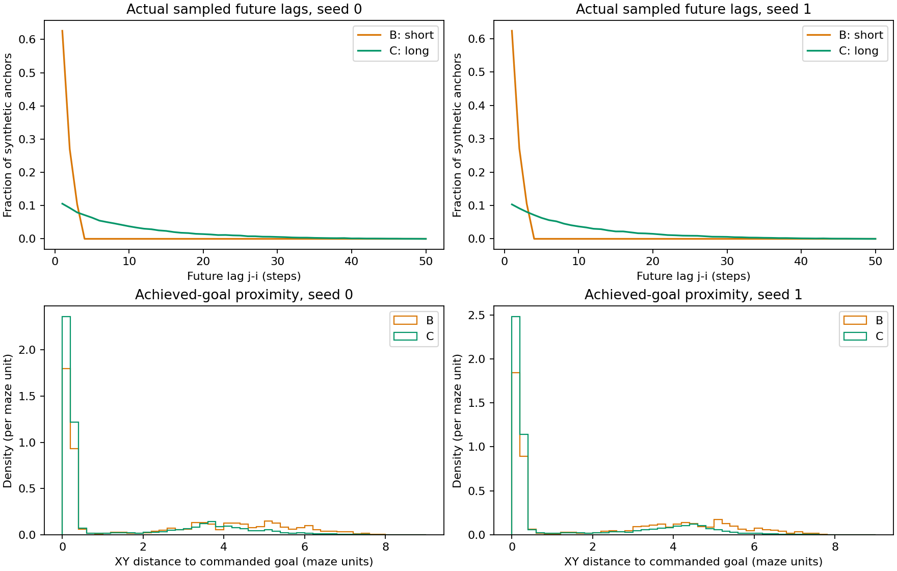
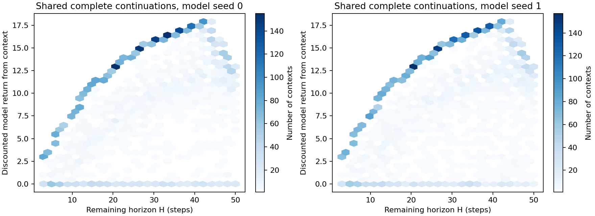
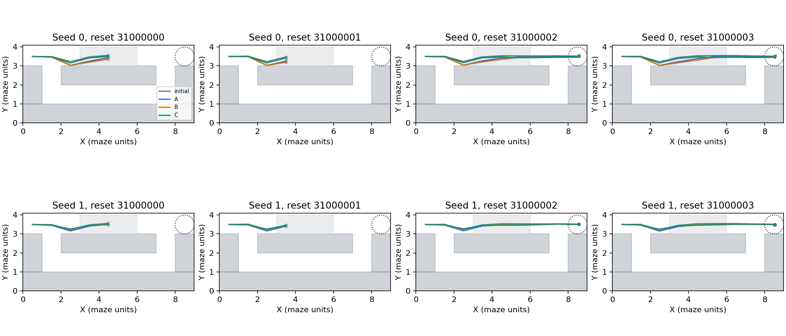
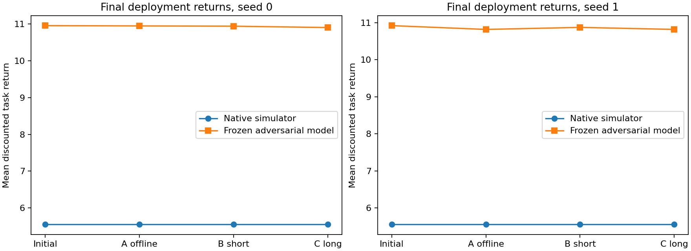
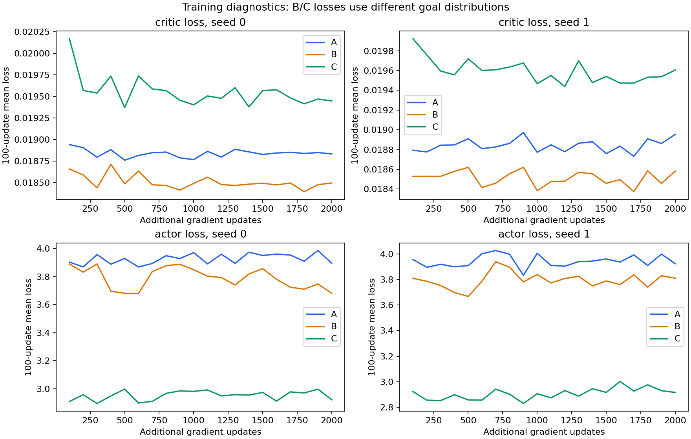

# Shared anchors, longer future goals: changed exposure without native benefit

**The bounded experiment completed. Long windows substantially changed the sampled goals and learned parameters, but did not improve native policy performance over short windows or offline continuation. Stop here.** This result does not support future-window truncation as a sufficient explanation for the preceding null result at this training budget. It does not establish that the ETT objective or model family is the sole bottleneck.

## Answers

1. **Did long windows change learning?** They changed the actual goal exposure: C sampled beyond step 3 for 80.65%/81.05% of synthetic anchors, and mean future lag increased from 1.478/1.481 to 9.833/9.915 steps. Both actor and critic updated, with distinct B/C parameter and goal-batch hashes. Deployment actions also changed. This establishes an active data intervention, not improved long-horizon decision making. B/C losses use different goal distributions and cannot be read as identical-target performance.
2. **Did C improve native performance over B or A?** No observed gain for either seed. All 128 paired episodes have identical task rewards, successes and failures for initial/A/B/C. C-B and C-A mean native return, success and failure differences are exactly zero.
3. **Did model-only improvement transfer?** No model improvement is established either. C-B adversarial-model mean return differences are -0.03694 and -0.05452, with 95% paired intervals [-0.19324, +0.06559] and [-0.18653, +0.01610]. C-A intervals also include zero. There is no positive model effect to claim as transferred.
4. **Does this support the truncation hypothesis?** It argues against the claim that extending future goals alone would rescue this particular setup after 2000 updates. The broader mechanism remains unresolved: a largely established actor, 10% synthetic anchors, unchanged BC/random-goal interactions, fixed behavior generation, partial observability and model error all remain relevant. Long continuations expose the learner to more model-generated near-goal states, including continuations with known stationary/absorption deficiencies. This is neither proof of useful additional information nor evidence that model errors alone caused the null result.

## Provenance and scope

Starting commit: `6c9ccb70d2e9530a9b83d719846f9db77e666371`, branch `feature/pointmaze-causal-transition`. Read the prior [frozen-model policy report](../../ett_policy_improvement/h3_mix10_u2000_s01_v1/REPORT.md), current replay integration, MC learner and original future sampler. Existing experiments and model implementations were preserved.

All six learners restore the same historical alpha0_seed0 final checkpoint at step 150000, including actor, critic, target critic and complete Adam state. Its SHA256 is `ea8a71d3cb8d963259a54d47250b454462dae2ae62f03a55c370ca81a2c8ec54`. The only initialization difference between learner seeds is the learner RNG; B/C share that RNG within seed. Both model-data arms use the same frozen adversarial ETT, paired with model seeds 0/1 respectively. The action-invariant control from the preceding experiment is not used. Two coupled model/learner runs cannot independently identify those sources of variability.

The original mixed-collector PointMaze dataset has 6600 fixed 50-step episodes at per-cell swamp probability .3; it is not exclusively expert successes. File SHA256: `83b4e81d9fca2d66b648c9c34ccdb68196e1acf89e2ca6829e4cb198d27c322c`. Continue on all behavior sources from the established 5940-episode training partition, excluding the first 660 IDs in the seed-0 permutation. The initial actor/critic previously saw all original episodes; this experiment does not remove upstream reuse. Fresh native evaluation seeds are separate from this dataset and prior evaluation arrays.

Frozen components retain the original nominal state_goal K5 teacher-source behavior policy, including failures, its normalization, the diagonal sampler, adversarial coefficients, L=1 and geometry. Nominal checkpoint SHA256: `6376e60185aa616c2d09c5e0250d762cde2fb845c5042488e64910fb3b745f23`; diagonal source checkpoint SHA256: `9e9e1c56387d446b5788612e27e5b7f7743e120186bebc90a78fc6774476184e`. Exact coefficient, source, nominal-config and other input hashes are in [provenance.json](provenance.json). Pre-run, post-generation and final frozen parameter/normalization signatures match exactly. No ETT loss or coefficient is optimized.

The unchanged CRL recipe uses MC NCE, batch 256, 256x256 networks, representation 64, Adam 3e-4 with eps 1e-7, gamma .95, BC coefficient .5, actor random goals .5 and entropy zero. Failure-negative alpha stays 0 with no bank. Both actor and critic receive exactly 2000 main updates per arm and seed. No TD, return-regression critic, scorer, new bank, L change or alternating optimization is introduced.

## Shared trajectories and audited intervention

Before learning, generate 20 batches of 256 offline starting contexts per model seed. Choose training episodes uniformly and original times uniformly from 0..47. For time t, generate exactly H=50-t transitions with the unchanged initial stochastic actor, fixed nominal and frozen ETT. Each step samples x_prime independently from the nominal state-goal policy, samples the execution action from that actor, then samples the successor. Commanded goal remains tiled (8.5,3.5). These complete trajectories are generated once and shared; B/C never generate with their evolving actors.

Generation groups contexts by exact H, so no model transition is queried beyond the original horizon. The arrays have NaN storage tails after H; valid lengths prevent their use. The short view directly slices the same full trajectory. At update block k, only shared batch k is available for anchors; there is no growing replay or separate B/C generation.

For both B and C, choose a trajectory uniformly and i uniformly from {0,1,2}; horizon does not increase a trajectory's anchor weight. B samples j in i+1..3; C samples j in i+1..H. The inverse-CDF draw implements weights proportional to .95^(j-i), with independent anchor and goal RNG streams. Full achieved F4 at j is the goal, never the commanded goal merely because it was supplied to generation. Only the first three transitions supply anchors. F4 is newest first, with exact history shifts.

B/C each use exactly 51200 synthetic anchors among 512000 batch rows (10%), via the previous 25/26-row schedule. Full offline draws, source masks and permutations match across arms. The pretraining audit checks all 2000 B/C batch pairs per seed: mixed states, execution actions, immediate successors, offline draw indices, synthetic trajectory/anchor IDs, masks and permutations match exactly. Actual training reproduces those same common-batch hashes. Future indices differ in 45178/51200 and 45374/51200 draws under the coupled CDFs, while their allowed windows remain valid.

Changing goals also changes NCE in-batch negative goals, actor relabeled/random goals and goal conditioning of BC. Synthetic BC stays enabled. These are part of the intervention; this experiment does not isolate only critic positives. Training reads offline obs/act and shared states/actions/H. x_prime and diagnostic rewards remain separate. MC-unused reward/discount/next_action fields retain NaN sentinels, and all losses remain finite. No simulator targets, hidden bits, masks or death labels enter learning.

## Goal exposure and complete-continuation diagnostics

- Seed 0: B/C mean future index 2.479/10.834 and mean lag 1.478/9.833. C selects j>3 in **80.652%** of draws. Mean sampled-goal XY distance drops 2.041 to 1.141; XY distance <.5 rises 55.55% to 72.69%.
- Seed 1: B/C mean future index 2.487/10.921 and mean lag 1.481/9.915. C selects j>3 in **81.053%** of draws. Mean XY distance drops 2.037 to 1.157; XY distance <.5 rises 55.62% to 73.31%.
- Full-F4 distance to the tiled task goal also changes: means 4.801 to 2.646 and 4.804 to 2.668. These are sampled achieved goals; no goal-proximity selection is performed.

Actual index/lag histograms and expected conditional lag probabilities are saved in [diagnostics.json](diagnostics.json). Maximum absolute observed-versus-expected lag frequency differences are .00421/.00175 for B/C seed 0 and .00129/.00179 for seed 1. Separate sampler tests verify the truncated geometric law over multiple anchors and horizons. These numerical distribution checks are not outcome-driven tolerance tuning.



The 5120 shared continuations per seed have remaining-horizon discounted model return means 10.1043/10.1851, medians 11.5633/11.6376, zero fractions 14.69%/13.01% and observed maxima 17.9065. Horizons vary from 3 to 50, so these mixtures are not directly comparable with full-reset returns. Per-horizon distributions and raw per-context returns are retained. Later goals concentrate near the commanded goal, but those future states come from an imperfect model.



Across valid shared steps, outer-box projection affects 9.462%/7.975%; every sampled completely stationary F4 history resumes motion, and 99.984%/99.976% of sampled anchor atoms move. There are 902/883 stationary-history instances and 18226/16844 atom samples. Stationary histories include reset/waiting/possibly absorbed observations and are **not death labels**. These fractions do not identify which transitions should remain absorbed.

All endpoints, valid boxes, displacement limits and F4 shifts pass the inherited checks. Weighted sampled straight-segment wall-crossing fractions are .0514%/.0629%. They are 21-point interpolation diagnostics, not native axiswise reachability tests. The geometry correction rates refer to the outer convex box, not every correction internal to the diagonal sampler. Frozen diagonal preservation and the execution-action Lipschitz bound do not guarantee full physical validity. Longer continuation gives such model errors more opportunity to affect goal targets; this experiment does not separately quantify a causal error-accumulation effect.

## Native and model evaluation

Evaluate the unchanged actor once and all six final checkpoints on the same 128 fresh reset seeds 31000000..31000127. Use deterministic tanh(loc), natural p=.3, fixed task goal, actual simulator rewards and 50 steps with gamma .95. Success is minimum true XY distance <.5; task reward is radius 2. Absorbed death keeps done=False until the external timeout. Privileged failure information is isolated in evaluation audit files.

For **each** initial/A/B/C actor in both learner seeds:

- Native mean discounted return **5.553115**.
- Success and any-task-reward rate **54/128 = 42.1875%**.
- Failure and zero-return rate **74/128 = 57.8125%**.
- Every positive episode return is 13.162938; median return is zero.
- Lower-detour route usage is zero.

These new reset seeds yield a different initial success fraction from the prior experiment; that between-experiment difference is not a training effect. All within-experiment paired reward sequences and success/failure labels match. For C-B, C-A and C-initial, native empirical 95% paired-bootstrap intervals are [0,0]. This degeneracy follows from zero observed paired differences; it does not prove population equivalence or exclude rare unobserved differences. Episodes, not their steps, are bootstrap units. Intervals condition on these checkpoints, use 2000 resamples and have no multiplicity adjustment; two coupled model/learner seeds do not establish broad robustness.

Native actions and paths do change slightly while remaining on the shortcut. C's mean all-step action L2 difference from initial is .3614/.1103; restricted to each actor's live steps it is .0106/.0128. Thus all-step differences are strongly affected by behavior after absorption. These paired-time comparisons may involve different visible states and are descriptive, not same-state policy derivatives. The first four reset IDs are shown without outcome selection.



Full-reset adversarial-model return means for initial/A/B/C are:

- Model seed 0: 10.950574 / 10.942902 / 10.935392 / 10.898454.
- Model seed 1: 10.921162 / 10.818784 / 10.873665 / 10.819148.

C-B model return differences are -0.03694 [-0.19324, +0.06559] and -0.05452 [-0.18653, +0.01610]. C-A differences are -0.04445 [-0.17583, +0.04169] and +0.00036 [-0.20884, +0.24358]. C-initial differences are also negative with intervals including zero. All model returns remain separate from native returns, and a large model/native discrepancy remains. The same initial-state model evaluation uses matched noise across actors but does not certify causal correctness or optimization safety.





## Verification, budget and recommendation

Four focused tests pass: geometric future distribution, length-independent anchors and NaN tails, separate RNG/mask streams, and native replay. B/C each pass a five-update smoke from the unchanged initial state using shared data. Before main training, all 4000 paired B/C batches pass exact matching. Final checks verify actual actor/critic updates, unchanged model/nominal/normalization signatures, sample windows, offline starting states, absence of held-out training inputs, all 44800 native execution actions, native metrics/paired intervals, 28 selected native replay episodes, generation groups H=3/26/50 for both seeds and 512 selected full model-evaluation paths. Five figures were visually checked.

Actual model work: 272808 shared-generation transitions, 51200 evaluation transitions and 44069 replay transitions, totaling **368077 / 650000**. Native work: 44800 main steps, 1400 selected replay steps and 200 focused-test steps, totaling **46400 / 50000**. No retry, cap amendment or outcome-driven extension was needed. The six main training loops took about 156.9 seconds on local CPU, excluding generation/compilation, preparation and evaluation. No remote server was needed.

**Recommendation: stop without alternating training or a larger sweep.** The goal-window intervention was real and substantial, but it did not produce native usefulness at the tested budget. This narrows the truncation explanation without ruling out interactions with the optimization budget, established actor, BC/random-goal rules, behavior occupancy or model quality. It does not establish a sole bottleneck, causal ETT identification or a global worst-case model. Existing long-continuation limitations remain reasons for caution, not a license to relabel stationarity as death or redesign the model within this experiment.

## Reproduction and files

Run from the PointMaze worktree using the existing local Python/JAX/Haiku/Optax/NumPy environment and a fresh directory:

```bash
python -m unittest scripts.test_future_window
python -m ett.run_future_window --out-dir artifacts/ett_future_window/NEW_RUN --phase prepare
python -m ett.run_future_window --out-dir artifacts/ett_future_window/NEW_RUN --phase generate
python -m ett.run_future_window --out-dir artifacts/ett_future_window/NEW_RUN --phase audit
python -m ett.run_future_window --out-dir artifacts/ett_future_window/NEW_RUN --phase smoke
python -m ett.run_future_window --out-dir artifacts/ett_future_window/NEW_RUN --phase train
python -m ett.eval_future_window --run-dir artifacts/ett_future_window/NEW_RUN
python -m scripts.check_future_window --run-dir artifacts/ett_future_window/NEW_RUN
python -m ett.report_future_window --run-dir artifacts/ett_future_window/NEW_RUN
```

The exact checkpoint/data paths and hashes are enforced; missing artifacts fail rather than being substituted. `contexts.npz` stores the predeclared schedule and partition; `s*_shared.npz` stores complete shared trajectories and valid lengths; auxiliary draws/diagnostics are separate. Sample-audit arrays record actual indices, masks and permutations. Configs, learning curves, native/model evaluation arrays, [numerical appendix](NUMERICAL_RESULTS.md), [diagnostics](diagnostics.json) and [verification](verification.json) are publishable. Final checkpoints remain local in ignored `checkpoints/s{0,1}_{A,B,C}_final.pkl`.

The independent checker and reporting code were added for final verification/presentation; frozen preregistered source hashes remain unchanged. No new failure bank/scorer, L or ETT-family change, extra training or alternating update was launched. No commit or push is performed automatically.
