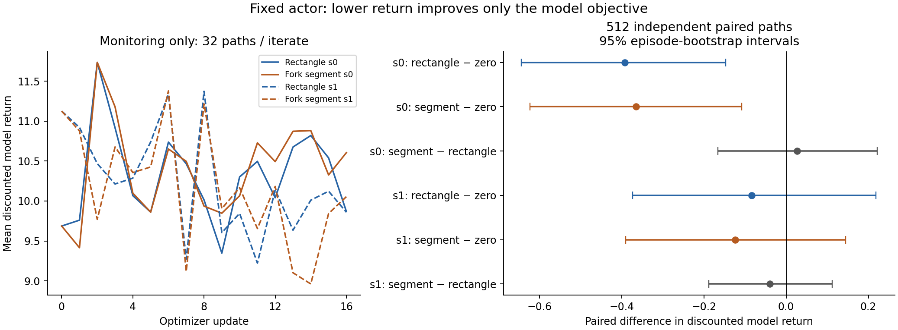
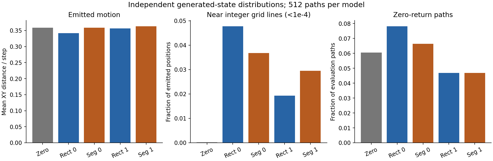
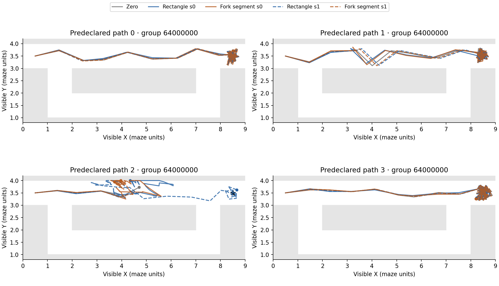

# Does the new geometry change what the existing pessimistic objective learns under a fixed actor?

**It changes the learned coefficients and projected transition responses, but this
budget does not establish a return advantage for either geometry. Both modes
reduce independent model return for optimizer seed 0; neither establishes a
decrease for seed 1. The mode-difference intervals include zero in both seeds.**
This is a mixed optimization result. Lower J improves the adversarial objective,
not actor performance or proof of useful synthetic data. No native evaluation or
downstream CRL training was run.

## Controlled experiment and independent return

Actual starting commit is `be1b3c520ce91ea4a7e9c4d9f4a7fa0941e86345`, exactly the
requested commit, on `feature/pointmaze-causal-transition`; no intervening commit.
The [pre-execution specification](SPEC.md), [configuration](config.json),
[seed schedule](seed_schedule.json) and [input/source hashes](provenance.json)
were saved before sampling. All four models start at exactly zero 32-vectors.
Both zero modes match exactly on the sampled diagonal checks and eight matched
50-step initial paths, including actor/nominal actions, anchors, states and rewards.

The historical stochastic actor, its critic state, state-goal nominal policy,
guarded diagonal sampler and every normalization remain frozen. Each rollout
samples x_prime, then execution x, then the successor; each model's own generated
state conditions its next actions. Perturbation directions and rollout random
keys are paired across modes within each optimizer seed and across +/- queries.
Random streams are not native hidden randomness, and diverging states do not
share fixed nominal action values. Training, monitoring and evaluation keys are
disjoint. Evaluation uses four groups of 128 paths, shared across all five models.

The two-term objective stays L_diag + lambda E[J], lambda=1/sum(.95^t), H=50,
with successor-position reward 1[distance to (8.5,3.5)<2]. L_diag is structurally
constant: only the second term updates theta, not a jointly trained diagonal
network. The original antithetic parameter-perturbation estimator and capped
descent helper perform 16 updates, 8 directions, 32 paths/sign, sigma=.1, rate=1,
cap=.2. Final iterate only. No hard-reward pathwise derivative, likelihood-ratio
surrogate, readout or third loss is used. A zero-weight optimizer was not repeated.

The common initialization has mean J=10.413263, L_diag=0.014970824 and weighted
adversarial term 0.564065. L_diag is the same in every final model; it was measured
with 16 draws on each of 1,024 preserved training and 1,024 held-out tuples.
Its smaller Monte Carlo audit than the historical experiment changes neither
the population fitting term nor its zero contribution to parameter differences.
The following intervals use 2,000 paired episode-bootstrap replicates within the
four evaluation groups, not individual steps or pooled optimizer seeds.

* **rectangle, seed 0:** final mean J=10.021104; final-minus-zero -0.392159, 95% CI [-0.644147, -0.147310]. Weighted adversarial term=0.542823.
* **fork_segment, seed 0:** final mean J=10.047891; final-minus-zero -0.365372, 95% CI [-0.623159, -0.107566]. Weighted adversarial term=0.544274.
* **rectangle, seed 1:** final mean J=10.329531; final-minus-zero -0.083733, 95% CI [-0.373086, +0.217964]. Weighted adversarial term=0.559530.
* **fork_segment, seed 1:** final mean J=10.289493; final-minus-zero -0.123770, 95% CI [-0.389866, +0.144610]. Weighted adversarial term=0.557361.

* Seed 0: fork-segment minus rectangle **+0.026787**, 95% CI [-0.166352, +0.221315].
* Seed 1: fork-segment minus rectangle **-0.040037**, 95% CI [-0.188121, +0.111748].

These are conditional intervals for the five fixed checkpoints and common frozen
inputs. They do not establish broad optimizer robustness. Group-specific means,
objective terms and every paired episode difference are retained in the numerical
artifacts. Monitors use different keys at each iterate and never select checkpoints.

## What changed in the transitions

The segment mode retains the prior demonstrated capacity; it does not contain
every output of an individual rectangle instance. This experiment finds a change
in responses, without requiring downward motion or route completion.

On independent rollouts, supported fork-region visits are 578 for zero, then
613/598 for rectangle/segment seed 0 and 559/579 for seed 1, out of 25,600 steps
per model. Geometry-eligible counts are 569, 600/586 and 550/570 respectively.
Segment runs select their segment on all 586/570 eligible steps (2.289%/2.227%
of steps); rectangles never select one. These differing counts describe changing
generated-state distributions, not fixed-input response changes.

For the segment models, mean projection fractions are .00816/.00932. Exact anchor
mass is 65.53%/62.98%; endpoint mass is zero, and maximum fractions are .1362/.1323.
At their eligible contexts, mean anchor displacement is approximately (+.851,+.006)
and (+.851,+.005), correction is (+.0217,-.0048) and (+.0117,+.0046), and emitted
displacement is (+.8459,+.0007) and (+.8454,-.0013). Most of the sampled anchor's
rightward motion remains. Set projection can suppress a correction; the second
objective is not required to pursue the lower route.

Separately, all four learned coefficient arrays were evaluated in **both** modes
on the same 512 fresh component anchors plus 225 preserved fork/descent inputs.
No changed component output was fed forward. On the fixed 225 contexts, mean
unclipped Y correction for rectangle-trained versus segment-trained coefficients
is -.04955 versus -.02749 in seed 0, and -.03691 versus +.03603 in seed 1.
Changing only geometry leaves the matrix correction unchanged but changes emitted
XY; all eight combinations retain six below-Y=3 outputs. These descriptive
component comparisons separate parameter/projection changes from state visitation;
they are not new route rollouts or native response labels.

Zero-return path rates are 6.05% initially, 7.81%/6.64% in seed 0, and 4.69%/4.69%
in seed 1 (rectangle/segment). Mean step motion is .3591 initially, .3419/.3587 and
.3569/.3632. Occupancy within 1e-4 of an integer XY grid line rises from .0195%
to 4.77%/3.68% and 1.93%/2.95%; such a line need not be a physical wall.
Selected-set boundary occupancy is 3.95% initially, 10.36%/9.39% and
4.54%/6.36%; for a segment, this refers to relative endpoints, not a physical wall.

Every rectangle-model stationary anchor, and 99.83%/99.84% of segment-model
stationary anchors, emits motion above 1e-5. Initially stationary anchors remain
fixed, but the baseline itself resumes motion in 7.92% of 1,869 non-reset stationary
histories. The final models have **zero** such histories, so their conditional
stationary-history statistic is unavailable, not evidence that absorption is
correct. Visible stationarity is not confirmed death: these findings flag a
limitation, not a proved native violation. Rare sampled straight-line wall
intersections remain (.027%–.086% in finals); that line audit is not the native
axiswise simulator path. Valid endpoints alone do not settle kinematic validity.

## Verification, numerical qualifications and accounting

All four new checkpoints persist `format_version`, `geometry_mode`, `bound` and
theta. New evaluation requires mode metadata; historical theta/bound checkpoints
still mean rectangle. Reloaded first evaluation groups reproduce **every saved
field exactly**. Rollouts retain geometry kind, eligibility, segment endpoints and
fraction, reference box, anchor, correction, proposal, successor, goals and boundary
indicators. Validation uses the actual selected convex set, not the old box for
segment outputs. The original sampling emitter is otherwise unchanged.

Frozen component/file/normalization hashes, exact diagonal samples and F4/goal
contracts pass. Maximum normalized block Frobenius norms are .4180/.3671 in seed 0
and .4192/.3463 in seed 1. Finite fixed-conditioning grid/near-pair checks have zero
positive bound excess within 2e-6. The proof remains fixed-set nonexpansive
projection composed with ||M||op<=1, for every execution-action pair at fixed
state, goal, x_prime, anchor and parameters. L=1 is prescribed; these properties
do not identify off-diagonal causality, native kinematics, absorption or long-term
validity. The known float32 anchors exceeding literal unit steps by 1.19e-7 are
preserved; the contract is the original rounded q+/-1 box, not a repaired strict bound.
Across each of the five new evaluation sets, the maximum literal coordinate step
is 1.0000004768371582, reflecting rounding at other coordinate magnitudes as well.

The [ledger](transition_ledger.json) records exactly **2,098,720** newly sampled
model transitions against the predeclared **2,500,000** cap. All sampler calls
completed; no training restart or extra optimization occurred. Nine focused
tests pass, including metadata-loss rejection, actual segment membership and
the existing analytic optimizer sign test. Independent saved-result checks
recompute all 64 updates, paired keys, cache hashes and return intervals.

Three implementation qualifications are preserved in [IMPLEMENTATION_NOTES.md](IMPLEMENTATION_NOTES.md):
a preparation-only seed-scan false positive (zero draws); an overly strict
post-hoc checker tolerance for the original float32 update cast (zero draws);
and a near-ceiling standalone-versus-JIT eligibility tally discrepancy. Actual
rollout eligibility and selection agree everywhere; the fixed-component raw
standalone tally is 217, while emitted JIT diagnostics select 218 saved fork
contexts. Both use the declared action-independent rounded construction.
The corrected selected-set counts and exact example are retained separately.
No trained model or hyperparameter was changed in response.

## Decision

**Defer downstream CRL.** This budget establishes neither a geometry return
advantage nor a repeatable decrease across both optimizer seeds, and the
stationary-anchor/boundary behavior leaves synthetic-transition validity unresolved.
The new capability is real, and its learned use changes, but lower model return
alone does not establish better training data. First resolve which of these
off-diagonal motion/absorption behaviors are admissible using explicit physical
assumptions or suitable visible action-coverage evidence; this report does not
assign a hidden failure label or blame the second loss alone.

If that concern is resolved, the later small comparison should use matched
learner seeds, update counts, replay mixture, future-goal sampling and native
evaluation for offline-only, rectangle-generated and fork-segment-generated
samples. Keep model optimizer seeds separate. That comparison was **not run**.
See [REPRODUCE.md](REPRODUCE.md) for the completed experiment commands.
