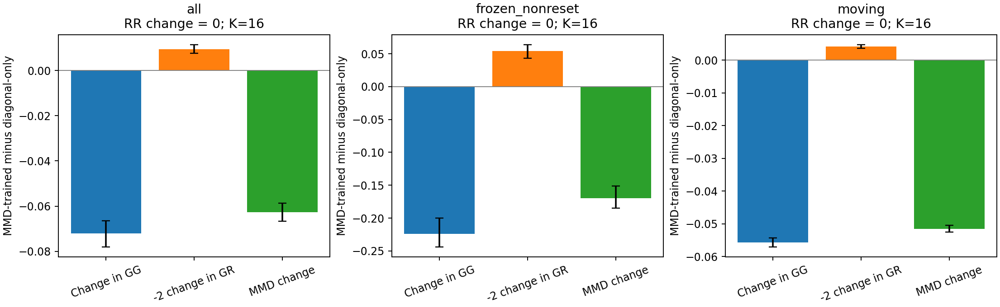
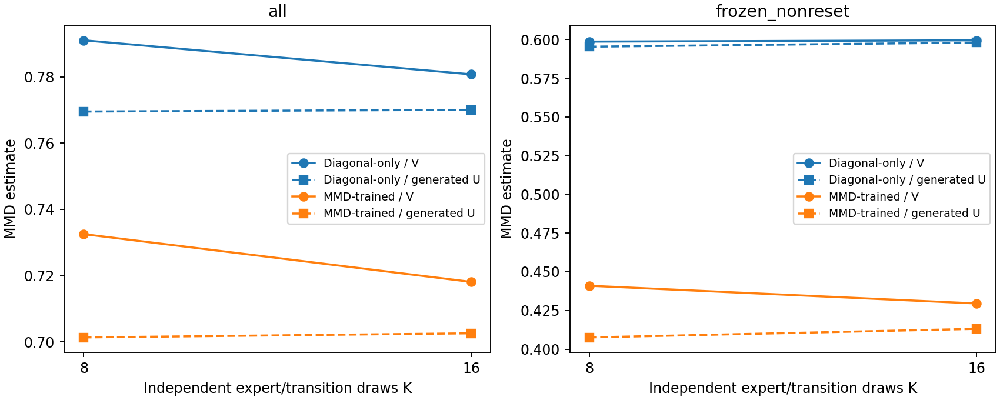
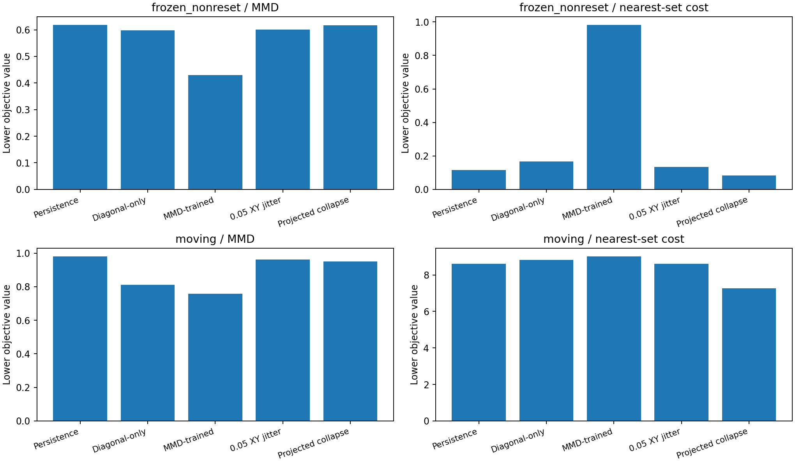
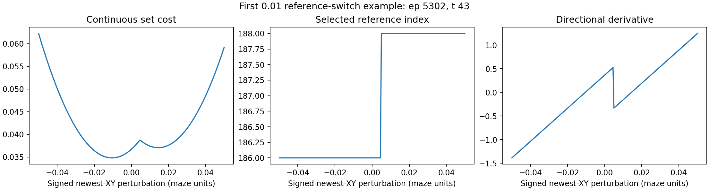
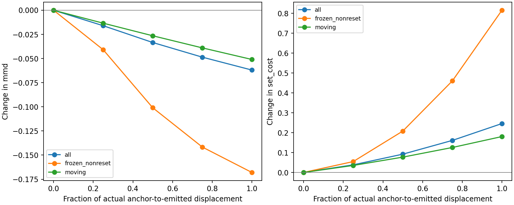
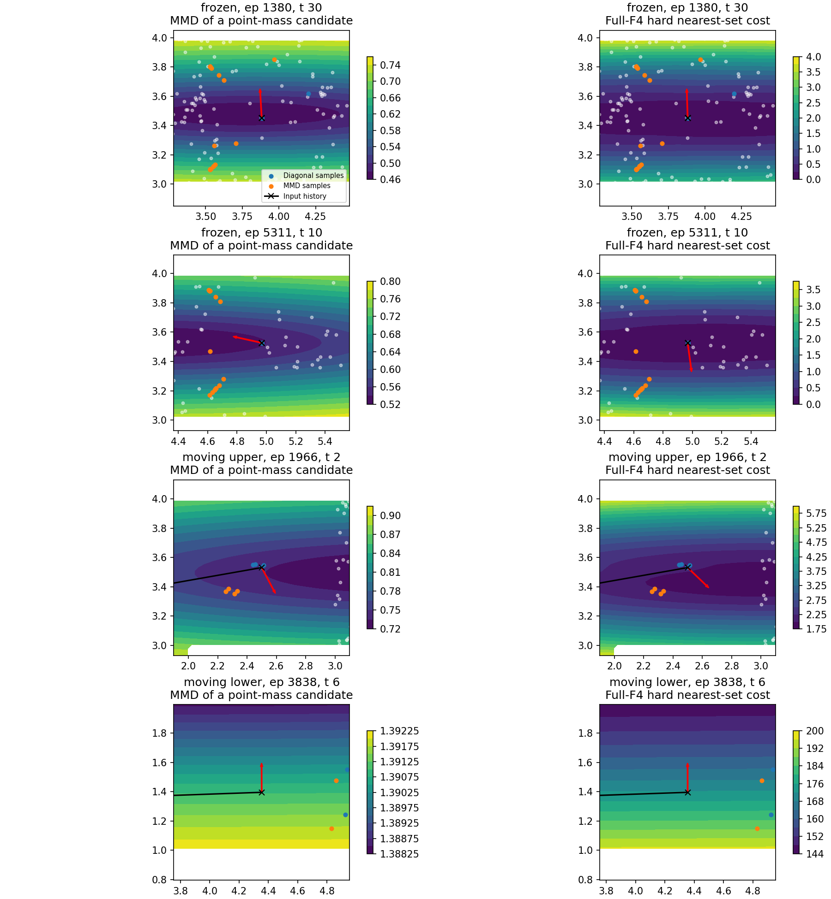

# PointMaze failure-objective diagnostic

**Decision B: reconsider the unconditional one-step target before another training comparison.** Hard set distance rejects the most conspicuous MMD dispersion artifact, but it still rewards moving every held-out frozen history to another stored location and can reward complete sample collapse. Neither objective passes the stronger behavioral test of preserving an already stationary outcome without an independent reason to move it. This is structural/observational evidence, not proof that these histories are absorbing deaths. No new neural network was trained and no A/B/C comparison was launched.

## Preserved context and compatibility

The authoritative run remains `artifacts/ett_distribution_matching/f4_p30_s01_guarded`. Its README designation, sibling run records and Git history were inspected. Remote branch HEAD was `b44562f1b32d45b1b42f5b54bbbbfc1ae1d39a39`, matching local HEAD; no newer authoritative run was found. All five guarded final checkpoints were available and their SHA-256 hashes match the saved metrics. The original K=8/16 seed-0 MMD results and separate K=64 frozen-history stationarity check reproduce. Every original artifact hash is unchanged after the diagnostic.

- Environment/data: `point_two_route_swamp_windy_f4_v0`, per-cell swamp probability 0.30; dataset SHA-256 `83b4e81d9fca2d66b648c9c34ccdb68196e1acf89e2ca6829e4cb198d27c322c`.
- Expert-positive source episodes [1200,6000), including failures and stationary rows; 4,321 training episodes/216,050 transitions and 479 validation episodes/23,950 transitions. The source is teacher-generated with documented random behavior, not uniformly optimal or success-only data.
- Reuse all 1,024 saved evaluation contexts from 427 episodes; frozen non-reset subset: 91 contexts from 39 episodes; moving histories: 863 contexts. The lower-corridor moving stratum has only 7 contexts/5 episodes.
- Reuse exactly 233 training-only F4 references: 141 uniform-coverage, 12 expert-positive and 80 appended blind-demonstrator source episodes. Zero source-validation overlap. The original bank composition used privileged teacher-mode/swamp bits; this diagnostic does not construct a bank or use hidden labels. Reference-set semantics do not remove that privileged provenance.
- Bank content SHA-256: `022f2d0d52cf6e0147def46cd800ae2da65e4b5592090397f606f051f6e2c7e9`. Saved episode IDs and rows are checked against the source observations. State is newest-first F4 XY, width 8; action is two coordinates in [-1,1]; the width-8 commanded goal stays in both frozen policies and transition inputs.
- Frozen nominal: `artifacts/nominal_policy/f4_p30_expert_only_mdn_k5_s0/best.pkl`; frozen actor: `artifacts/f4_p30_server_30076/results/runs/f4_p30_sweep/p30_a0_a01_a03_s0_s1/alpha0_seed0/final.pkl`. Models: guarded seed 0/1 diagonal-only and L=0.25 MMD-trained, plus seed-0 L=0.75 MMD-trained. The actor originally saw all source episodes, so this is not held-out actor evaluation.

`config.json` records exact input/checkpoint hashes, split/reference IDs, normalizers and bandwidths. Normalization is loaded unchanged and independently reproduced from training data. No new labels, critic score, death reward, hidden input, learned embedding, or normalization fit was introduced.

## Objectives and estimators

`L_set(Y) = mean_i min_f sum_j ((Y_ij - F_fj) / std_j)^2` uses all eight F4 coordinates. Both sides use the same original normalization; its common mean cancels in Euclidean differences. The primary cost is a hard minimum. Exact ties select the first reference in saved order; the continuous piecewise-quadratic value has a potentially discontinuous selected index/gradient at a tie. The implementation differentiates that chosen branch, without a soft minimum or tie-gradient averaging.

`MMD_V = GG + RR - 2 GR` reuses the original full-F4 multiscale Gaussian kernel, with bandwidths `[0.608408510684967, 1.216817021369934, 2.433634042739868, 4.867268085479736]`. Each objective is computed per fixed (s,x) group. The actor action is held fixed across models, K, and repetitions; each sample first draws x_prime from the frozen nominal model and then a transition. Four paired sampling seeds (0,1,2,3) and K=8/16 are evaluated on every checkpoint. Contexts are never pooled before calculating MMD.

Because generated self pairs have kernel value 1, `GG_U = (K*GG_V - 1)/(K-1)` removes their bias. `MMD_generated_U = GG_U + RR - 2 GR` is unbiased over independent generated draws against the fixed empirical bank. RR retains all pairs, including bank self pairs; it is an exact expectation under that empirical target. This is not a population-failure estimator, and a realized U estimate may be negative.

## Paired decomposition: where the MMD gain comes from

For seed 0, L=0.25, K=16, averaging all four sampling seeds: GG 0.839241 -> 0.767198; RR stays 0.393805; GR 0.226152 -> 0.221461. Total MMD 0.780742 -> 0.718081; nearest-set cost 7.744019 -> 7.987190.

The MMD change is `-0.072043 + 0 + 0.009382 = -0.062661`. All improvement comes from reduced generated-generated similarity; reduced cross-reference similarity actually offsets part of it. This conclusion uses the kernel terms directly, not a visual inference from diversity.

On the 91 frozen histories, the corresponding changes are GG -0.224174, cross contribution 0.054146, total -0.170027, and set cost +0.797807. When the old frames are fixed, within-group GG depends only on newest-XY spread. For histories far from the bank, cross-kernel similarity can be weak while dispersion still lowers GG. This explains the surrogate mismatch.

- `s0_L0p25_lambda1` versus its seed-matched control: MMD change -0.062661 (95% episode interval [-0.066764, -0.058613]); set-cost change +0.243172.
- `s0_L0p75_lambda1` versus its seed-matched control: MMD change -0.102608 (95% episode interval [-0.105676, -0.099448]); set-cost change +0.504793.
- `s1_L0p25_lambda1` versus its seed-matched control: MMD change -0.062901 (95% episode interval [-0.066952, -0.058866]); set-cost change +0.245525.

Intervals resample source episodes after averaging sampling replicates per context, retaining context weights through episode sums/counts. Repeated frozen rows are not treated as independent episodes. The fixed models/bank and prior reuse of this development subset are not covered by those intervals.



For the seed-0 control, K8/K16 V estimates are 0.791015/0.780742, while generated-U estimates are 0.769509/0.770025. The analogous trained estimates show the same estimator effect. A lower V estimate at K16 is not a better model. Residual K differences are Monte Carlo error; K8/16 draws share keys but are not nested sample sets.



## Frozen histories and controlled candidates

The saved K64 check reproduces stationary sampling rates of 93.15% (control) and 7.45% (MMD-trained). Their recorded next positions are stationary, but observational stationarity is not a proof of absorbing death.

For controlled candidate comparisons below, K=16 and sampling seed 0 are fixed. Persistence is `[current XY, state[0:6]]`; small cardinal perturbations and symmetric radius-0.05 jitter change only newest XY and use the existing endpoint projection. For moving histories persistence is merely a valid candidate, not a failure label.

On frozen contexts, persistence/diagonal-only/MMD-trained set costs are 0.116566/0.165796/0.981315; MMD values are 0.617831/0.598089/0.430113. MMD prefers its trained output over persistence in all 91 contexts; hard set cost prefers persistence in all 91. Symmetric 0.05 jitter lowers MMD in all 91, but raises mean set cost to 0.133291. Thus set distance is better aligned with this specific stationary-candidate comparison.

However, no held-out persistence vector is an exact bank member. Moving newest XY to the reference that minimizes old-frame distance reduces set cost for every frozen context: 0.116566 -> 0.084091, with mean movement 0.1750 maze units. All these frozen-context moves pass endpoint, per-coordinate cap and segment checks, but 27.54% of saved draw/radius pairs fail the original action anchor bound. Projection does not remove the frozen-context drift.

Even restricting to contexts where a single collapsed position satisfies all 16 sampled anchors and the geometry checks leaves 34 frozen contexts. Their exact counts and costs are in `feasible_collapse_probe.json`. This empirical subset is not an all-randomness guarantee. The formula contains no penalty for losing conditional uncertainty. Without counterfactual ground truth, we cannot determine whether the removed spread is legitimate uncertainty or model error; this demonstrates a collapse loophole, not that the original spread should be retained.



## History mismatch, local derivatives, and feasibility

For frozen persistence, fixed old frames contribute 72.16% of nearest-set cost. The immutable history-only floor averages 0.084091; across all contexts it is 5.310318. Distance to each fixed reference has a fixed old-frame contribution, but the chosen reference may change when newest XY changes; consequently the selected old-frame term can change without editing history.

A 0.01 maze-unit cardinal perturbation changes the nearest reference in at least one direction for 17.58% of frozen contexts and 7.13% overall. The cost remains continuous while the selected-reference derivative can jump. Reference indices and their exact source episode/row IDs are saved in `primary_nearest_references.json`.



All newest-XY gradients are finite. At frozen persistence, mean common-translation gradient norms are 0.113191 for MMD and 0.816277 for set cost. Their numerical scales have different units and are not comparable quality scores. Neither objective has zero local drift on these held-out frozen points. Old frames stay fixed in these derivatives.

The saved actual own-diagonal-anchor-to-generated displacement is also evaluated at fractions 0, 0.25, 0.5, 0.75 and 1. This is not a pairing of separately trained control and treatment samples. Along the actual residual path, MMD falls while set cost rises on average for frozen histories. Interpolation does not reproject the path; every fraction has separate endpoint/segment/bound checks.





The unrestricted history-nearest collapse violates the one-step cap in 79.00% of all contexts. For all 7 lower-corridor moving contexts, the reference lies across blocked geometry and beyond the coordinate cap. Their large set costs distinguish public spatial/history configurations, not proven failure versus safety. This objective can favor unrelated failure locations; it is not merely motion suppression. Endpoint and sampled-segment checks do not establish full physical reachability. All evaluated model outputs retain exact history shift, valid endpoints and their sampled anchor bounds.

## Formula properties versus behavioral evidence

On the 233 exact training-bank vectors, set cost is zero as expected. Repeating one bank point 16 times gives set cost 0.0 but MMD 0.569806. Duplicating that reference 233 times in memory leaves set cost unchanged and changes MMD to 0.142451. The bank file is unchanged. These checks establish membership, duplication invariance and frequency sensitivity; they do not establish failure recognition. The held-out behavior results above are separate.

## Recommendation and scope of the evidence

Set distance is a more appropriate diagnostic for proximity to a reference set than unconditional distribution matching, and it exposes the MMD artifact. Nevertheless, nearest-point drift, uncertainty collapse, fixed-history floors and unreachable references remain basic obstacles to treating it as a reasonable global single-step failure objective. Reconsider reference conditioning and one-step versus longer-horizon target compatibility before another training experiment. This diagnostic does not establish that the F4 representation itself is insufficient.

No hyperparameter of the alternative was fitted or tuned: it has the prescribed hard minimum, unchanged normalization and bank. This repeatedly used development subset is not an independent validation of a selected objective. No hidden labels, outcome classifier or generated-state failure labels were used. Counterfactual ground truth remains unavailable in these records.

## Completed reproduction and next experiment

Completed: seven formula/gradient tests, a 128-context smoke diagnostic, and the full 5-checkpoint x 2-K x 4-sampling-seed diagnostic in 75.2 seconds on ['cpu:0']. The report reads saved samples; it does not resample a model.

```bash
python -m scripts.test_failure_objectives
python -m ett.diagnose_failure_objectives --out-dir artifacts/ett_objective_diagnostic/smoke --max-contexts 128 --sampling-seeds 0 --sample-counts 16 --verified-remote-head b44562f1b32d45b1b42f5b54bbbbfc1ae1d39a39
python -m ett.diagnose_failure_objectives --out-dir artifacts/ett_objective_diagnostic/f4_p30_s01 --sampling-seeds 0,1,2,3 --sample-counts 8,16 --verified-remote-head b44562f1b32d45b1b42f5b54bbbbfc1ae1d39a39
python -m ett.report_failure_objectives --run-dir artifacts/ett_objective_diagnostic/f4_p30_s01
```

Use a fresh output directory when reproducing; previous artifacts are never overwritten by the diagnostic. `visualization_samples.npz` contains only visible evaluation states, sampled outcomes and objective gradients, not weights, hidden labels or training targets. Publication of the code, configuration, metrics and evaluation artifacts was separately authorized by the user. Checkpoints remain local and are excluded from publication.

The concrete later A/B/C protocol is in [NEXT_ABC_SPEC.md](NEXT_ABC_SPEC.md). In that specification A is a plain conditional mixture with diagonal fitting only; B is the identical plain network with diagonal plus hard-set cost and no equality indicator or zero-residual architecture; C uses the current explicitly anchored architecture with the same two losses. The selected hard-set cost is an exploratory candidate, not approved as a failure metric. No A/B/C implementation, training run or launch command was executed.
