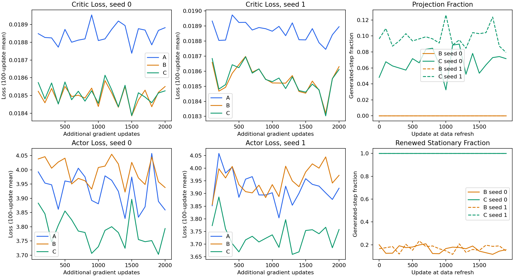
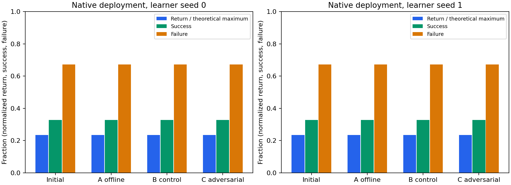
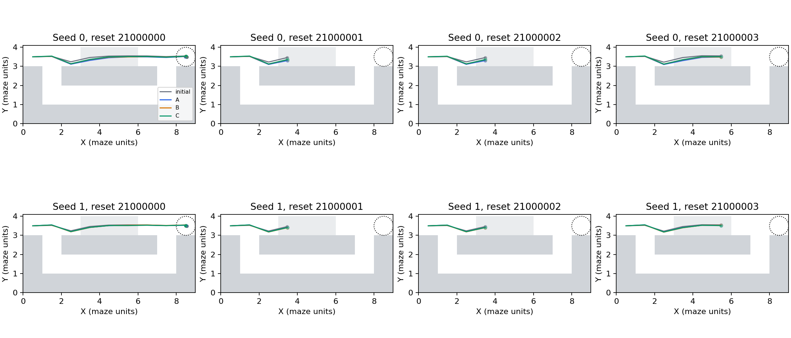
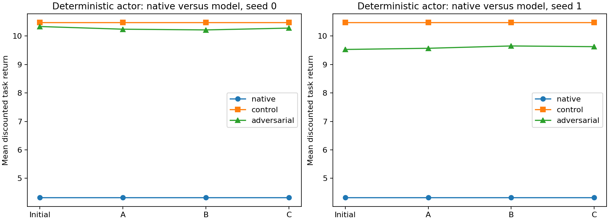

# Frozen ETT policy improvement: no observed native benefit

**The six fixed-budget runs completed, but adversarial-model data did not improve native deployment over either offline continuation or control-model data. Stop before alternating training.** The unchanged actor and all six final actors have identical per-episode task rewards, successes and failures on the 128 paired evaluation seeds. Their parameters and actions do change; the shortcut route and discrete outcomes do not.

## Five answers

1. **Does C improve over A? No observed improvement.** For both learner seeds, C minus A native discounted return is exactly 0, success difference 0 and failure difference 0 on every paired episode.
2. **Does C improve over B? No observed improvement.** The same zero differences hold. B is an action-invariant model-data control, not validated ordinary dynamics; beating B alone would not have established usefulness anyway.
3. **Does model-return improvement transfer? No.** Adversarial-model C-minus-A mean differences are only +0.0386 and +0.0572, with paired 95% intervals [-0.2017, +0.3028] and [-0.0328, +0.2147]. C-minus-B is +0.0642 and -0.0247, also inconclusive. C-minus-initial reverses sign across model seeds (-0.0551, +0.0980). There is no established model improvement and no native transfer. Control-model returns are exactly actor-invariant.
4. **What behavior changes?** All native actors take the shortcut; none uses the lower detour. Small path differences and changed actions do not change crossing outcomes or reward timing. Across all 50 steps, including absorbed states, action-component saturation rises from 13.38% initially to 30.02%/19.42% for C. These all-step diagnostics are not estimates restricted to live decisions. The first four predetermined reset trajectories illustrate overlapping routes, not selected successes.
5. **What explains the failure?** Checks support correct integration, while known model deficiencies remain prominent. The frozen model predicts returns around 9.5-10.5 where native returns are 4.319. Generated motion from stationary histories and moved anchor atoms remain common, and short-segment goal sampling plus mixed BC introduces a distribution shift. This small experiment establishes no usefulness gain; it does not isolate a causal explanation or demonstrate systematic actor exploitation. The lack of native improvement, substantial model/native gap and unresolved model validity are more limiting than justification for alternating training.

## Starting point and matched training

Starting commit: `2d8ee94db180bc850d372c197305c1e0c3885e4c` on `feature/pointmaze-causal-transition`. Read the completed convex prototype, fixed-actor continuation and frozen-readout reports; no critic diagnostic was repeated. The prior stop-before-actor recommendation was retained as a limitation, and the user's new request explicitly authorized this bounded usefulness test.

All arms start from the same complete historical alpha0_seed0 checkpoint at update 150000, including actor, critic, target critic and Adam moments. Its SHA256 is `ea8a71d3cb8d963259a54d47250b454462dae2ae62f03a55c370ca81a2c8ec54`. Adam continues rather than restarting. Only the learner RNG changes between seeds; C seed 0/1 pairs with adversarial model seed 0/1. This combines learner and model variability and gives only two replicates.

The unchanged launcher recipe uses MC NCE, batch 256, representation 64, 256x256 networks, Adam 3e-4 with eps 1e-7, BC coefficient .5, random-goal mixing .5, gamma .95 and zero entropy coefficient. The chosen historical checkpoint has failure-negative alpha=0 and no bank; all arms retain that configuration. Alpha=.3 models from earlier scorer work are not substituted, and no bank or alpha is swept. The existing critic/actor objectives are called directly through `crl.losses.build_learner`; logits are not interpreted as calibrated task Q.

The original dataset file SHA256 is `83b4e81d9fca2d66b648c9c34ccdb68196e1acf89e2ca6829e4cb198d27c322c`. It contains 6600 fixed 50-step mixed-collector episodes of PointMaze F4 at per-cell swamp probability .3, not exclusively expert successes. This continuation uses all behavior sources from the established 5940-episode training partition; 660 seed-0 held-out episodes are excluded. Initial actor/critic upstream training saw all source episodes, which this split cannot undo. New simulator evaluation uses fresh independent seeds.

Nominal policy is the existing teacher-source state_goal K5 MDN, including failures; SHA256 `6376e60185aa616c2d09c5e0250d762cde2fb845c5042488e64910fb3b745f23`. The guarded diagonal source SHA256 is `9e9e1c56387d446b5788612e27e5b7f7743e120186bebc90a78fc6774476184e`. Frozen coefficient hashes are checked against the completed prototype's training record. Nominal normalization and config are unchanged from the starting committed version; the independent checker additionally verifies that sidecar after training, ignoring only Windows line-ending conversion. That additional check is explicitly distinguished from the pre-run weight manifest. All exact input and final checkpoint hashes are in [provenance.json](provenance.json) and [verification.json](verification.json).

Each arm performs exactly 2000 gradient updates. B/C refresh 256 three-transition trajectories every 100 updates using their current stochastic actor, retaining only the newest refresh. Starting contexts use only recorded visible F4 from the offline training partition and original times 0..47. Commanded goal remains tiled (8.5,3.5). Nominal x_prime is sampled without optimization or selection, separately from the current actor's execution action. Frozen model parameters, nominal, diagonal, L=1 and geometry never update.

The generated trajectory has four actual observations, never a padded 51-row episode. A positive goal is the full achieved F4 at a sampled future j>i of that same segment, using the original geometric law proportional to .95^(j-i). It is not the commanded goal merely because the rollout received it. The available future window is three steps, explicitly shorter than offline replay and a potential bias. Counts alternate 25/26 synthetic anchors, yielding exactly 51200/512000 (10%) per model arm. All 256 rows/columns participate in the original NCE objective, including cross-source negatives. Actor random-goal rolling and BC also use this same mixed batch, so synthetic actions are self-imitation targets in the BC term. B/C have identical effective counts and source weighting.

Only obs/action arrays enter training. x_prime stays in separate auxiliary files. Unused MC reward, discount and next_action slots contain NaN sentinels; finite losses confirm no boundary placeholder is used as a training target. There are no fabricated terminal labels, hidden fields, simulator rewards, return readouts or counterfactual targets in the learner. The ETT two-term formulation remains unchanged and neither term is updated.



## Native evaluation and uncertainty

Deployment follows the existing greedy deployment helper: deterministic tanh(loc), natural p=.3 simulator, fixed goal, 50 steps and external timeout. This differs deliberately from the earlier stochastic fixed-actor continuation evaluation. Success uses minimum true simulator XY distance <.5; task rewards use radius 2. Both are reported separately. Absorbed death retains done=False through the fixed episode and is never treated as early truncation.

The unchanged actor and every final trained run have:

- Mean discounted native return **4.319089**.
- **42/128 successes (32.8125%)**, 42 episodes with any task reward.
- **86/128 failures (67.1875%)**, also exactly the zero-return episodes.
- All nonzero episode returns **13.162938**; median return zero.
- Zero lower-detour episodes.

The theoretical reward-only upper bound is sum(.95^t)=18.4611; 13.162938 is the observed successful-path return after travel, not that upper bound.



Reset seeds 21000000..21000127 are paired across comparisons. There is no stochastic policy draw during deployment; native RNG begins with aligned seeds, but policy-dependent absorbed branches can consume randomness differently, so this is not a claim of identical future masks after arbitrary divergence. Each trajectory is a bootstrap unit; steps and the same reset across actors are not independent replicates. Two thousand paired bootstrap resamples produce [0,0] for native return/success/failure differences because all observed paired differences are zero. **These degenerate empirical intervals do not establish population equivalence or exclude rare unobserved discordant outcomes.** No outcome-driven collection, extra seed, checkpoint selection or hyperparameter change was performed.



## Separate model outcomes and validity

Initial/A/B/C control-model mean returns are all 10.474172 for both coefficient seeds, as expected from action invariance. Under adversarial model seed 0, initial/A/B/C are 10.335007 / 10.241310 / 10.215766 / 10.279936. Under adversarial model seed 1, they are 9.529242 / 9.570094 / 9.652005 / 9.627264. These are deterministic-actor model rollouts with independent model RNG, not native outcomes; the earlier model-minimization experiment used stochastic actors and different seeds.



On short training segments, C's projection rate averages 6.71%/9.81% across refreshes. Every sampled completely stationary F4 history resumes motion in C, and all sampled stationary anchor atoms are moved; B's per-refresh renewed-stationary fractions average 16.07%/17.00%. Stationary histories can represent reset, waiting or absorption; these are **not death labels**, and no such classification is used. These conditional fractions have different denominators across models because their generated histories differ.

The first-to-last refresh projection rate rises 4.82% to 7.16% for seed 0 and falls 9.64% to 7.94% for seed 1; those samples use different offline contexts, so these endpoint comparisons cannot isolate actor drift. Independent full model evaluation shows only small initial-to-C projection increases, 12.09% to 12.31% and 10.06% to 10.56%. No consistent strong increase in suspicious-region occupancy is established. Nevertheless, C moves essentially every anchor atom and the limitations exist before policy updating.

All generated endpoints, displacement caps, valid boxes and F4 shifts pass. Sampled straight-segment wall crossings still average 0.299%/0.326% in C's training refreshes, versus 0.267%/0.339% in B. These 21-point interpolation checks are not native axiswise reachability tests. The frozen action-Lipschitz construction and its diagonal preservation remain intact, but neither certifies absorption or complete physical validity. Full-evaluation stationary-history diagnostics include reset histories and must not be compared directly with the previous report's non-reset conditioning.

## Checks, engineering amendment and budget

Three focused tests pass for exact segment boundaries/geometric goals, mixing/bounded replay and native snapshot/action/reward/timeout behavior. The five-update smoke has finite losses with unused-field NaN sentinels. All six runs retain finite parameters and losses, update both actor and critic, use matched counts and keep model-side hashes unchanged. Independent checking reconstructs all 44800 final native actions, all native metrics/paired intervals, all 20480 generated segments and their offline starts/future goals, plus 512 complete frozen-model trajectories and auxiliary actions. All 28 selected native replay episodes are exact after the fix below.

An initial evaluation attempt failed its exact replay check: changing the actor's network batch from 128 to 4 changed float32 GEMM rounding, producing maximum F4 difference 9.536743e-7. That attempt used 6600 native steps and exited before saving outcome arrays or reporting aggregate results. The corrected helper pads only the feed-forward inference batch to 128 and retains only real simulator rows; it does not pad trajectories or rewards. The same reset IDs and unchanged final checkpoints were evaluated again once. [evaluation_amendment.json](evaluation_amendment.json) records the reason, source hashes and one-time native cap change from 47000 to 53600. The original prepared config/spec/source hashes and pre-fix source copies are preserved; this was a reproducibility repair, not an outcome-based protocol change. Before initial preparation, an actor-compatibility probe also disclosed sub-micro float32 differences between closed-over and dynamic JIT weights, accepted at a fixed 2e-6 tolerance; no policy was substituted.

Actual totals including failed attempt, tests, smoke and replay: **53206 native steps**, below the transparently amended 53600 cap, and **190208 model transitions**, below the original 220000 cap. The original 47000 native cap was exceeded by the accounted engineering retry; no claim is made that the original cap held. Six training loops took about 128.5 seconds on local CPU, excluding preparation, smoke, evaluation and reporting. No remote server was needed. Four saved figures were visually checked.

## Recommendation and reproduction

Do not begin alternating ETT/actor training from this result. It supplies no native usefulness gain, while the model/native discrepancy, action-invariant control and three-step goal-window/self-BC effects limit interpretation. A subsequent independently authorized study would need to address or isolate these limitations before scaling. No alpha=.5 run, new scorer, ETT-family modification or further experiment is launched.

From the PointMaze worktree, use a fresh directory and the installed Python/JAX/Haiku/Optax/NumPy environment:

```bash
python -m unittest scripts.test_policy_improvement
python -m ett.run_policy_improvement --out-dir artifacts/ett_policy_improvement/NEW_RUN --phase prepare
python -m ett.run_policy_improvement --out-dir artifacts/ett_policy_improvement/NEW_RUN --phase smoke
python -m ett.run_policy_improvement --out-dir artifacts/ett_policy_improvement/NEW_RUN --phase train
python -m ett.eval_policy_improvement --run-dir artifacts/ett_policy_improvement/NEW_RUN
python -m scripts.check_policy_improvement --run-dir artifacts/ett_policy_improvement/NEW_RUN
python -m ett.report_policy_improvement --run-dir artifacts/ett_policy_improvement/NEW_RUN
```

The corrected implementation requires no amendment for a fresh run. The published run preserves its actual repair history. Use the exact original checkpoint paths/hashes in provenance; missing or mismatched checkpoints fail explicitly. Final checkpoints are local under `checkpoints/s{0,1}_{A,B,C}_final.pkl`, ignored by Git. Configurations, curves, visible generated/native/model trajectories, separately named evaluation audits, auxiliary draws and [numerical results](NUMERICAL_RESULTS.md) are available beside this report. This interpretive report and independent checker were written after training; they do not alter the frozen pre-run protocol. No commit or push is performed automatically.
