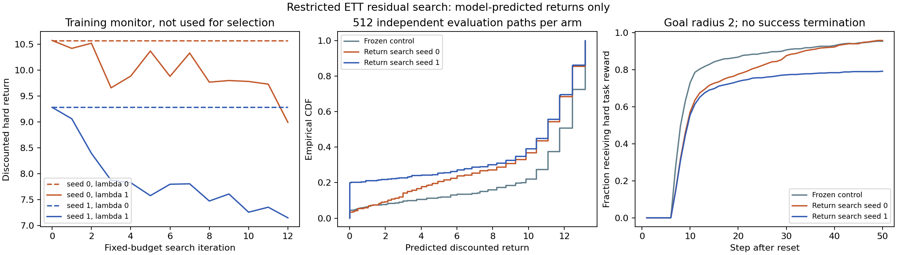
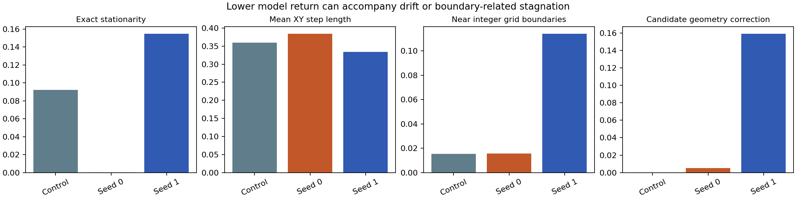
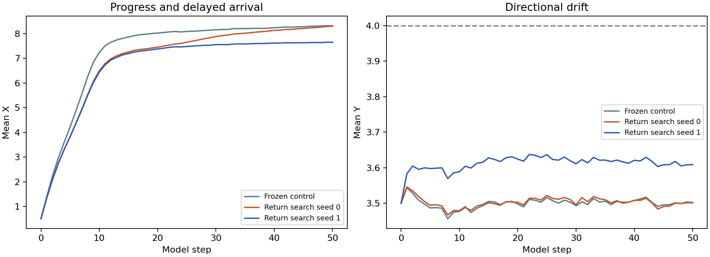
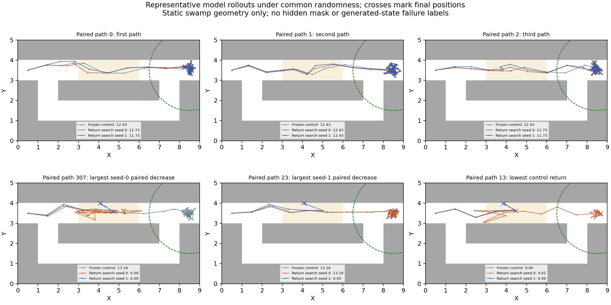

# Bounded PointMaze hard-rollout-return experiment

**Decision: the second term is optimizable inside the model, but stop before joint or alternating actor-critic training.** Independent model returns decrease for both search seeds, while diagonal likelihood stays exactly fixed. The decrease accompanies drift, boundary-related stagnation and larger departures from observed frozen histories. It does not establish a physically valid counterfactual kernel or a worst-case Q function.

## Prior evidence and exact task contract

Branch HEAD at the start was `8eaee1370e1abeb1bf3df52ee693aca21221b93c`. The critic-continuation report covering commits `e670a33`, `6947186`, and `089f083` was read: the raw score is inverted on tight authentic dead/alive matches. That diagnostic was not repeated, and no critic or failure scorer was used. The preceding MMD and nearest-set reports were also read; the former improved dispersion rather than failure proximity, and the latter retained drift/collapse problems.

Task: `point_two_route_swamp_windy_f4_v0`, per-cell activation probability 0.30. The actual rollout horizon is 50, and the frozen actor training log confirms discount 0.95 (the generic config default of 0.99 is not used). The commanded goal is `(8.5,3.5)` tiled four times; reset is `(0.5,3.5)` tiled four times. State is newest-first F4, width 8; both actions have width 2 in [-1,1]. Both nominal and actor receive state plus the commanded goal, unchanged throughout every rollout.

The environment gives **one reward each step with newest-XY distance strictly below 2.0**, unless dead. It does not terminate on success or death; the caller stops after 50 transitions. The commonly reported reached@0.5 metric is only supplementary and is not the optimized reward. All absorbing deaths are located in swamp cells x in [3,6), y in [3,4), at least 2.5 units from this fixed goal. Thus the hidden death gate cannot change the mathematical position reward on reachable real states in this task. The rollout function explicitly rejects other goals. This position reward is not generalized to other tasks or arbitrary hidden-state assignments. Generated states need not be physically realizable.

**Finite-precision qualification:** the environment uses a float64 internal position and exposes float32 observations. Universal bit-exact reward reconstruction from those observations is therefore impossible at the strict radius boundary: internal x=6.5000001, y=3.5 is rewarded, but is observed as x=6.5, whose position indicator is zero. The model objective uses the strict radius-2 predicate on its emitted float32 state with float32 arithmetic; this is the stated numerical convention, not distance shaping. The 1,600 actual rollout rewards checked below agree, but do not establish equality for all boundary states. Post-run precision checks found 0 reward differences when evaluating the same saved model positions in float64, across all reset and continuation arms. The deterministic counterexamples and saved-sample checks are in `reward_precision_audit.json`; the training objective was not changed.

At each step, draw a fresh x_prime from the frozen goal-conditioned nominal, independently draw the agent action x, then sample T(s_next | s,x,x_prime,g). Every trajectory gets fresh policy and transition randomness; the goal stays fixed. Agent trajectory files store only x in `action`; x_prime and anchor diagnostics are in separate auxiliary files. There is no hindsight goal relabeling, hidden reward input, death label, bank target or new reward shaping.

## Preserved inputs and initial signal check

Dataset SHA-256: `83b4e81d9fca2d66b648c9c34ccdb68196e1acf89e2ca6829e4cb198d27c322c`. The unchanged expert-positive episode split has 4,321 training and 479 validation episodes (216,050 / 23,950 transitions). The source population is teacher-generated and is not uniformly optimal. The actor was originally fitted using all source episodes, so this is not actor-heldout evaluation. The policy loader still verifies source provenance; teacher modes never become rewards or model inputs.

Initialization: `ett_distribution_matching/f4_p30_s01_guarded/s0_L0p25_lambda0/final.pkl`. Its residual output head is exactly zero. The same frozen nominal K5 checkpoint and alpha-0 seed-0 actor are reused. Exact files and SHA-256 hashes are in `config.json`. The old MMD checkpoint is a preflight reference only; all search and control arms start from the identical diagonal-only checkpoint. No existing artifact was changed.

Preflight completed 256 reset-to-horizon model paths each for control and old MMD, with shared keys 410001/410002. Control return mean/std: 9.96875/4.10939; nonzero fraction 94.53%. Old MMD mean: 8.80386. The predefined gate (>=5% nonzero and std>0.01) passed before any parameter search. Zero return was not treated as a worst-case discovery.

A separate 32-episode real-environment check with the same frozen actor returned mean 3.36228, nonzero fraction 34.38%. All 1,600 reported environment rewards exactly matched visible reconstruction, without reading audit fields. This small real sample is supplementary and has different randomness; no ETT update changes the real actor here. The large model/environment gap remains unresolved. At zero residual the modeled next-state law follows its diagonal anchor conditioned on x_prime and has no dependence on x; this is a material off-diagonal baseline limitation.

## Exactly two losses, restricted optimization

`L_ETT = L_diag + lambda * mean(sum_{t=0}^{49} 0.95^t r_g(s_{t+1}))`, minimized. The sign is positive: reducing predicted task return is the pessimistic direction. The diagonal likelihood is the existing zero-displacement-atom plus continuous XY-density NLL, in nats per raw maze-unit 2D transition. There is no third loss, regularizer, weight decay, critic substitution, smooth reward or Lipschitz loss.

**The diagonal backbone is frozen, so L_diag is constant:** training NLL -5.69614553; held-out NLL -5.79925632. This experiment verifies the second term in a restricted family; it is not joint two-loss training. Only six existing residual-head coordinates move: both output biases and both output weights at hidden-unit rows 0 and 32. The residual torso, all other head weights, nominal, actor and diagonal parameters remain fixed.

Two optimizer seeds each have lambda=0 and lambda=1 arms. Every arm executes 12 iterations, four independent N(0,I6) directions per iteration, sigma=0.2, and 16 complete paths at each plus/minus point. The same full-trajectory random keys are used within each plus/minus pair and between matched lambda arms. The estimate is `lambda * mean((J_plus-J_minus)*epsilon/(2*sigma))`; SGD subtracts 0.1 times it, with parameter-update L2 capped at 0.2. This step cap is an optimizer setting, not a loss. Each arm uses 1,536 parameter-query trajectories plus 208 fixed-monitor trajectories. Final iteration is evaluated; monitoring never selects a checkpoint or changes the fixed budget.

The estimator includes complete resampling of mixture choices, atoms, state-dependent action distributions, hard reward and geometry decisions. It estimates the derivative of a Gaussian-smoothed expected return in the six-dimensional parameter space, not the exact unsmoothed objective gradient. No ordinary pathwise gradient through a hard indicator or discrete draw is assumed. All estimated gradients were finite. Lambda=0 controls receive zero search gradient and remain exactly initialized, while spending the same sampling budget.

The existing L=0.25 anchored action-change bound, exact x=x_prime anchor branch, tanh residual, one-unit per-axis cap, endpoint projection and bound fallback are retained. They limit final displacement relative to the sampled diagonal anchor and ensure exact old-frame shift. They are not full physics validity, state-dependent absorbing-state guarantees, or all-pairs action Lipschitzness.

## Independent model evaluation

Four unused evaluation seeds (710001..710004), 128 complete paths each, give 512 paths per arm. They are independent of optimization directions, parameter-query draws, monitoring, and preflight. Control/treatment paths are paired by their random keys. All contexts are the same deterministic reset, so the bootstrap unit is an independent simulated path, not a source episode.

- s0_lambda0: mean return 10.54357; nonzero 95.51%; rewarded steps 38.05; held-out diagonal NLL -5.79925632.
- s0_lambda1: mean return 9.33275; nonzero 96.48%; rewarded steps 35.49; held-out diagonal NLL -5.79925632.
- s1_lambda1: mean return 8.60536; nonzero 79.88%; rewarded steps 31.64; held-out diagonal NLL -5.79925632.
- s0, lambda1 minus lambda0: -1.21081, paired model-path 95% interval [-1.54212, -0.90594].
- s1, lambda1 minus lambda0: -1.93821, paired model-path 95% interval [-2.33446, -1.56968].

Both search seeds lower return on every evaluation-seed group. These intervals cover model Monte Carlo variation only; they do not validate physical outcomes, hidden-variable identification or worst-case Q. Both lambda=0 controls have identical final parameters and exactly identical evaluation paths under the common keys.



## Behavioral degradation checks

- s0_lambda0: exact stationary steps 9.22%; mean motion 0.3595; first rewarded step among paths that reach 11.03; near-grid-boundary steps 1.54%; candidate geometry corrections 0.00%; last ten steps exactly frozen on 3.71% of paths.
- s0_lambda1: exact stationary steps 0.02%; mean motion 0.3844; first rewarded step among paths that reach 13.89; near-grid-boundary steps 1.55%; candidate geometry corrections 0.51%; last ten steps exactly frozen on 0.00% of paths.
- s1_lambda1: exact stationary steps 15.48%; mean motion 0.3343; first rewarded step among paths that reach 11.04; near-grid-boundary steps 11.41%; candidate geometry corrections 15.93%; last ten steps exactly frozen on 14.84% of paths.

Seed 0 mainly delays reward while increasing motion and leftward drift; its nonzero-return fraction actually increases. Seed 1 reduces the fraction reaching reward and increases boundary-related stagnation and projection use. Its 11.41% near-grid-boundary rate is a coordinate diagnostic, not an exact wall-contact label. Trajectory diversity does not collapse uniformly: the within-context trajectory XY spread rises from 1.052 to 1.436/1.611, but this includes divergence between successful and stalled paths and is not a quality score.

All final rollout samples pass endpoint, coordinate-cap, action-bound, F4-shift and original anchor-bound checks. Sampled straight segments still intersect blocked geometry on about 0.0234% / 0.0234% / 0.0039% of active reset transitions (control / seed0 / seed1). Axiswise simulator substeps and these approximate projection/segment checks are different; passing them is not proof of full reachability.





The continuation audit reuses 32 distinct-episode observable frozen non-reset starts and 32 moving starts from the previous development contexts. It uses four paths per start, key 720001, and only the remaining original episode steps. No death labels are loaded or inferred from stillness. On frozen-history starts, mean first-step motion rises from 0.0555 to 0.2052/0.2459 maze units. This is renewed arbitrary-motion evidence rather than preserved stationary behavior. The original control itself sometimes escapes those histories and earns positive model return; a frozen diagonal backbone does not solve multi-step model bias.



Examples are the first three paired paths plus explicit return-extreme paths; indices and selection reasons are saved. All reset and continuation trajectories are retained for review, alongside separate observational-action/anchor diagnostics.

## Continue / stop and limits

**Stop before contrastive-agent alternating training.** This result establishes that finite-difference residual search can lower the specified hard model-rollout return without altering diagonal fit. It does not show that the chosen transition is a valid pessimistic outcome. The model/environment return gap, arbitrary motion on frozen histories, and boundary-related stagnation would contaminate actor learning if alternated now. Any follow-up should first test multi-step predictive validity and these trajectory pathologies on independently specified environment comparisons; it should not rerun the rejected raw-critic diagnosis. No joint diagonal/residual optimization or actor-critic alternation was launched.

The six-dimensional family and fixed 12-iteration budget do not exhaust the residual network or guarantee a global minimum. Independent rollout seeds only test model-internal optimization. There is no claim of identifying the true ETT or recovering a strict worst-case value.

## Reproduction and completed checks

Completed: five numerical/contract tests; frozen-model signal preflight and 32 real-environment reference rollouts; four matched-budget restricted-search arms; independent reset and continuation evaluation; saved-checkpoint diagonal NLL and sampling-identity checks. Search and evaluation took 21.5 seconds on ['cpu:0']. Freeze checks include parameter equality for diagonal and nominal, untouched residual torso/unselected head weights, and exact repeated fixed-key actor/nominal outputs. `config.json` hashes all preserved input artifacts. The separate artifact verification reloaded all four checkpoints and exactly reproduced 128 saved full paths from each, including states, actions and rewards. All checkpoints are Git-ignored. Its results are in `verification.json`.

```bash
python -m scripts.test_rollout_return
python -m ett.run_rollout_return --phase preflight --out-dir artifacts/ett_rollout_return/preflight
python -m ett.run_rollout_return --phase search --preflight-dir artifacts/ett_rollout_return/preflight --out-dir artifacts/ett_rollout_return/residual6_s01 --iterations 12 --directions 4 --search-replicates 16 --seeds 0,1
python -m ett.report_rollout_return --run-dir artifacts/ett_rollout_return/residual6_s01 --preflight-dir artifacts/ett_rollout_return/preflight
python -m scripts.check_rollout_return_artifacts --run-dir artifacts/ett_rollout_return/residual6_s01
```

Use fresh output directories to reproduce. Checkpoints `s*_lambda*.pkl` stay local and are ignored by Git. Load one with `ett.anchored_transition.load_anchored`; it retains the existing sampling interface. The preflight driver hash predates removal of an unused local variable; all rollout computations are unchanged. The search run records the final driver hashes and `search_config.json` records the exact search-module hash. Code, configurations and evaluation artifacts are shareable; model checkpoints remain local.

The existing transition sampling interface is preserved. For already-loaded frozen policies and a batch of fixed-goal F4 states:

```python
import jax
from ett.anchored_transition import load_anchored
model = load_anchored("artifacts/ett_rollout_return/residual6_s01/s0_lambda1.pkl")
nominal_key, actor_key, transition_key = jax.random.split(jax.random.PRNGKey(901), 3)
x_prime = nominal.sample(state, nominal_key, 1, goal=goal)  # [B, 2]
x = actor(state, goal, actor_key)  # [B, 2], the execution action
next_states = model.sample(state, x, x_prime, transition_key, num_samples=8, goal=goal)  # [B, 8, 8]
```

Those eight next-state draws condition on the same x and x_prime. `TaskRollout.run` instead draws fresh independent policy actions for each trajectory and step, and returns arrays grouped as `[context, replicate, time, feature]`.
