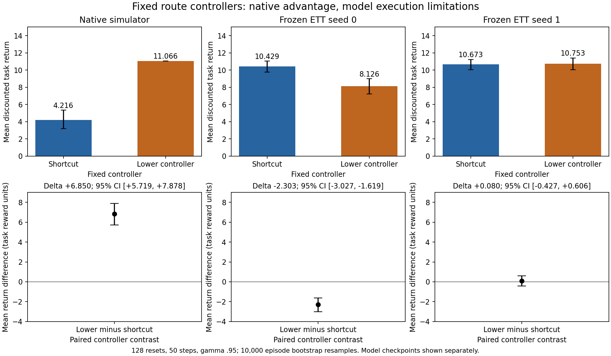
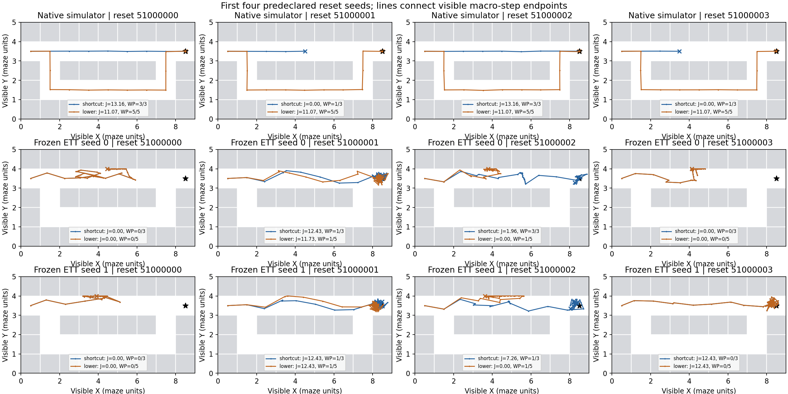

# Does the current frozen ETT model provide a usable preference between the shortcut and the lower detour?

**No usable preference for the intended routes is established.** Native evaluation clearly favors the lower detour. ETT seed 0 confidently favors the shortcut controller; seed 1 is inconclusive. Crucially, **neither model completes the detour waypoint sequence in any of 128 episodes**. Most detour-controller model rollouts instead cross the shortcut. This is an action-response/rollout-validity limitation, so the model returns cannot be interpreted as a clean comparison of successfully executed routes.

## Return comparison

Returns are accumulated task rewards, `sum(t=0..49) .95^t r_(t+1)`. Delta is lower-controller minus shortcut-controller mean return. Each line is a separate environment/checkpoint with 128 paired episodes:

- **Native:** shortcut **4.216254**, lower **11.066089**; **Delta +6.849835**, 95% CI **[+5.718645, +7.878190]**.
- **ETT seed 0:** shortcut **10.429277**, lower **8.125968**; **Delta -2.303309**, 95% CI **[-3.026814, -1.618788]**.
- **ETT seed 1:** shortcut **10.672793**, lower **10.752929**; **Delta +0.080136**, 95% CI **[-0.426776, +0.606470]**.

Intervals use 10,000 percentile bootstraps of paired episode differences, with bootstrap seed 53000000. Steps are never resampled as independent units. Intervals condition on each frozen checkpoint and have no multiplicity adjustment; the two checkpoints are not pooled as independent episode replicates. Seed 0's controller ranking disagrees with native evaluation, but failed route execution prevents attributing this specifically to a reward-ranking error along the intended detour. Seed 1 supplies no clear controller preference.

All native detour episodes return 11.066089. Successful shortcut episodes return 13.162938, while its 87 failures return zero. Thus the detour's **expected discounted-return advantage is empirical**, not an assumption that its successful path is faster or individually more rewarding. The 41 successful shortcut pairs favor the shortcut; the other 87 favor the detour. A degenerate empirical interval for the detour mean does not prove zero population variation.

Model-minus-native return gaps, ordered shortcut / lower-controller:

- ETT seed 0: **+6.213024 / -2.940120**.
- ETT seed 1: **+6.456539 / -0.313160**.

The small seed-1 lower-controller mean gap does not imply valid detour prediction: its generated paths mostly use the shortcut. Gap intervals and all full-precision numbers are in [results.json](results.json).

## Route execution and success

Success is minimum XY distance **<0.5**, distinct from the task reward's **<2** radius. Native success uses actual simulator XY; visible-float32 success agrees on every evaluated episode. Passage adherence was defined before rollout: visit central X cells 2, 3, 4, 5, 6 in order while staying in the designated Y band, `[3,4)` for shortcut or `[1,2)` for lower. This requires crossing the passage, not merely dipping below Y=2. It measures visible macro-step traversal, not full waypoint completion or substep reachability. All counts below have denominator 128.

- **Native shortcut:** success 41 (32.031%); shortcut passage 41 (32.031%); all waypoints 41 (32.031%). Lower-passage traversal 0. Confirmed native failures: **87 (67.969%)**.
- **Native lower:** success, lower passage and all waypoints each 128 (**100%**); shortcut passage 0. Confirmed native failures: **0**.
- **ETT 0 shortcut:** success 122 (95.313%); shortcut passage 115 (89.844%); all waypoints 34 (26.563%). Lower-passage traversal 7 (5.469%).
- **ETT 0 lower:** success 98 (76.563%); lower passage 7 (5.469%); all waypoints **0**. Shortcut passage 98 (76.563%).
- **ETT 1 shortcut:** success 126 (98.438%); shortcut passage 119 (92.969%); all waypoints 37 (28.906%). Lower-passage traversal 8 (6.250%).
- **ETT 1 lower:** success 118 (92.188%); lower passage 6 (4.688%); all waypoints **0**. Shortcut passage 117 (91.406%).

Waypoint completion counts in specified sequence order are native shortcut `[128,41,41]`, native lower `[128,128,128,128,128]`, ETT 0 shortcut `[105,34,34]`, ETT 0 lower `[105,2,0,0,0]`, ETT 1 shortcut `[94,37,37]`, and ETT 1 lower `[94,2,0,0,0]`.

Native shortcut noncompletion is explained by confirmed absorption; the lower controller executes normally. Model noncompletion is visible failure to follow the commanded sequence: only two episodes per checkpoint reach the lower-left waypoint in sequence, and none reaches the lower-right waypoint in sequence. Under the descent target, 4,919/5,048 and 4,400/4,510 model steps are already right of the fork (X>=2), despite actions still targeting (1.5,1.5). Some episodes never complete even the shared first waypoint. The model continues away from its requested targets, and shortcut completion is also poor despite high model success. This establishes an execution limitation without identifying its sole internal cause. No controller was retuned after smoke or main results.

The plotted subset is fixed at resets 51000000..51000003; it was not selected for outcomes. Crosses mark final positions and stars the commanded goal. Overlapping lines are possible. A stationary or nearly stationary model trajectory is **not a confirmed death**.

## Scope and verification

Started on the requested branch at reviewed commit a23991f2b81708d1df36a00e71846d3fc640da4e, with no later commits or existing tracked-source changes. Both exact frozen adversarial checkpoints, nominal policy, guarded diagonal sampler, normalization, L=1 and geometry were verified against the future-window manifest and remained unchanged. The native p=.3 task, goal, horizon, action noise, collisions, reward and absorption were preserved.

Used 128 fresh resets 51000000..51000127, with identical initial visible observations. Native reset RNGs are paired until branch-dependent draw consumption diverges; model nominal/transition keys are paired across controllers, independently of native hidden randomness. The identical visible-XY controller implements the prescribed waypoint sequences and exact .25 advancement threshold. No actor or critic was loaded, and no model or learner was updated.

All recorded actions, progress, rewards, returns, goals, history shifts and endpoint constraints passed independent checks. First-four replay is exact for all six combinations. Three focused tests pass; frozen hashes and normalization signatures match. Total work was **40,200 transitions: 38,400 main, 600 smoke, 1,200 replay**, with no retries or budget expansion. Model projection rates increased under the lower controller; these and stationary-atom diagnostics are reported without interpreting them as hidden deaths.

See [METHODS.md](METHODS.md) for exact hashes, coupling, geometry diagnostics, file descriptions and reproducible commands. [Configuration](config.json), [provenance](provenance.json), [verification](verification.json), [per-episode results](episodes.csv), [paired differences](paired_differences.csv) and [model diagnostics](model_diagnostics.json) retain the complete numerical record. Privileged native labels remain in explicitly named evaluation-only files.

This diagnostic evaluates these existing frozen models, not the best member of the ETT function class or optimization objective. It does not identify the second ETT loss as the sole cause, or show that the learner merely failed to exploit a valid detour preference. No L change, failure scorer, alpha tuning, actor/critic/model update, alternating optimization or sweep was performed.

**Next step:** investigate the frozen model's response to the descent action at the fork, using these recorded failed-route trajectories, before attempting further policy training.
