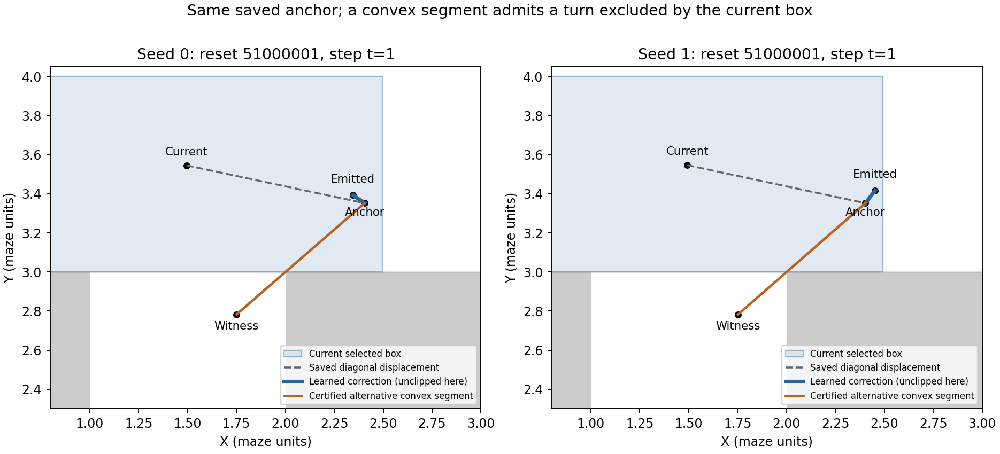

# Fork audit: an unnecessary geometry restriction and a separate learned response

**Both implementation and parameters matter, but their contributions to full-route failure are not identifiable from these saved paths alone.** The upper box forbids crossing below Y=3 at **119/122** seed-0 and **100/103** seed-1 fork/descent steps, regardless of the 32 coefficients. Yet it blocked **zero actual descent-entry proposals**: current parameters almost always add an upward Y correction. Downward motion within the top corridor is already expressible by the existing class at every recorded fork step. The stated diagonal and L=1 assumptions do **not** generally require this particular box restriction; explicit full-domain Lipschitz witnesses admit excluded turns.

Starting commit: **`9b8bacaa3f8a83f063fa776271244a9562a17919`**, on `feature/pointmaze-causal-transition`, exactly the requested commit. Read its route report, methods, configuration, arrays and the prior convex adversarial specification, implementation and report. Existing code, checkpoints and experiments are unchanged. This audit uses **zero new trajectories, sampler calls or training steps**.

## What the saved traces establish

The subset is pre-action XY in `1<=X<2, 3<=Y<4`, with active waypoint index 1, the lower-left target. We independently reconstruct waypoint progression and actions, then the matrix, anchor-relative correction, proposal, rectangle selection, clipping and emitted F4. There are **122 steps from 105 episodes** in seed 0 and **103 steps from 94 episodes** in seed 1. These are descriptive counts, not independent step replicates for inference.

- **Seed 0:** upper/vertical rectangles **119/3**. Mean anchor displacement **(+.82037, -.00788)**; learned correction **(-.04018, +.05683)**; emitted displacement **(+.78018, +.04750)**. Correction Y is positive on **121/122** steps. Only **44/122** proposals move downward relative to the current position; the same 44 emitted positions do. Three proposals enter Y<3 and all three survive clipping.
- **Seed 1:** upper/vertical rectangles **100/3**. Mean anchor displacement **(+.83962, +.00774)**; learned correction **(+.04427, +.06114)**; emitted displacement **(+.86029, +.06747)**. Correction Y is positive on **101/103** steps. **30/103** proposals move downward; the same 30 emitted positions do. Three proposals enter Y<3 and all survive clipping.

Execution Y action is -1 throughout this subset, while mean nominal actions are approximately **(+.83082,-.01192)** and **(+.85314,-.00051)**. The anchor predominantly moves right, and the current correction generally does not redirect it toward the requested branch. Seed 1 has one lower-bound clipping event that raises Y slightly, but it remains below 3; it is a step-limit correction, not suppressed branch entry. Thus removing clipping from the recorded proposals would not reveal a hidden set of attempted turns.

These statements concern response relative to the controller request. They do not impose “down action must move down” as a true off-diagonal label, or establish failed pessimistic optimization. The earlier objective optimized a different frozen actor and is not required to reproduce native expected-return rankings.

Full trace decompositions are in [fork_traces.json](fork_traces.json), scalar capacities in [fork_capacity.csv](fork_capacity.csv), and means/counts in [trace_summary.json](trace_summary.json). [Selected examples](TRACE_EXAMPLES.md) use the first reset/time in each named mechanistic category; absent clipping-suppression examples remain explicitly absent.

## What any coefficients could do

For a fixed recorded anchor A, selected box C and action difference d=x-x', the exact attainable output set is **C intersect Ball(A,||d||)**. Every point in it is attained by an admissible rank-one matrix with all eight blocks equal. Hence the exact minimum Y is **max(C_low,Y, A_Y-||d||)**. This is not a sampled-grid estimate.

The existing class can move downward relative to current Y at all **122/103** contexts, but can enter Y<3 at only **3/3**. A single shared coefficient choice, all blocks `diag(0,1)`, demonstrates those counts without fitting or rolling out. Current parameters omit a feasible downward response at **78/73** steps. All six fixed contexts where descent entry is feasible already emit it.

There are also shared-gate, affine-response and Frobenius-versus-operator restrictions. Their existence is provable, but they do not tighten the exact single-query radius bound. We have not shown that independently optimal responses can be simultaneously implemented by one shared coefficient array, or that any coefficient choice can or cannot complete the full detour. Later contexts and anchors would change under different coefficients.

## Is the extra geometry restriction necessary?

**No.** Keep the same recorded anchor and L=1, and use a fixed, free, anchor-containing convex segment that crosses the fork. Projection onto this segment preserves the same nonexpansiveness proof and exact diagonal law; the execution action can continuously choose an upper or lower output within that one set. Existing rank-one matrix blocks suffice for the displayed examples.

We certify excluded responses at **119/99** upper-box contexts under the existing rounded step envelope. **115/91** also satisfy a literal real-arithmetic unit step limit: twelve saved anchors already exceed that strict limit by 1.19e-7 from float32 addition. That failed strict check is preserved, not silently relaxed. One other seed-1 context is truly radius-limited: its anchor Y minus action-distance radius is **3.01149**, so no admissible one-step response can enter below 3 there. Some certified entries are shallow; none establishes a full route.

Merely preferring the left rectangle among the existing four would change availability at only **11/7** upper-selected anchors that also lie in the vertical rectangle (one of those is radius-limited). The other **108/93** upper-selected anchors lie outside it. A fixed box swap cannot handle those while preserving their anchors.

[DERIVATIONS.md](DERIVATIONS.md) proves the current bound and the witnesses, separates endpoint-ball feasibility from full-function feasibility using intrinsic path length, and gives counterexamples to nonconvex nearest projection and unproved action-dependent switching. It also documents the strict-step precision failure. The proof is primary; finite arithmetic/grid checks only validate the examples' implementation.

## One recommended implementation step

**Add an isolated optional convex-set emitter at the fork, starting with certified anchor-containing segments spanning the upper/vertical junction, while retaining the original rectangle emitter as an available member.** Keep the existing signed matrix response, Frobenius normalization, L=1, frozen anchor law and two-term objective. Choose the set using fixed visible conditioning, anchor and model parameters, **never the evaluated execution action**. Project the action-dependent proposal onto that one set. Its all-action-pairs guarantee follows from the same proof; this removes a demonstrated restriction without requiring nonconvex projection or a new loss.

Segment endpoints must be selected from known free geometry and the declared step envelope independently of the live execution action and waypoint label. The witness matrices/endpoints are existence certificates, not training targets. The pessimistic search must remain free to choose response sign and whether to use the new member. Geometry alone supports endpoint feasibility; native kinematic correctness, absorption and useful multi-step behavior would require additional explicit physical assumptions or appropriate visible action-coverage evidence. Off-diagonal causal responses remain unidentified. No production replacement or fitting was performed here.

Reproduce the saved-data analysis and component checks using [REPRODUCE.md](REPRODUCE.md). Input hashes and verification results are recorded beside the report.

**Next step:** implement and review that optional convex-set geometry interface with diagonal and all-action-pairs component tests, before any ETT or policy training.
