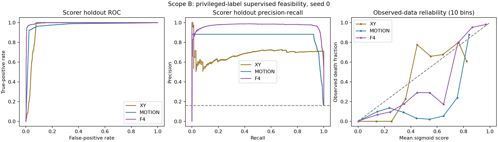
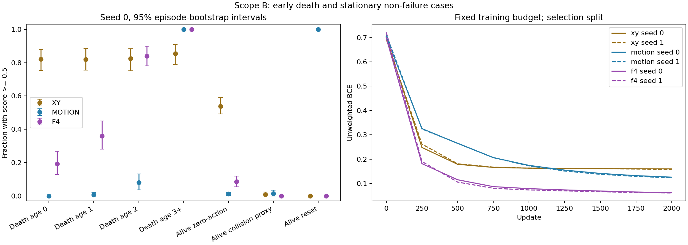
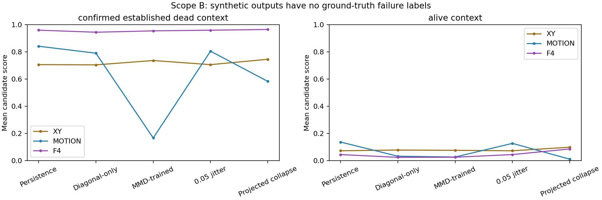
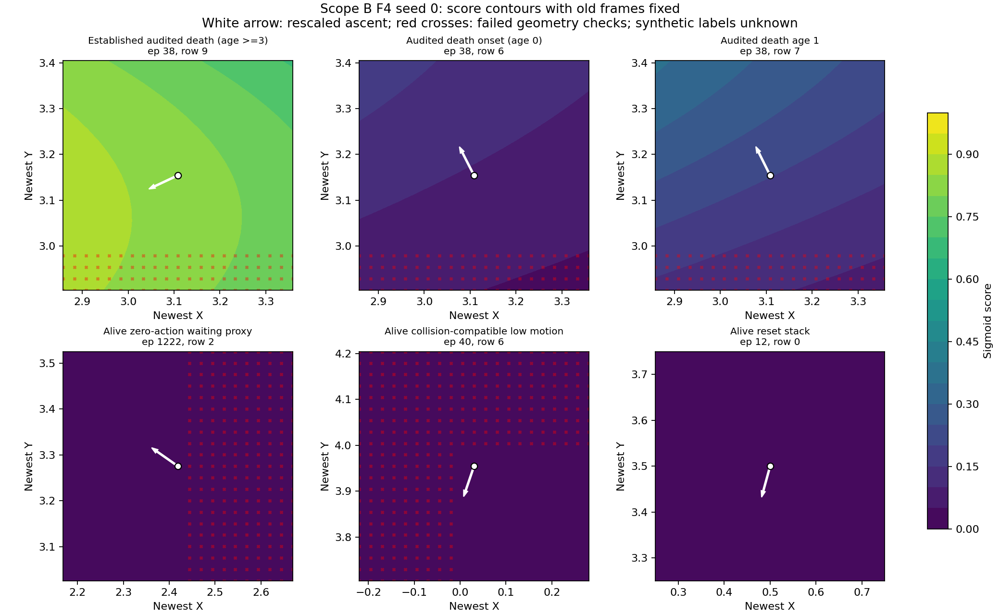
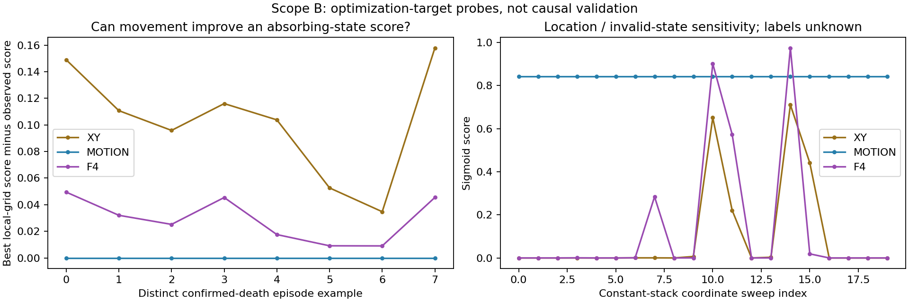

# Scope-B PointMaze failure-scoring feasibility

**Decision B + D: useful for established observed failures, insufficient as a justified one-step failure objective; supervision is privileged.**

This is a supervised feasibility probe, not an offline-compatible failure reward, diagonal/off-diagonal discriminator, counterfactual validator, or worst-case value function. No ETT, actor or critic was updated. The fixed scorer comparisons and synthetic audits below do not validate optimizing a transition model against these scores.

## Label and environment audit

Environment `point_two_route_swamp_windy_f4_v0`, per-cell active probability 0.30, 6,600 episodes of 50 transitions. Dataset SHA-256 `83b4e81d9fca2d66b648c9c34ccdb68196e1acf89e2ca6829e4cb198d27c322c`. The authoritative guarded distribution run and objective diagnostic at branch commit `71a7219` were reused; no newer remote commit existed at task start.

The label is **dead when the scored observation is seen**, reconstructed from the existing `entered_active_swamp` per-episode audit flag, the pre-action `swamp_bits`, and the next landed cell. The environment moves, checks the current mask, sets its absorbing death flag, then redraws the mask; the F4 wrapper pushes newest XY after physics. Fatal transition row d-1 is alive; observation d has death age 0. The previous observability reconstruction and existing ETT audit agree exactly. Death labels are never inferred from stillness. The early ages 0/1/2 retain old motion; an equal four-frame history forms at age 3 in observed death episodes.

Scorer rows follow the established valid-transition view: observations t=0..49, excluding the terminal observation/dummy action row. Death at the last transition can therefore be recorded at episode level without a positive scorer row; this is explicit horizon censoring.

Death is absorbing with ignored actions and zero reward until the fixed horizon; `done` is not a death indicator. Reset repeats an alive position. Zero recorded action is a waiting/holding proxy, not a death label; action noise can still move it. The collision stratum is alive, action norm >0.05 and observed next-motion norm <=0.05. No collision flag or physics-noise trace was recorded, so these are collision-compatible examples, not confirmed collisions. Exact collision-specific performance remains unmeasured. Actions and future motion are used only for audit strata, not model inputs.

Uniform coverage [0,1200), teacher/expert-positive source [1200,6000), and appended blind demonstrator [6000,6600) are source memberships, not death/non-death or quality labels. Contrastive positive/negative labels express the earlier contrastive sampling task, not simulator survival. Non-success and absence from a failure bank supply no binary death target. The bank stores 233 retained training references from three sources; its original curated mixture used privileged teacher modes and swamp masks, with death cross-checks. Its stored F4 states alone do not provide reliable alive labels or onset timing. Only scope B has reliable binary targets under the present files: the collector explicitly designates these audit fields unavailable to learner training.

## Population, independent scorer partitions and reuse

All three existing source populations are included for this supervised diagnostic. This expands the earlier expert-only observability probe, adds a motion-only ablation, separates selection from scorer test, and tests the frozen scores on generated/controlled observations. The established seed-0 full-source 10% holdout becomes scorer test; its complement is split 90/10 using seed 9201 into scorer training and selection. Every complete episode stays in one partition; byte-identical complete observed trajectories crossing partitions are rejected.

- train: 5,346 episodes / 267,300 transitions; current-death prevalence 16.73%; 1186 observed death episodes; 209 retained-bank episode overlaps; 0 prior objective-development episode overlaps.
- selection: 594 episodes / 29,700 transitions; current-death prevalence 16.19%; 125 observed death episodes; 24 retained-bank episode overlaps; 0 prior objective-development episode overlaps.
- test: 660 episodes / 33,000 transitions; current-death prevalence 16.17%; 140 observed death episodes; 0 retained-bank episode overlaps; 427 prior objective-development episode overlaps.

Test is independent of this scorer fitting/selection only. The actor already used every source episode; the expert holdout was previous observability checkpoint-selection data. The old 1,024 diagnostic contexts from 427 test episodes are development data and are explicitly separated from the other test episodes in metrics. A new partition does not erase upstream reuse. All scorer-test episodes are absent from the retained training bank; exact vector membership is also tested separately. Bank references are not supervised targets or model inputs.

## Inputs and fixed training budget

Three 64/64 SiLU MLPs use (1) current XY; (2) six successive newest-first displacements `[p0-p1,p1-p2,p2-p3]`; (3) all eight F4 coordinates. Each retains the same commanded-goal block, which is constant and normalizes to zero. No action, future observation, reward, hidden field, episode ID, source code or death age enters any scorer. The motion ablation deliberately removes location; this is not an assumption that actual failure hazards are translation invariant.

All models use train-only normalization, unweighted BCE, uniform transition minibatches of 1,024, Adam 3e-4, 2,000 updates and seeds 0/1. This leaves the natural observed class prior unchanged. The lowest selection BCE at 250-update intervals selects each checkpoint. Test scores and synthetic audits never select a checkpoint, threshold or hyperparameter; threshold 0.5 is fixed. Raw sigmoid outputs are uncalibrated scores; observed-prevalence reliability/Brier diagnostics are reported, without post-hoc calibration or a claim of calibrated deployment probabilities.

## Observed scorer-test results

- xy_s0: ROC-AUC 0.95765; average precision 0.68071; Brier 0.05363; BCE 0.15892; precision/recall 70.19%/85.15%; ECE 0.03661.
- xy_s1: ROC-AUC 0.96008; average precision 0.70381; Brier 0.05233; BCE 0.15541; precision/recall 72.43%/87.91%; ECE 0.02896.
- motion_s0: ROC-AUC 0.97252; average precision 0.85861; Brier 0.03238; BCE 0.13170; precision/recall 86.18%/92.43%; ECE 0.01505.
- motion_s1: ROC-AUC 0.97340; average precision 0.86050; Brier 0.03171; BCE 0.12946; precision/recall 86.57%/92.43%; ECE 0.01489.
- f4_s0: ROC-AUC 0.99597; average precision 0.96545; Brier 0.01370; BCE 0.05521; precision/recall 94.16%/95.80%; ECE 0.01055.
- f4_s1: ROC-AUC 0.99611; average precision 0.96850; Brier 0.01349; BCE 0.05457; precision/recall 94.63%/95.71%; ECE 0.00963.

The full-F4 gain is meaningful overall, but not uniform across strata. For seed 0, the paired episode-bootstrap F4-minus-XY ROC-AUC interval is [0.03512469587538303, 0.042227865804118137]; F4-minus-motion is [0.020497104832917203, 0.02675348646153905]. The following distinctions prevent the aggregate gain from being interpreted as reliable onset recognition:

- XY is mainly a location detector: within the swamp corridor its ROC-AUC is 0.4355, despite the high overall AUC. It marks 53.91% of alive zero-action rows positive.
- Motion-only marks all 660 alive reset stacks positive, and the single alive equal stack after reset. It cannot distinguish these from established dead stacks using motion alone. F4 marks these rows negative by also using location.
- Inside the swamp corridor, motion-only AUC/AP 0.9757/0.9924 exceed F4 0.9637/0.9758; F4 is not uniformly better.
- For onset versus alive, F4 AUC/AP are 0.9401/0.0570. Its paired onset AUC is lower than XY, whose apparent early recall comes with many location-related false positives. Later immobility accounts for most of the strong overall death discrimination.

Late-window censoring is preserved: test contains 140 age-0, 139 age-1 and 137 age-2 observations. Episodes ending before a later age do not acquire invented rows or labels. The single alive equal stack after reset is a one-episode stratum and cannot establish general stationary-alive performance. The safe-route stratum has 1,099 rows from 88 episodes and no death positives; specificity there is not a death-recognition test.

Source strata have different prevalences. Seed-0 F4 AP is 0.9780 for uniform coverage, 0.9445 for teacher source, and 0.9990 for blind demonstrator. These source strata were represented during scorer fitting; this is unseen-episode generalization, not unseen-policy or unseen-region transfer. All 5,335 dead test rows are from episodes absent from the retained bank; their metrics are separately stored. Outside prior objective-development episodes there are 233 test episodes, still seen by the original actor. The older expert-only probe used 4,000 updates and a different population; its numbers are not a matched-budget control for this experiment.



Seed-0 F4 performance by difficult stratum (positive-prediction rate means recall on dead-only rows and false-positive rate on alive-only rows):

- dead_age_0_first_observation: 140 rows / 140 episodes; score >=0.5 rate 19.29% (95% episode interval [12.86%, 26.80%]); mean score 0.2290.
- dead_age_1: 139 rows / 139 episodes; score >=0.5 rate 35.97% (95% episode interval [28.06%, 44.98%]); mean score 0.4445.
- dead_age_2: 137 rows / 137 episodes; score >=0.5 rate 83.94% (95% episode interval [78.10%, 89.78%]); mean score 0.7718.
- dead_established_age_ge_3: 4,919 rows / 136 episodes; score >=0.5 rate 100.00% (95% episode interval [100.00%, 100.00%]); mean score 0.9386.
- alive_zero_recorded_action_waiting: 499 rows / 273 episodes; score >=0.5 rate 8.62% (95% episode interval [5.60%, 11.95%]); mean score 0.1231.
- alive_nonzero_action_near_stationary_collision_compatible: 215 rows / 132 episodes; score >=0.5 rate 0.00% (95% episode interval [0.00%, 0.00%]); mean score 0.0044.
- alive_reset_seeded_equal_stack: 660 rows / 660 episodes; score >=0.5 rate 0.00% (95% episode interval [0.00%, 0.00%]); mean score 0.0007.
- alive_equal_stack_after_reset: 1 rows / 1 episodes; score >=0.5 rate 0.00% (95% episode interval [0.00%, 0.00%]); mean score 0.0001.
- alive_moving_history: 27,004 rows / 660 episodes; score >=0.5 rate 1.17% (95% episode interval [1.00%, 1.37%]); mean score 0.0199.

Single-class strata have undefined ROC-AUC/AP, explicitly stored as null. `onset_vs_alive` and `early_vs_alive` supply two-class comparisons; spatial, source, bank-membership, and prior-development reuse strata are all saved, including empty strata. Mean scores and threshold rates have 500-replicate episode-bootstrap intervals. F4-minus-XY and F4-minus-motion ROC-AUC/AP/Brier comparisons use 200 paired complete-episode bootstrap replicates, separately for all rows, swamp, onset-versus-alive and early-versus-alive. These intervals condition on the fitted model and source distribution, and do not create upstream-independent evidence.



## Frozen-score optimization-target audit

Both scorer seeds evaluate the saved seed-0 diagonal-only and MMD-trained K=16 outputs at the exact 1,024 prior contexts. Their original actor and nominal draws are preserved by reading the saved samples. Synthetic outputs have no ground-truth failure labels. Context death labels are aligned from audit records and apply to the source context only. Persistence, cardinal 0.01/0.05 perturbations, symmetric 0.05 jitter and raw/projected history-nearest collapse exactly follow the prior diagnostic constructions. All old frames are preserved. Endpoint, per-coordinate cap, sampled segment and original sampled anchor-bound checks are reported separately; a constructed candidate may violate the anchor bound. These checks do not prove physical reachability.

Audit labels independently confirm that the 91 frozen non-reset contexts are established dead states. Seed-0 F4 mean scores for persistence / diagonal-only / MMD-trained / projected collapse are 0.96052 / 0.94526 / 0.95543 / 0.96559. Thus the scorer ranks the MMD-trained outputs above the diagonal-only outputs on average even though their sampled motion is much larger (0.3493 versus 0.0516 maze units). It also rewards moving to the projected reference location over persistence on average. Both model-output sets pass the saved anchor check here; 27.54% of projected-collapse draw/radius pairs fail it. The collapse comparison is therefore structural evidence, not a feasible-improvement claim for every draw.



Gradient examples use the first eight distinct scorer-test episodes in each of six named strata, independent of predicted scores. They perturb the scored observed state itself, retaining its old six coordinates. Geometry is checked relative to the preceding source observation; a matching action-pair anchor is unavailable for these examples and no anchor guarantee is asserted. We report newest-XY derivatives, a projected 0.05 ascent step, and the highest-scoring endpoint/cap/segment-valid candidate in a fixed 21x21 grid extending 0.25 maze units around the observed XY. This is an input sensitivity audit, not a transition-model optimization run.

- xy seed 0, 8 confirmed established-death examples: mean local-grid score gain 0.10259; 8/8 have gain >1e-4; mean maximizing XY displacement 0.3249 maze units.
- motion seed 0, 8 confirmed established-death examples: mean local-grid score gain -0.00000; 0/8 have gain >1e-4; mean maximizing XY displacement 0.0000 maze units.
- f4 seed 0, 8 confirmed established-death examples: mean local-grid score gain 0.02918; 8/8 have gain >1e-4; mean maximizing XY displacement 0.2561 maze units.



The eight displayed established-death examples come from the earliest eligible uniform-coverage episodes, so their counts are qualitative examples, not population estimates. In both scorer seeds, every one gains score by moving within the valid local grid; the mean gain is about 0.029/0.027 and the selected movement about 0.256/0.255 maze units. Even the 0.05 projected gradient step raises mean F4 score by about 0.0065/0.0061. These are actual audited absorbing observations, so the incentive to move their newest coordinate is an optimization-target failure. An available action-bound guarantee was not established for these examples.

Whole-history translations preserve displacement features but may change true hazard exposure. Their score changes are only location sensitivity, not accuracy under label-preserving augmentation. A separate constant-stack coordinate sweep includes wall and out-of-maze points, with unknown failure labels. Approximate F4 support distance uses 12,000 training reference rows and a 99th-percentile threshold from 4,000 rows in disjoint internal training episodes; it is neither a physical validity proof nor a density estimate. Confident scores on unsupported/invalid synthetic observations are reported explicitly. No test or synthetic outcome tunes these settings.

The fixed coordinate sweep does **not** show >0.9 scores on any of its 15 invalid endpoints for either F4 seed. For seed 0 the largest invalid-point score is 0.573. This negative result bounds this particular probe, not all adversarial inputs. Motion-only assigns every constant stack approximately 0.842 regardless of whether it is an alive reset, a swamp failure or invalid geometry. On observed scorer-test rows, 210/33,000 exceed the training-derived support threshold (0.8832); 3 of those 210 receive F4 scores above 0.9 in each seed. They are observed examples with audit labels, whereas the saved synthetic confidence/support results have no automatic truth labels.



**Calibration on observed data does not establish reliability on optimized synthetic states.** Strong recognition of prolonged immobility at hazard locations can coexist with weak failure-onset evidence, false alarms on normal waiting/collision-compatible rows, and exploitable score gradients. A synthetic observation with a higher score is not validated as more failed.

## Decision and one recommended next experiment (not run)

The intended later loss `-E_{x_prime~b, y~T}[C_fail(y)]` was not implemented. The supervised results do not supply reliable offline-compatible labels or justify a one-step pessimistic transition objective. The most defensible use under this dataset is a separately marked audit score for established failures; early post-contact states need distinct treatment. This experiment does not establish fundamental F4 non-identifiability or solve worst-case Q.

Recommended next: preregister a **multi-step observed-outcome feasibility comparison** with horizon 1 versus 4, using the same episode partitions and privileged audit protocol, without ETT or policy optimization. Fix the current scorer and assess the sequence of scores across actual onset trajectories and matched alive waiting/collision-compatible trajectories. Evaluate detection delay, early recall at a selection-chosen false-positive constraint, and source/spatial breakdowns; reserve a separately collected future simulator test set before claiming independent generalization. Existing audit supervision remains explicitly diagnostic. This would test whether allowing observable consequences to accumulate helps outcome assessment, not whether a generated transition is causally correct. No such follow-up was launched.

## Provenance, reproduction and completion

All exact partition/source episode IDs, data/bank/model hashes, input definitions, normalizers, loss histories and budgets are saved in `config.json` and `training.json`; prior files are hash-checked unchanged. Local checkpoints are named `supervised_probe_*` and declare `B_supervised_privileged_label_feasibility_only`, `offline_compatible=false`. They are ignored by Git. Publication of the code, configuration, metrics and evaluation artifacts was separately authorized by the user. Checkpoints remain local and are excluded from publication.

Completed: five independent contract tests, three updates for all three models and both seeds, the fixed 2,000-update comparison, observed stratified/paired/calibration evaluation, frozen synthetic scoring, local gradients and support/geometry audits. Full execution took 98.0 seconds on ['cpu:0']. Unrun/unavailable: true collision labels, an upstream-untouched dataset, off-diagonal counterfactual outcome truth, deployment calibration, ETT loss optimization, A/B/C comparisons and any actor-critic update.

```bash
python -m scripts.test_failure_scoring
python -m ett.run_failure_scoring --out-dir artifacts/failure_scoring/scope_b_three_update --steps 3 --seeds 0,1 --eval-every 1 --numerical-only
python -m ett.run_failure_scoring --out-dir artifacts/failure_scoring/scope_b_f4_p30_s01 --steps 2000 --seeds 0,1 --batch-size 1024 --eval-every 250 --bootstrap-replicates 200
python -m ett.report_failure_scoring --run-dir artifacts/failure_scoring/scope_b_f4_p30_s01
```

Use a fresh output directory when reproducing. The dataset and existing guarded-run dependencies are resolved from the preserved source configuration; a missing dependency fails explicitly rather than being regenerated.

The three-update check preceded addition of the synthetic audit and extra reporting strata; its configuration preserves the earlier driver-source hash. The full run records the final training/audit driver hashes. No probe architecture or training setting was tuned from the smoke result.

```python
import jax.numpy as jnp
from ett.failure_scoring import load_failure_scorer
scorer = load_failure_scorer("artifacts/failure_scoring/scope_b_f4_p30_s01/supervised_probe_f4_s0.pkl")
# Visible newest-first F4 only; the saved constant commanded goal is used.
score = scorer.score(jnp.asarray([[4.0, 3.5] * 4]))  # shape [1]
# Scope B: privileged-supervision diagnostic, not a deployment probability.
```
