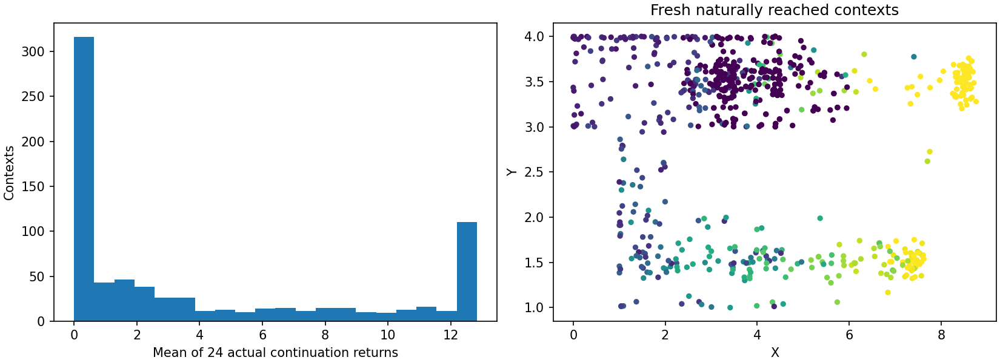
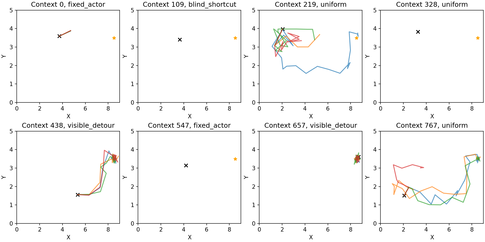

# Independent fixed-actor continuation evaluation

This is a single bounded transfer evaluation. All encoders, actors and readouts remain frozen; no new targets fit any model. The evaluated returns come from the actual native PointMaze simulator, not an ETT rollout.

## Protocol and provenance

The protocol was saved before collecting any new trajectories. The historical default alpha0_seed0 final actor (150,000 updates) was chosen because it was already designated by the distribution-matching/rollout experiments, not because of new returns. It uses the unchanged stochastic tanh-Gaussian sampling helper. Every context has one first action sampled once, scored by all models, then held fixed across 24 continuations. Later actor draws and future environment RNG streams vary. Goal (8.5,3.5), horizon 20 and discount 0.95 are fixed.

All four original contrastive checkpoints (alpha 0/.3, seeds 0/1), five ridge readouts, two raw MLP readouts, normalization and prior predictions were hash-verified. The original readout replay check was run before collection. Feature extraction again verifies phi/psi against the native critic. Alpha is the negative-loss mixture weight; the original failure_bank_f4_r60d40.npz has 256 references. There is no alpha .1 or .5 arm. Exact hashes are in provenance.json.

384 independent reset seeds produce 30-step natural prefixes (96 parents each: historical actor, blind shortcut waypoints, visible detour waypoints, uniform actions). Coverage controllers use visible positions only, with declared speeds/noise/pauses. Candidates at t=4,8,12,16,20,24,28,30 are sampled two per parent using inverse observable-stratum frequencies and 4x outside-goal weight. No scorer, future return, hidden death flag or mask affects selection. Complete F4 histories come from actual environment steps, with no teleportation.

The native environment delegates its 50-step limit to the caller. TimedSimulator stores the external elapsed time and deep-copies the entire native environment, including geometry, all configuration, frame history, persistent absorption, current bits and RNG. Restoring with a new future RNG does not call reset or resample current bits. Bits redraw naturally at each subsequent step; absorption persists. Death is an absorbing zero-reward state with done=False, not an early time-limit truncation. Repeats are conditional on the SAME full snapshot, not hidden-state posterior samples.

Every continuation completes exactly 20 steps without crossing t=50. Actual reward is checked every step against visible fixed-goal reconstruction and against the audited implementation after collection. That equivalence holds only for this goal: lethal positions cannot lie within its radius-2 reward region. Action bounds, fixed first-action execution, F4 shifts and fixed goal are asserted. Tests check exact replay (including RNG), changed future RNG with unchanged persistent initial state, absorbing behavior, horizon boundaries and indexing.

Budget: 11,520 collection steps plus 368,640 continuation steps; at most 2,048 focused-check steps, total cap 382,208. Collection stops at the declared budget regardless of unequal-pair counts. Actual main-run steps: 380,160. Native simulation is used because no reusable vectorized PointMaze simulator was found; actor inference is batched.

## Population and applicability

Mean context return: 4.0146, standard deviation 4.8281. Context-mean zero/max fractions: 40.49%/9.77%. Individual continuation zero/max fractions: 56.87%/14.33%. Full predeclared region, progress, motion, source and support strata are in return_population.json and metrics.json.



Observable support uses the original raw-ridge training normalization, 16,384 fixed training reference rows and 2,048 disjoint calibration rows. 20.83% of new inputs exceed the old calibration 95th-percentile nearest-reference distance (1.0731). Coordinate-range violations, action saturation and F4 motion distributions are reported in support_before_outcomes.json. No support statistic changes selection or fitting. Proximity in visible inputs cannot establish hidden-state or continuation-policy support.

Fresh RNG trajectories were never used to train the original encoder or readouts. They can revisit the same visible states, which is expected in this small maze. The new parent-policy mixture differs from the logged mixture, and continuation always uses the single fixed actor. Transfer errors therefore combine continuation-policy and context-distribution shifts; they do not isolate either mechanism.

## Frozen prediction and ranking results

- alpha0_seed0_ridge: MAE 2.2420, RMSE 3.1550 (95% interval [3.0279562596524094, 3.3382082172493948]), Spearman 0.5610; reliable matched ordering 0.5806451612903226, interval [0.3870967741935484, 0.7419354838709677].
- alpha0_seed1_ridge: MAE 2.4034, RMSE 3.3063 (95% interval [3.1677098887361437, 3.5044794075423873]), Spearman 0.5181; reliable matched ordering 0.5161290322580645, interval [0.3548387096774194, 0.6774193548387096].
- alpha0p3_seed0_ridge: MAE 2.3398, RMSE 3.2452 (95% interval [3.104746634408785, 3.4167886673434817]), Spearman 0.5629; reliable matched ordering 0.6451612903225806, interval [0.4838709677419355, 0.8064516129032258].
- alpha0p3_seed1_ridge: MAE 2.3357, RMSE 3.2227 (95% interval [3.0942958522574333, 3.405161108904108]), Spearman 0.5676; reliable matched ordering 0.6129032258064516, interval [0.45161290322580644, 0.7741935483870968].
- raw_input_ridge: MAE 3.3691, RMSE 3.9550 (95% interval [3.8128246899194216, 4.146387124826484]), Spearman 0.3662; reliable matched ordering 0.7419354838709677, interval [0.5806451612903226, 0.9032258064516129].
- raw_mlp_s110: MAE 2.2058, RMSE 3.0453 (95% interval [2.91219900676445, 3.2371937357531726]), Spearman 0.5426; reliable matched ordering 0.5483870967741935, interval [0.3870967741935484, 0.7096774193548387].
- raw_mlp_s111: MAE 2.3228, RMSE 3.0843 (95% interval [2.952068863807287, 3.264942862806317]), Spearman 0.5155; reliable matched ordering 0.5483870967741935, interval [0.3870967741935484, 0.7096774193548387].

Original training-mean baseline RMSE: 6.2313. Raw scalar logits are ranking-only, with null MAE/RMSE; no calibration or clipping is introduced. All raw-scalar, unmatched ordering and conditional results are in metrics.json.


Matching is fixed before outcomes: exact source, goal and XY cell, XY distance <=.25, goal-distance gap <=.25, time gap <=3. A random anchor per parent may match another candidate of an unused parent; each parent occurs in at most one pair. There are 132 matched pairs, 65 equal estimated-mean pairs, 67 unequal pairs and only 31 meeting the predeclared uncertainty-and-effect-size rule.

A reliable label requires |mean difference| > max(0.5, Welch 97.5% t critical value times repeat SE). Exact equal means within 1e-10 are excluded, prediction ties receive half credit. These labels are provisional finite-repeat estimates, not simultaneous significance tests or proof that rare outcomes cannot occur. Twenty-four identical outcomes can underestimate uncertainty about rare events. All unequal-mean and conservative-subset results are shown separately; no tolerance changed after outcomes.

Remaining matched first-action L2 gaps (min/median/95%/max): [0.009989806450903416, 0.5521410703659058, 1.9931760370731353, 2.0794060230255127]; old F4-frame L2 gaps: [0.05511069297790527, 0.4718153327703476, 1.741642850637435, 2.7948036193847656]. Actions/history are intentionally not equated; these are comparable visible contexts, not identical hidden states.

500 nested bootstrap replicates resample whole parents with both contexts together and repeats within each context. Paired model comparisons reuse the same resamples. Pair intervals resample disjoint two-parent blocks and continuation repeats, conditional on the fixed observed reliable subset; the subset is not adaptively reselected. Nested ordering-flip rates are reported. This conditions on trained models, the chosen actor and fixed matching, and does not capture checkpoint-training or matching uncertainty. MAE/RMSE compare predictions to Monte Carlo means, so residual target noise remains.


Paired alpha=.3 minus alpha=0 comparisons (positive ordering difference favors .3; negative RMSE difference favors .3):

- Seed 0: {'rmse_difference': {'value': 0.09014973166959894, 'interval95': [0.008585986726415442, 0.1691866920346265]}, 'overall_unequal': {'accuracy_difference': 0.019354838709677358, 'interval95': [-0.01935483870967747, 0.07096774193548383]}, 'overall_reliable': {'accuracy_difference': 0.03676470588235292, 'interval95': [-0.007352941176470562, 0.08823529411764708]}, 'matched_unequal': {'accuracy_difference': 0.04477611940298509, 'interval95': [-0.10447761194029848, 0.14925373134328357]}, 'matched_reliable': {'accuracy_difference': 0.06451612903225801, 'interval95': [-0.06451612903225801, 0.1935483870967742]}}
- Seed 1: {'rmse_difference': {'value': -0.08361296249593542, 'interval95': [-0.17243052037402387, -0.0015911976285581104]}, 'overall_unequal': {'accuracy_difference': 0.032258064516129004, 'interval95': [-0.016290322580645136, 0.08387096774193548]}, 'overall_reliable': {'accuracy_difference': 0.044117647058823595, 'interval95': [-0.014705882352941124, 0.10294117647058831]}, 'matched_unequal': {'accuracy_difference': 0.014925373134328401, 'interval95': [-0.11940298507462688, 0.16417910447761197]}, 'matched_reliable': {'accuracy_difference': 0.09677419354838712, 'interval95': [0.0, 0.2258064516129032]}}

## Answers and stopping decision

The final interpretation must distinguish broad return prediction from comparable-context ordering, and transfer from the original logged-policy task. The numeric summaries above and paired_comparisons.json are the basis for the accompanying conclusion; no model is selected from these outcomes.

This evaluation does not establish conditional ETT ground truth, intervention identification, robust/worst-case Q or safe optimization over generated states. A snapshot fixes latent state instead of integrating the latent posterior given the observation. A new alpha=.5 arm would require matched training and evaluation and is not run here.



## Reproduction

From the PointMaze worktree, use the same Python environment as the prior readout report. The commands below use a fresh output directory; checkpoints and simulator snapshots remain local. Configurations, observable evaluation arrays, metrics, plots and reports are publishable.

```bash
python -m scripts.check_return_readout --run-dir artifacts/return_readout/f4_h20_g095_v1
python -m unittest scripts.test_fixed_actor_continuation
python -m ett.run_fixed_actor_continuation --out-dir artifacts/fixed_actor_continuation/f4_h20_g095_v1 --phase prepare
python -m ett.run_fixed_actor_continuation --out-dir artifacts/fixed_actor_continuation/f4_h20_g095_v1 --phase collect
python -m ett.run_fixed_actor_continuation --out-dir artifacts/fixed_actor_continuation/f4_h20_g095_v1 --phase run
python -m ett.analyze_fixed_actor_continuation --run-dir artifacts/fixed_actor_continuation/f4_h20_g095_v1
```
