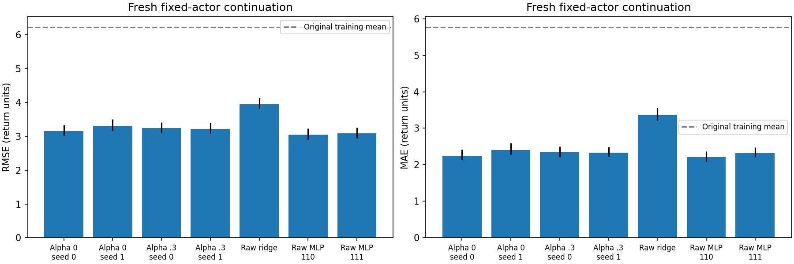
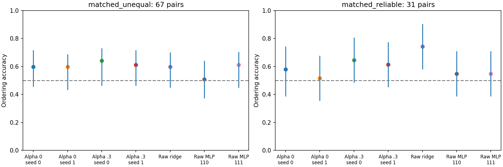

# Fixed-actor continuation: partial transfer, local ordering unresolved

**Stop here. Existing readouts retain broad predictive information for this actor, but the experiment does not establish reliable comparable-context gains from failure negatives or justify an alpha=0.5 run yet.**

## Four answers

1. **Do readouts transfer? Partially.** Contrastive RMSE is 3.155-3.306 versus 6.231 for the original training-mean constant; global Spearman is 0.518-0.568 versus 0.332-0.433 for raw critic scores. Their broad reliable-pair accuracy is 72.8-77.2%. This is useful broad ranking on the evaluated fixed-actor distribution, but errors nearly double relative to the old logged-return evaluation (RMSE 1.700-1.761). Among 695 contexts outside the goal region, contrastive Spearman falls to 0.345-0.412. Local ordering remains unresolved.

2. **Does alpha=0.3 improve comparable-context ordering? Not established.** On the 31 conservative matched pairs, seed 0 changes from 18/31 (58.1%) to 20/31 (64.5%); seed 1 changes from 16/31 (51.6%) to 19/31 (61.3%). Paired gains are +6.45 percentage points (95% interval -6.45 to +19.35) and +9.68 points (0.00 to +22.58). These intervals include no gain. On all 67 unequal-mean pairs, both paired intervals cross zero. Aggregate RMSE effects also reverse across seeds: +0.090 for seed 0 (worse), -0.084 for seed 1 (better). The modest aggregate benefit in the logged-data report does not transfer consistently.

3. **Are contrastive readouts better than raw-input baselines? No clear dominance.** Contrastive RMSE beats raw-input ridge (3.955), but both raw MLPs are better overall (3.045 and 3.084). For alpha=.3, paired RMSE excess over either MLP is 0.138-0.200, with positive nested-bootstrap intervals in all four comparisons. Contrastive reliable matched accuracy is 61.3-64.5%, MLP accuracy 54.8%, and raw ridge 74.2%; paired intervals do not establish a consistent contrastive advantage. Raw ridge illustrates that aggregate calibration and local ordering need not agree.

4. **Would one matched alpha=0.5 experiment be informative now? It is not the next priority.** It could give another checkpoint comparison, but would inherit only 31 reliable local pairs, transfer error and two-seed variability. Resolving the comparable-context evaluation bottleneck is more limiting than another negative-loss weight. Any next independently authorized experiment should preregister a new distribution emphasizing observable approach/motion contexts, with enough independent parents and a repeat budget justified before new outcomes. It should retain frozen scorers and the same actor first. No outcome-driven top-up, new readout fit, alpha=.5 training or ETT optimization is launched here.

## What was fixed before outcomes

Base commit: 5d454cbb3782a86eee40a6cf2664fd9276fe992e. Actor: historical alpha0_seed0 final checkpoint, SHA256 `ea8a71d3cb8d963259a54d47250b454462dae2ae62f03a55c370ca81a2c8ec54`. It was already the default in earlier distribution-matching and rollout work. Execution uses the original stochastic tanh-Gaussian helper; no actor was chosen using these returns. All scoring models share each exact first action and continuation.

The four frozen contrastive readouts and raw critics (alpha 0/.3, seeds 0/1), raw-input ridge and MLPs (readout initialization seeds 110/111) were verified against the original hashes and saved predictions. The original 256-reference failure_bank_f4_r60d40.npz is unchanged. Alpha weights the negative-loss mixture; it is not a fraction of bank entries. Goal remains (8.5,3.5), tiled through F4; H=20 and gamma=.95.

384 fresh parents (96 each from the fixed actor, a blind shortcut controller, a visible detour controller and uniform actions) run natural 30-step prefixes. The visible-only coverage controllers use fixed waypoints, .55/.9 speeds, Gaussian action noise .12 and predetermined pauses. Two candidates per parent are selected from t=4,8,12,16,20,24,28,30 using inverse observable-stratum counts and 4x weight outside the goal. This is a designed coverage population, not the actor occupancy distribution. No outcome or scoring model determines selection.

The 768 selected contexts include 222 before the swamp, 339 inside it, 138 after it and 69 in the detour; 193 stationary, 104 slow and 471 moving F4 histories. Only 73 are already inside the goal reward region. Histories are complete natural simulator histories. Every context has 24 continuations from an identical full snapshot. The first stochastic actor action is held fixed, and only future RNG varies.

A snapshot deep-copies the full native environment and external elapsed counter. Current bits, absorption, geometry, configuration, F4 frames and current position persist on restoration. Replacing the future RNG never resets the environment or redraws initial bits. Native bits resample at subsequent step ends. Absorbing death keeps done=False and zero rewards until the original 50-step limit. No continuation crosses that limit or uses padded targets. Repeats therefore sample future randomness conditional on one hidden snapshot, not the posterior over hidden states given the visible observation. Hidden snapshots remain in a local ignored file.

Actual main collection/continuation budget: 380,160 steps; including all focused tests and replay: 380,770, below the preregistered hard cap 382,208. There was one collection and no adaptive extension.

## Outcomes and uncertainty

The mean of context returns is 4.0146, with standard deviation 4.8281. Context means are 40.49% zero and 9.77% maximal. Individual continuations are 56.87% zero and 14.33% maximal. Maximum return is 12.83028. Actual simulator rewards match the audited fixed-goal reconstruction exactly.



Per-seed point results (native return units):

- alpha0_seed0_ridge: MAE 2.242, RMSE 3.155, Spearman 0.561; previous logged RMSE 1.743.
- alpha0_seed1_ridge: MAE 2.403, RMSE 3.306, Spearman 0.518; previous logged RMSE 1.761.
- alpha0p3_seed0_ridge: MAE 2.340, RMSE 3.245, Spearman 0.563; previous logged RMSE 1.700.
- alpha0p3_seed1_ridge: MAE 2.336, RMSE 3.223, Spearman 0.568; previous logged RMSE 1.704.
- raw_input_ridge: MAE 3.369, RMSE 3.955, Spearman 0.366; previous logged RMSE 3.032.
- raw_mlp_s110: MAE 2.206, RMSE 3.045, Spearman 0.543; previous logged RMSE 1.714.
- raw_mlp_s111: MAE 2.323, RMSE 3.084, Spearman 0.515; previous logged RMSE 1.718.

Pairs are defined before outcomes using exact collection source, goal and XY cell; XY separation <=.25, goal-distance gap <=.25 and time-index gap <=3. Each parent is used in at most one pair. Of 132 matched pairs, 65 have equal estimated means, 67 have unequal means, and only 31 satisfy |mean difference| > max(0.5, Welch 97.5% t critical value times repeat SE). The prior 43 unequal logged pairs and the current 67 unequal pairs are not the same population or labeling problem. With only 31 reliable pairs, the old lack of informative comparable contexts has not been resolved.

Equal returns within 1e-10 are excluded; prediction ties get half credit. Reliability is a provisional finite-repeat criterion, not simultaneous inference. It cannot rule out rare outcomes when all 24 repeats agree. Independent resampling flips about 11.46% of unequal-pair estimated orders, but 0.23% in the conservative subset. Reported intervals condition on that fixed subset.

500 nested bootstrap replicates resample parents with both selected contexts together, then repeats within context. Pair intervals resample disjoint parent-pair blocks and repeats; paired scorer differences use the same draws. Upstream checkpoint variability, pairing uncertainty and rare unobserved events are not covered. Finite-repeat mean targets retain Monte Carlo noise.

Matched action differences remain substantial: median L2 0.552, 95th percentile 1.993; old-frame F4 L2 differences have median 0.472 and 95th percentile 1.742. These pairs control coarse visible context, not actions, histories or hidden state.



## Distribution shift and limits

The predeclared support check uses original raw-ridge training normalization, 16,384 old training reference inputs and 2,048 disjoint calibration inputs. 20.83% of fresh inputs exceed the calibration 95th-percentile nearest-reference threshold. Current XY and actions stay within old coordinate ranges; two old-frame coordinates have a 0.13% range violation rate. Support diagnostics never filter results or fit models.

Contrastive performance varies by collector: detour-source Spearman 0.898-0.935 versus uniform-source 0.042-0.216. Alpha=.3 nearest-support-inlier RMSE is 3.080-3.108 versus 3.714-3.721 outside the declared threshold. These are descriptive strata, not identified mechanisms. Context-distribution shift and continuation-policy shift both occur, so the comparison cannot attribute the transfer loss to only one. Raw MLPs also transfer imperfectly.

Fresh trajectories remove the prior upstream episode reuse, but visible states can recur in a small maze. None of the new evaluation trajectories trains or selects a model. Observations omit hidden state and time by the existing input contract; external time controls eligibility and matching only. Success here would support scoring on this evaluated actor/context distribution, not conditional ETT ground truth, interventional identification, robust Q or resistance to generated-state score exploitation.

## Artifacts and checks

Six focused tests pass. All saved scoring predictions and all 368,640 actor execution actions replay exactly. Sixteen selected 20-step native continuations and selected parent steps replay exactly, including time limits. Reward reconstruction, target indexing, matching and frozen hashes pass. Four plots were visually reviewed. No model is trained, no checkpoint is uploaded, and no commit/push is performed automatically.

- [Pre-run protocol](protocol.json) and [hash provenance](provenance.json).
- [Detailed numerical report](REPORT.md), [metrics](metrics.json), [paired comparisons](paired_comparisons.json), [return strata](return_population.json).
- [Restoration/action/reward verification](verification.json), [support diagnostics](support_before_outcomes.json).
- Visible contexts, parent trajectories, fixed predictions, pair indices and continuation XY/actions/rewards are stored in NPZ files beside this report; opaque simulator snapshots remain local and ignored.

Run from the PointMaze worktree with the prior Python environment; use a fresh output directory to reproduce collection. The original readouts are required locally and their hashes are enforced. If absent, first reproduce the exact old protocol in a separate directory and verify against its saved predictions.

```bash
python -m scripts.check_return_readout --run-dir artifacts/return_readout/f4_h20_g095_v1
python -m unittest scripts.test_fixed_actor_continuation
python -m ett.run_fixed_actor_continuation --out-dir artifacts/fixed_actor_continuation/f4_h20_g095_v1 --phase prepare
python -m ett.run_fixed_actor_continuation --out-dir artifacts/fixed_actor_continuation/f4_h20_g095_v1 --phase collect
python -m ett.run_fixed_actor_continuation --out-dir artifacts/fixed_actor_continuation/f4_h20_g095_v1 --phase run
python -m ett.analyze_fixed_actor_continuation --run-dir artifacts/fixed_actor_continuation/f4_h20_g095_v1
python -m scripts.check_fixed_actor_continuation --run-dir artifacts/fixed_actor_continuation/f4_h20_g095_v1
python -m ett.report_fixed_actor_continuation --run-dir artifacts/fixed_actor_continuation/f4_h20_g095_v1
```

This concise interpretation was written after outcomes. The preregistered collection, scoring and numerical-analysis source hashes remain unchanged. This reporting step adds no new experiment or statistical comparison.
