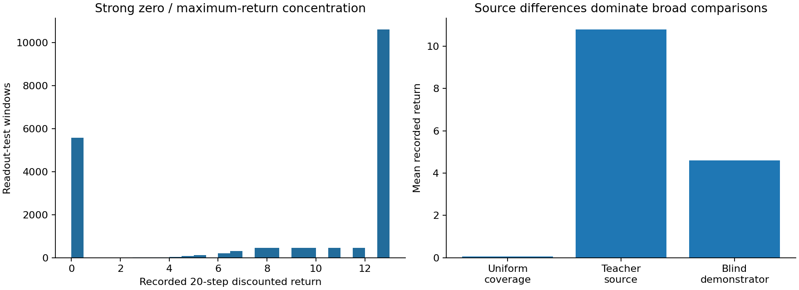
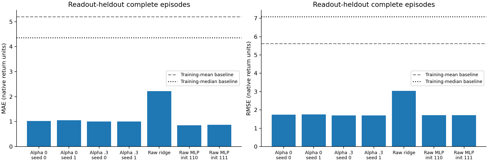
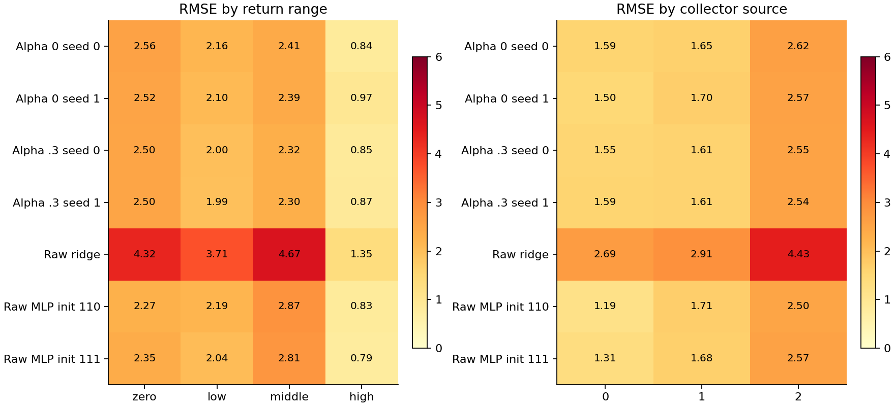
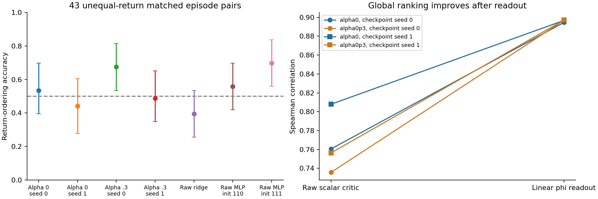

# Frozen contrastive representations and logged future return

**Result: return information is linearly decodable in broad heldout-readout comparisons. Failure-negative features have slightly lower aggregate error in both checkpoint seeds, but no robust improvement is established for outcome ordering among closely matched observations. A small raw-input MLP is competitive.**

## Question and preserved scope

This experiment predicts the next 20 recorded task rewards after a recorded action. It differs from the rejected actor-sampled raw-critic continuation diagnostic, the nearest-bank onset audit, and the supervised death-classifier probe. Those reports and the current training/reward implementations were read first. Their failure-recognition results are not recycled as return-prediction results. No hidden death labels, swamp masks, failure distance or hindsight goals are used as targets, features, pair-selection variables or model-selection criteria. No ETT, actor or encoder is trained; actors are not sampled. Only the declared readouts are fitted.

## Checkpoints and faithful features

The fixed comparison uses alpha=0 versus the historically primary alpha=0.3, checkpoint seeds 0/1, all at final step 150,000. Alpha=0.1 is not searched. All four checkpoints are verified against their previously recorded hashes and p=0.30 dataset provenance. They share 256/256 ReLU encoders, 64-dimensional phi/psi, one head, no representation normalization, no temperature scaling and no observation scaling. Other recorded settings agree: batch 256, learning rates 3e-4, discount 0.95, NCE, BC coefficient 0.5, entropy coefficient 0 and random-goal fraction 0.5. Alpha changes the negative GOAL distribution using the same original 256-vector bank; it does not add death input to the state.

The bank is the current PointMaze random60/deliberate40 artifact, curated using privileged teacher modes and swamp bits. That provenance affects the upstream encoder, even though neither bank distance nor hidden fields enter this readout experiment. Configured within-seed factors match; original initialization checkpoints and per-update batch hashes are unavailable. Historical actor/critic optimization trajectories also differ as a consequence of training. With two checkpoint seeds, these results do not establish a universal effect of failure negatives.

A representation access function was added to crl.networks. It calls the SAME internal encoder function as the critic, returning [batch,representation,head] phi and psi. It does not change actor/critic forward functions, topology or weights. Tests verify full cross-batch dot products for one/two heads, representation normalization, non-unit learned temperature, observation scaling and LayerNorm. Actual checkpoint dot products are checked against the existing critic throughout extraction. These checkpoints have one head; no head reduction is hidden. The phi readout consumes all 64 coordinates, not a monotonic transformation of the scalar logit.

The commanded goal is constantly (8.5,3.5), tiled four times. Consequently psi is exactly constant across all rows; concatenating it would add no state-dependent information to a linear readout with intercept. Its value and dot-product verification errors are saved in feature_verification.json. Recorded actions are used for phi and the raw scalar comparator throughout.

## Return construction and scope of holdout

`R_t = sum(k=1..20) 0.95^(k-1) * 1[||XY_(t+k)-(8.5,3.5)|| < 2]`

The dataset does not store rewards, so the established audited task_reward implementation reconstructs them from visible positions. The environment moves, checks lethal contact, then returns zero on death or the strict radius-2 goal indicator otherwise. In this fixed task all possible absorbing death positions are in x<6 swamp cells, at least 2.5 from the commanded goal, hence their position reward is already zero. This equivalence is task-specific. It does not justify reconstruction at another goal. No hidden gate is read. Float32 reward decisions agree with an independent float64 calculation on every stored observation; the nearest recorded distance to the radius boundary is 4.2000496e-05, comfortably above the observed coordinate rounding scale.

Each trajectory contains 51 observations and 50 real actions. Only t=0..30 has a complete future segment through t+20: 204,600/330,000 windows (62%) are eligible before partition exclusions. The remaining 125,400 incomplete windows are discarded, not padded. Terminal dummy actions are never used, while final observation 50 is a valid reward outcome. F4 history shifting and return indexing are checked. Goals remain commanded, and all future positions affect only the target, never the features.

The established seed-0 source 10% holdout is readout test; its complement is split with seed 9201 into readout train/selection. Original bank-source episodes are removed from selection/test, giving 5,346/570/637 episodes and 165,726/17,670/19,747 windows. Training retains 209 bank-source episodes; selection and test retain none. No complete visible trajectory duplicates cross partitions. Splits are by episode, so overlapping windows stay together.

All these episodes trained the original contrastive encoders and actors. The final readout test episodes have also been inspected in earlier audits. This is held out from readout fitting and validation selection only, not from the pipeline, and not a new untouched test. No generalization to unseen goals or policies is claimed.

Before any fitting, population_before_training.json recorded substantial variation: training return mean/std 7.9539/5.7786, selection 8.7310/5.4620 and test 8.4697/5.5926. Test has 28.20% zero returns and 53.71% maximal returns (12.83028). Source means are 0.0556 for uniform coverage, 10.7872 for teacher-source and 4.5989 for blind demonstrators. These are behavior-policy source memberships, not quality or death labels.



## Fixed readout procedure

B/C: deterministic ridge on train-standardized phi, optimizing mean squared error plus lambda times coefficient norm squared, with unpenalized intercept. The predeclared validation-only grid is [0.0001,0.01,1,100]. Every checkpoint selects 0.0001 by selection MSE. Means/scales use training rows only. The grid boundary was not expanded after results. Ridge has no initialization variability; seeds 0/1 refer to different frozen checkpoints.

D: raw F4 state, recorded action and constant commanded-goal block, with both the same inexpensive ridge control and a bounded 32/32 ReLU MLP (1,697 parameters). MLPs use initialization seeds 110/111, identical minibatch stream, Adam 0.003, batch 512, 1,000 updates and validation every 200 updates. Each uses its own lowest selection-MSE checkpoint; both select step 1,000. These seeds describe readout initialization, not encoder variability. There is no architecture/learning-rate sweep or test-based seed selection. Target scaling for the MLP and feature scaling are fitted on training only. Raw mean and median constant predictors are also training-derived. Outputs are not clipped post hoc.

A: the existing untransformed scalar logit at the recorded action is evaluated directly for ranking. Its scale is not return units, so its MAE/RMSE fields are null instead of presenting an uncalibrated logit as a return prediction. No monotonic score calibration substitutes for the phi readout.

## Aggregate fit and ranking

- alpha0_seed0_ridge: MAE 1.02408, RMSE 1.74259, Spearman 0.89459.
- alpha0_seed1_ridge: MAE 1.05447, RMSE 1.76060, Spearman 0.89673.
- alpha0p3_seed0_ridge: MAE 1.00802, RMSE 1.70047, Spearman 0.89688.
- alpha0p3_seed1_ridge: MAE 1.00474, RMSE 1.70437, Spearman 0.89712.
- raw_input_ridge: MAE 2.21548, RMSE 3.03241, Spearman 0.86261.
- raw_mlp_s110: MAE 0.84756, RMSE 1.71394, Spearman 0.89490.
- raw_mlp_s111: MAE 0.87590, RMSE 1.71765, Spearman 0.89486.
- constant_mean: MAE 5.20172, RMSE 5.61631, Spearman undefined (constant prediction).
- constant_median: MAE 4.36063, RMSE 7.09169, Spearman undefined (constant prediction).

Raw scalar Spearman correlations, seed 0/1: alpha=0 gives 0.76053/0.80791; alpha=0.3 gives 0.73569/0.75631. Phi readouts improve all four global correlations to about 0.895-0.897 and lower RMSE sharply relative to constant predictors. Against raw-input ridge (RMSE 3.0324), contrastive features are useful nonlinear features. Against the small raw-input MLPs (RMSE 1.7139/1.7177), their advantage is not consistent: the MLPs have lower MAE (0.8476/0.8759 versus approximately 1.00-1.05 for phi ridge).



All errors are in native finite-horizon return units. Per-source and per-return-range results are in metrics.json. Return ranges are zero, (0,5), [5,10), and [10,12.83028]. Constant-target strata have undefined rank correlation. Uniform-source return variation is very small, and its phi Spearman is only about 0.05-0.13 despite high global correlation; teacher and blind-source correlations are about 0.81 and 0.84. Global metrics can be driven by goal progress and population differences rather than the desired conditional ordering.



## Predetermined pairing and uncertainty

Pair definitions were saved before training and never inspect targets or model scores. A fixed RNG (95121) assigns one random eligible anchor window per test episode. The overall comparison pairs disjoint episodes without context constraints. The harder comparison greedily pairs to a window in an unused episode with the same collector source, commanded goal and newest XY cell, XY distance <=0.25, goal-distance difference <=0.25 and time-index difference <=3. It minimizes the sum of these gaps divided by their tolerances; ties follow stored row order. Recorded action and old frames are allowed to differ. Each episode is used at most once in either role per pairing set. These are approximate recorded contexts, not causal or hidden-state matches.

Overall: 318 disjoint episode pairs, 105 equal-return pairs excluded, 213 informative pairs. Matched: 311 pairs covering 622/637 episodes, but 268 have equal return and only 43 are informative. Equal target returns within 1e-10 are counted and excluded; equal predictions get half credit. This saturation-induced loss of information is a central limitation, not a reason to change the objective or pairing tolerances.

One thousand bootstrap replicates resample the disjoint two-episode blocks, conditional on the informative subset and fixed matching. MAE/RMSE intervals use 500 complete-episode resamples, retaining all 31 windows together. Paired comparisons reuse the same episodes/pairs. These intervals condition on fitted encoders/readouts and do not cover upstream training, matching uncertainty or checkpoint-seed variability. Global Spearman is descriptive; its window count is not an independent sample count.

- alpha0_seed0_ridge: matched ordering 53.49% (episode-pair interval 39.53% to 69.77%).
- alpha0_seed1_ridge: matched ordering 44.19% (episode-pair interval 27.91% to 60.47%).
- alpha0p3_seed0_ridge: matched ordering 67.44% (episode-pair interval 53.49% to 81.40%).
- alpha0p3_seed1_ridge: matched ordering 48.84% (episode-pair interval 34.88% to 65.12%).
- raw_input_ridge: matched ordering 39.53% (episode-pair interval 25.58% to 53.49%).
- raw_mlp_s110: matched ordering 55.81% (episode-pair interval 41.86% to 69.77%).
- raw_mlp_s111: matched ordering 69.77% (episode-pair interval 55.81% to 83.72%).

Raw scalar matched accuracy, seed 0/1, is 53.49%/51.16% for alpha=0 and 53.49%/48.84% for alpha=0.3. Broad unmatched ordering is much easier: phi readouts and raw MLPs score about 99%, but this does not transfer to local matching.

The paired alpha=0.3-minus-alpha=0 matched accuracy improvements are +13.95 percentage points for seed 0 (interval [0.00,+27.91]) and +4.65 for seed 1 ([-13.95,+25.58]). The seed-0 readout-versus-own-scalar improvement is +13.95 points with interval [-2.33,+30.23]; seed 1 is unchanged with [-18.60,+18.60]. Thus the matched evidence does not robustly establish either ranking improvement across seeds. MLP initialization variability (55.81% versus 69.77%) is itself substantial on these 43 pairs.



Paired complete-episode RMSE differences (alpha=0.3 minus alpha=0) are separately reported because aggregate fit and local ordering answer different questions:

- Checkpoint seed 0: -0.042119, interval [-0.055603, -0.029792].
- Checkpoint seed 1: -0.056228, interval [-0.075983, -0.039598].

These modest aggregate improvements are consistent in both available checkpoint seeds, conditional on this dataset and fitting procedure. They do not establish improved ranking among comparable future outcomes, nor independence from upstream reuse.

## Three distinct answers and next step

1. **Readout versus scalar critic:** yes for broad rank correlation and unmatched ordering; local matched improvement is not consistent. The encoders contain return-related information that the fixed-goal scalar projection leaves unused.
2. **Contrastive features versus raw observations:** yes versus a raw linear ridge model; no clear dominance over the bounded raw MLP. Similar overall RMSE, lower MLP MAE, and unstable matched ordering prevent attributing the useful signal uniquely to contrastive learning.
3. **Failure negatives versus matched no-negative training:** a small aggregate linear-decoding improvement is observed for both available seeds, but the central matched-ranking benefit is unresolved. Two upstream seeds and only 43 informative pairs are inadequate for a strong mechanism or generalization claim.

Stop before ETT optimization. The next useful step is an independently collected, fixed-actor continuation evaluation with adequate comparable-context return variation, keeping current readouts frozen. That would address behavior-policy mismatch and upstream reuse before any generated-candidate scoring study. Candidate support and score-exploitation checks would still be required later. No such experiment is launched here. A weak linear probe would not establish absence of nonlinear information; conversely, successful logged-return prediction is not the current actor's Q, an interventional value, a robust value or worst-case Q.

## Reproduction and checks

Six focused tests pass for encoder/head/scaling extraction, fixed-goal reward, return indexing and terminal handling, episode/bank splitting, train-only ridge normalization, and score-blind disjoint pairing with ties. Stored readouts are replayed; maximum ridge prediction differences are below 4e-15. Visible reward float32/float64 decisions and target indexing agree exactly; matched pair lists and stored ranking metrics reproduce. Original dataset, bank and checkpoint hashes remain unchanged. Readout weights stay local in the ignored readouts directory; normalization, configs, metrics, pair indices, visible-derived targets/predictions and plots are available for publication. No raw audit fields are loaded or published.

The bounded extraction/fitting/evaluation stage took 12.73 seconds on local CPU, excluding preparation, replay and plotting. The actual configured budgets were not changed after evaluation.

```bash
python -m unittest scripts.test_return_readout
python -m ett.run_return_readout --out-dir artifacts/return_readout/f4_h20_g095_v1 --prepare-only
python -m ett.run_return_readout --out-dir artifacts/return_readout/f4_h20_g095_v1 --run-prepared
python -m scripts.check_return_readout --run-dir artifacts/return_readout/f4_h20_g095_v1
python -m ett.report_return_readout --run-dir artifacts/return_readout/f4_h20_g095_v1
```

Run from the PointMaze worktree and use a fresh output path for a new run. Dataset/checkpoint paths and hashes are in provenance.json. Missing or mismatched current artifacts fail explicitly; no AntMaze substitution exists. The network change only exposes the existing representations and does not modify trained critic/policy computations. No commit or push is performed automatically.
