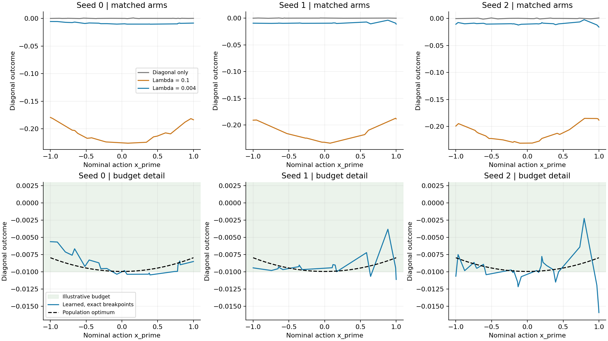
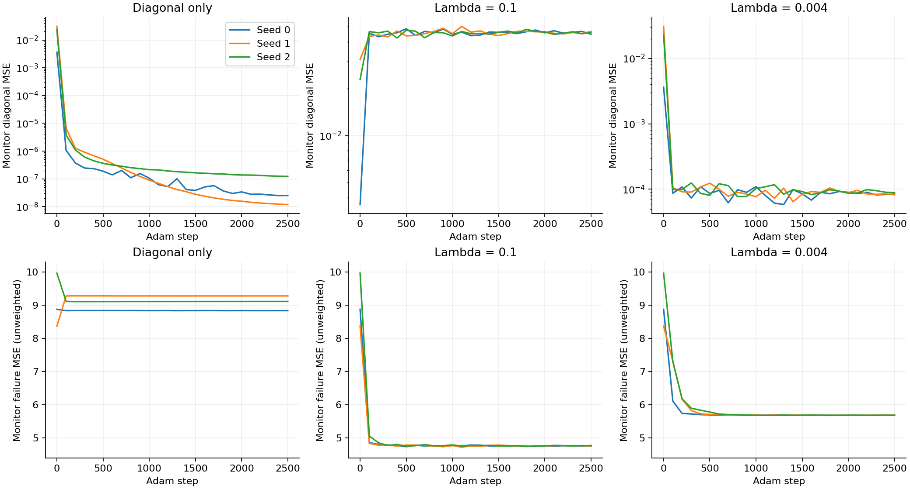
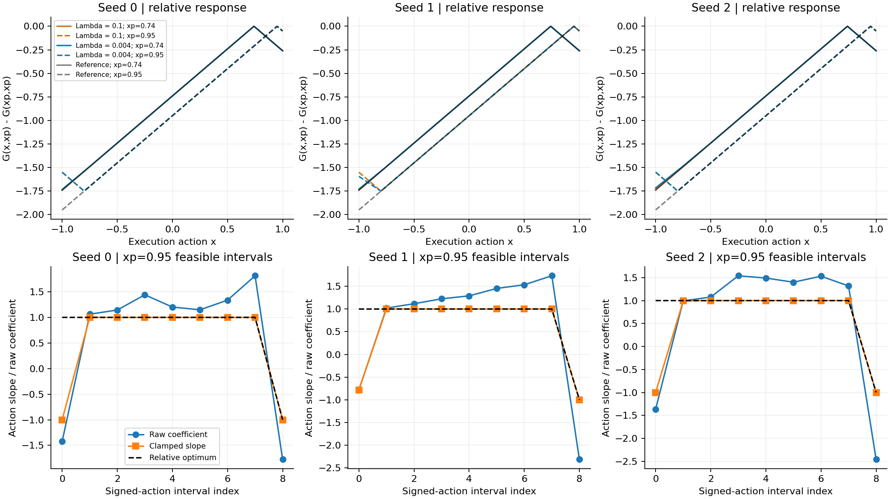
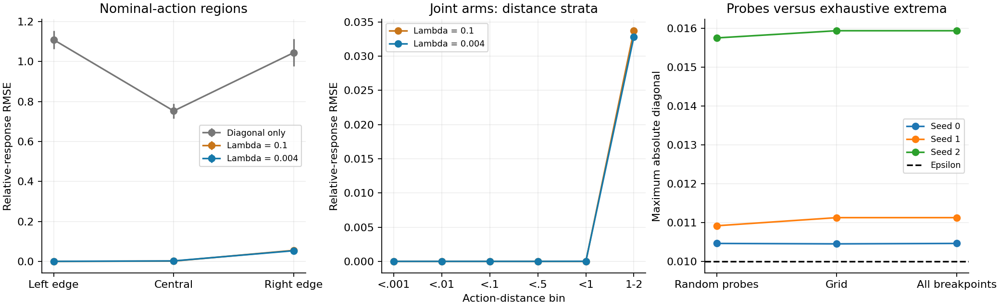

# Predetermined diagonal-error budget: lambda = 0.004

Reducing the weight greatly improves diagonal fidelity and preserves action-dependent pessimism under the unchanged training budget. However, none of the three trained models meets epsilon=0.01 over [-1,1]. This is a partial success, not a certified-budget result. The global population optimum meets the budget only with very small slack; the learned diagonal still has residual fitting error.

## Setup, derivation and provenance

The existing 1,681-parameter ConditionalSpline and its structural full action-Lipschitz bound L=1 are unchanged. Inputs x and x_prime are independent uniform scalar actions on [-1,1], c=0 and the detached synthetic failure bank is {-3}. Both terms use the same nominal marginal. In each training dataset, the 8,192 diagonal contexts occur exactly four times among the 32,768 off pairs; minibatches independently sample the two terms. Only x is redrawn on an exact equality tie, so no boundary rejection changes the context population.

`L = mean(G(x_prime,x_prime)^2) + lambda * mean((G(x,x_prime)+3)^2)`

There are exactly two losses. No correct off-diagonal next-state labels, analytic training targets, hidden inputs, discriminator, PointMaze rollout, actor, critic or additional penalty is used. All shared parameters remain trainable. Hard-clamped coefficients may receive zero direct gradient locally. The final emitted function is evaluated directly, with no recentering or candidate-selection wrapper.

The derivation in [REFERENCE.md](REFERENCE.md) was saved before the first update. Projection onto [-3,infinity) reduces the problem to d>=-3. At fixed d, max(-3,d-|x-x_prime|) minimizes bank distance under the full bound. The conditional objective is strictly convex in d. Its stationary solution is d*=-lambda/(1+lambda)*(5-x_prime^2)/2. For 0<=lambda<1, the minimum margin above the bank is (1-lambda)/(1+lambda)>0, so this solution lies in the assumed branch everywhere and is globally optimal. For positive lambda, G*=d*-|x-x_prime|. At lambda=0, the diagonal-only objective does not identify the relative action response.

Epsilon=0.01 and lambda=0.004 were predetermined. The optimum has maximum |d*|=0.00996015936, RMSE=0.00931510115, failure MSE=5.62319434083 and objective=0.0225795484728. Its budget slack is just 0.00003984064. These are native scalar outcome units, not a justified PointMaze tolerance.

Exactly three new final-step runs use seeds 0/1/2, 2,500 Adam updates, cosine learning rate 0.001 to 0.0001, diagonal/off batches 128/256, float64 and one CPU thread. The unchanged historical train() routine starts each seed from its original random initialization. Initialization, training data and every minibatch index match the lambda=0.1 runs by SHA256. Only the loss weight changes. Training does not start from an old checkpoint. Old diagonal-only and lambda=0.1 results come from the latest failure-bank experiment at cbb8e47638b74a0b8ab5aa24134743798a329bd0, not the earlier supervised experiment. All six old checkpoints, their full saved metrics/arrays, source hashes and configurations were verified before new training.

Evaluation reuses the already-inspected 4,096 nominal contexts, 16,384 off pairs, 32,768 arbitrary-action triples, 201-by-201 grid and fixed slices. These are not newly untouched test sets. They were never used to select a checkpoint or adjust settings. The monitor stream also remains unchanged. Old files and artifacts are hash-verified unchanged.

## Diagonal fidelity and budget

- Diagonal only: diagonal RMSE 0.00020797 +/- 0.000133; continuum maxima by seed [0.000793778, 0.000367335, 0.001191948]; relative-response RMSE 0.82831749 +/- 0.0409; failure MSE 9.0772826 +/- 0.226.
- Lambda = 0.1: diagonal RMSE 0.21289272 +/- 0.00211; continuum maxima by seed [0.225873498, 0.233893448, 0.230945069]; relative-response RMSE 0.01690353 +/- 2.96e-06; failure MSE 4.7218770 +/- 0.00895.
- Lambda = 0.004: diagonal RMSE 0.00919718 +/- 0.0002; continuum maxima by seed [0.010461489, 0.011124859, 0.015934014]; relative-response RMSE 0.01646448 +/- 0.00121; failure MSE 5.6305631 +/- 0.000301.

Uncertainty above is sample standard deviation across three matched seeds, not a confidence interval. The new mean diagonal RMSE improves by about 95.7% relative to lambda=0.1, but remains above the diagonal-only control. RMSE below epsilon is not a maximum-error guarantee.

- Seed 0: empirical maximum 0.010461214; exhaustive maximum 0.010461489 at x_prime=0.392145661; random-probe fraction exceeding epsilon 39.3555%; uniform continuum fraction 40.0698%; diagonal RMSE to d* 0.001126873.
- Seed 1: empirical maximum 0.010915738; exhaustive maximum 0.011124859 at x_prime=1.000000000; random-probe fraction exceeding epsilon 2.1240%; uniform continuum fraction 1.9984%; diagonal RMSE to d* 0.001228172.
- Seed 2: empirical maximum 0.015748583; exhaustive maximum 0.015934014 at x_prime=1.000000000; random-probe fraction exceeding epsilon 34.0576%; uniform continuum fraction 33.4007%; diagonal RMSE to d* 0.001639353.

The continuum calculation propagates affine pieces through every conditioner Linear/ReLU layer, splits them at the relevant coefficient clamp crossings, and evaluates every resulting diagonal breakpoint and both domain endpoints. The maximum of the absolute affine value on each piece occurs at an endpoint. Epsilon-crossing lengths also give the uniform continuum exceedance fraction. This exhaustive piecewise-linear algorithm is exact in real arithmetic, implemented in float64; it is not a formal outward-rounded numerical certificate. Endpoint reconstruction discrepancies are below 7e-16 for the new models, much smaller than their budget excesses. Finite grid or random maxima are labeled separately. Seed 0 peaks inside the domain; seeds 1/2 peak at x_prime=1.



## Action-dependent response and objective components

Relative response is h=G(x,x_prime)-G(x_prime,x_prime), evaluated against -|x-x_prime|. Its mean RMSE is essentially retained at the scale of the previous joint arm, and far below the uncontrolled diagonal-only response. This comparison is descriptive across three seeds; it is not a statistical equivalence claim. The absolute response is not merely shifted downward. Expected failure distance increases when diagonal movement is penalized more strongly, as the new optimum predicts.

- Seed 0: empirical diagonal MSE 8.363319489e-05, unweighted failure MSE 5.630226642, weighted failure 0.02252090657; own total 0.0226045397638. Integrated diagonal/failure components 8.404996448e-05/5.627541816; own integrated total 0.0225942172296, gap to the lambda=0.004 optimum 1.46687569e-05; 128/256-node difference 4.32e-09.
- Seed 1: empirical diagonal MSE 8.151793683e-05, unweighted failure MSE 5.630655992, weighted failure 0.02252262397; own total 0.0226041419054. Integrated diagonal/failure components 8.080699077e-05/5.628239386; own integrated total 0.022593764534, gap to the lambda=0.004 optimum 1.42160613e-05; 128/256-node difference 4.11e-09.
- Seed 2: empirical diagonal MSE 8.86932169e-05, unweighted failure MSE 5.630806761, weighted failure 0.02252322704; own total 0.0226119202602. Integrated diagonal/failure components 8.808500594e-05/5.628511655; own integrated total 0.0226021316257, gap to the lambda=0.004 optimum 2.2583153e-05; 128/256-node difference 1.34e-08.

For reference, the reused lambda=0.1 joint gaps to its own optimum 0.51696969697 are 0.000285958607, 0.000286599636, 0.000327352271. The diagonal-only control uses weight zero, optimum zero; its objective gap is simply its diagonal MSE. Do not rank raw total values, or infer a better task from smaller totals, across these different weights. All own-weight totals, components and reference gaps are saved in results.json.

The integration is exact in x within each spline interval and uses numerical Gauss-Legendre integration over x_prime. The 128/256 comparison is a convergence check, not a rigorous error bound. Paired empirical gaps use the same finite data for model and reference and are reported separately from population quadrature gaps.

The finite ReLU conditioner cannot equal a quadratic diagonal everywhere. Nevertheless, an independently constructed model of the same architecture interpolates d* at 33 knots with objective gap only 2.0264e-12 for lambda=0.004 (versus 1.1560e-9 for lambda=0.1). This brackets the architecture optimum tightly; it is evaluation only. Actual gaps of 1.42e-5 to 2.26e-5 are far larger than that approximation bound and the observed quadrature differences. The small nonzero optimal diagonal is the intended penalty tradeoff. The additional learned error and epsilon violations are not required by the population optimum; finite-sample and unresolved optimization effects remain.



## Boundaries, learning speed and clamp saturation

- Seed 0: relative RMSE at left/central/right nominal regions 8.48509e-17/0.00137502/0.0550842; distance >=1 relative RMSE 0.0337313; maximum individual relative error 0.461343; wrong-direction saturated coefficients 25/1800 feasible audited intervals; unsaturated fraction 2.389%.
- Seed 1: relative RMSE at left/central/right nominal regions 1.03938e-16/0.00144528/0.0491019; distance >=1 relative RMSE 0.0300990; maximum individual relative error 0.413091; wrong-direction saturated coefficients 0/1800 feasible audited intervals; unsaturated fraction 6.722%.
- Seed 2: relative RMSE at left/central/right nominal regions 8.87631e-17/0.00368136/0.0557758; distance >=1 relative RMSE 0.0346924; maximum individual relative error 0.461343; wrong-direction saturated coefficients 25/1800 feasible audited intervals; unsaturated fraction 7.000%.

All three new models fit the near-diagonal relative response essentially to float64 precision through action distances below 0.5. Most action error lies at large distances and the right nominal boundary, as in the old experiment. The small average error therefore does not imply uniformly accurate action responses; individual errors remain as large as 0.46. Region-specific diagonal and relative errors, raw coefficients and feasible masks are saved for review. The displayed x_prime=0.95 slice uses an existing grid context to expose this boundary behavior.

The lower weight weakens the bank term by a factor of 25, although Adam and shared parameter gradients prevent interpreting this as a literal factor-25 learning-speed change. Monitor failure loss falls substantially within the first 500-1000 updates. Seed 2 is visibly slower early (failure MSE 5.782 at step 500, 5.685 at step 1000), but the final relative response does not collapse. The final monitor components are nearly flat, with small diagonal fluctuations; monitor sampling means need not equal evaluation or population means. No action-response checkpoints were saved during training, so these component curves do not establish a detailed temporal mechanism.

Seeds 0/2 retain 25 wrong-direction saturated coefficients at the audited contexts, as did all three old joint runs. A raw coefficient beyond the wrong clamp endpoint has zero direct gradient through that clamp. Shared-conditioner gradients can still change it. Seed 1 has no wrongly saturated coefficient but still has wrong-sign unsaturated slopes and boundary error, so dead clamp gradients alone cannot explain all residuals. The current records do not isolate stochastic minibatch noise, conditioning or shared-network interference. No extra iterations, new optimizer, architecture change, setting or sweep was run.



For each fixed nominal action, bounded slopes in [-1,1] and continuous interval joins imply the full arbitrary-execution-action bound by integration. This holds structurally for every conditioner output, not just sampled contexts. Direct interval-slope and arbitrary-action numerical audits pass. It constrains sensitivity in x; it does not constrain diagonal displacement in x_prime or guarantee the epsilon budget.

- Seed 0: maximum exact audited interval slope 1.0; largest positive full-action excess 4.44e-16, below the unchanged 1e-12 tolerance.
- Seed 1: maximum exact audited interval slope 1.0; largest positive full-action excess 4.44e-16, below the unchanged 1e-12 tolerance.
- Seed 2: maximum exact audited interval slope 1.0; largest positive full-action excess 4.44e-16, below the unchanged 1e-12 tolerance.

Comparisons with the prescribed zero anchor are retained as diagnostics; they are not tests of the full action bound when the actual learned diagonal differs from zero. No physical-validity guarantee or real-environment Lipschitz constant is inferred.



## Decision and limitations

1. Diagonal fidelity improved substantially at the predetermined lower weight.
2. None of the trained seeds meets the illustrative maximum-error budget, either on the random probes or over the exhaustive piecewise-linear domain calculation.
3. Action-dependent pessimism survived at roughly the prior joint RMSE, with unresolved localized boundary errors.
4. All seeds are near their lambda-specific population objective optimum in aggregate, but their remaining gaps exceed the architecture approximation bound by many orders of magnitude.
5. The population diagonal shift is an intended tradeoff. Additional diagonal and action errors reflect unresolved empirical fitting/optimization, not a proved impossibility of preserving both.
6. This scalar diagnostic is understood well enough to motivate a separate read-only evaluation of the real bank's ranking quality. It does not clear the absolute diagonal-budget gate for model-based training. Stop the scalar experiment at its fixed budget; do not connect it to actor-critic or alternating training on this evidence.

The single recommended next study is a bounded frozen-model audit of the real failure bank's ranking quality, with its actual metric and provenance fixed in advance. That evaluation is not performed here. No additional scalar tuning is recommended from the inspected evaluation set. The scalar result does not validate the historical bank metric, establish exact diagonal equality, identify causal transitions, justify a PointMaze epsilon/L, or recover worst-case Q.

## Checks and reproduction

Seven focused unit tests passed: weight-dependent reference and regime; conditional global-reference comparisons; shared marginals and two-loss arithmetic; matched initialization/minibatches; feasible same-architecture reference; an exhaustive maximum detecting a narrow peak missed by a grid; and piece reconstruction plus structural bounds. A five-step smoke run preceded the three full runs and passed checkpoint replay. All nine final comparison evaluations (three new and six reused) reproduce every saved metric and array exactly. Loss arithmetic, finite records, final-step selection, hashes, raw structural bounds and historical artifact preservation passed the independent verification command.

The three new runs and comparison evaluation took 17.41 seconds on CPU, excluding preflight replay and later verification/plotting. Checkpoints remain local and ignored. Code, configurations, metrics, evaluation arrays and English figures/report are available for version control; nothing is automatically committed or pushed.

```bash
python -m unittest scripts.test_synthetic_diagonal_budget
python -m scripts.synthetic_diagonal_budget --out-dir artifacts/synthetic_diagonal_budget/smoke --smoke
python -m scripts.check_synthetic_diagonal_budget --run-dir artifacts/synthetic_diagonal_budget/smoke
python -m scripts.synthetic_diagonal_budget --out-dir artifacts/synthetic_diagonal_budget/lambda0004_s012
python -m scripts.check_synthetic_diagonal_budget --run-dir artifacts/synthetic_diagonal_budget/lambda0004_s012
python -m scripts.report_synthetic_diagonal_budget --run-dir artifacts/synthetic_diagonal_budget/lambda0004_s012
```

Use fresh output directories when reproducing training. The six historical local checkpoint files under artifacts/synthetic_failure_bank/bank_m3_lambda01_s012 are required for preflight matched comparison. Source/config hashes and Python/NumPy/PyTorch versions are recorded. No server or PointMaze dataset is needed.
