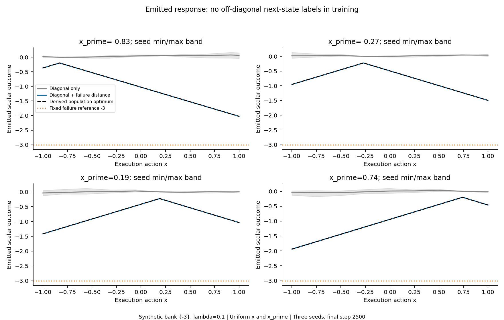
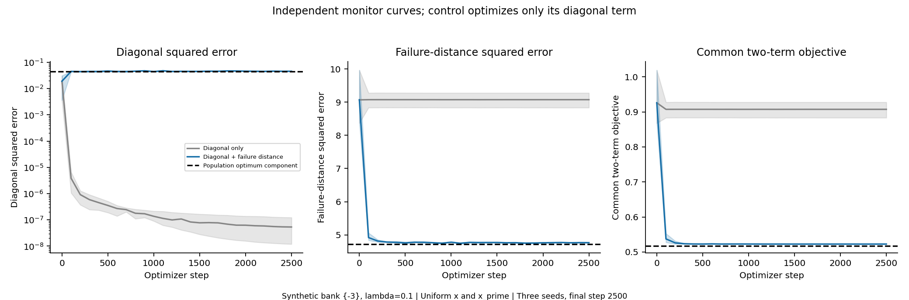
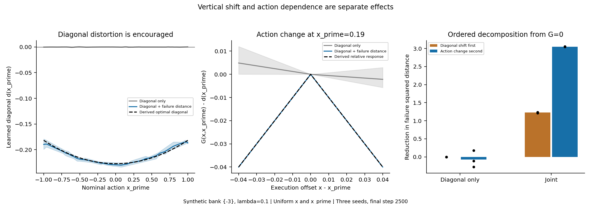
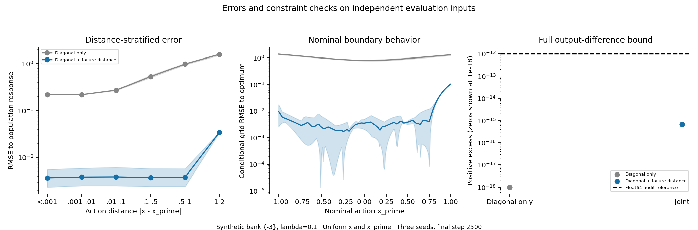

# Fixed scalar failure-bank training without next-state labels

## Design and pre-training expectation

This is a bounded scalar diagnostic, not PointMaze transition training. Keep the existing 1,681-parameter ConditionalSpline, L=1, x,x_prime in [-1,1], observed diagonal outcome c=0 and no forced diagonal equality. The bank {-3} and lambda_off=0.1 were fixed before evaluation. The bank is synthetic and supplies an unconditional preferred outcome, not the correct next state for each action pair. Lower scalar outcomes are defined as worse only here. With one reference there is no nearest-neighbor ambiguity.

The only losses are mean(G(x_prime,x_prime)^2) and mean(min_f(G(x,x_prime)-f)^2). The joint arm adds the latter with weight 0.1; the diagonal-only control uses weight zero. Both terms optimize the same shared network. The bank is detached and never trained. No correct off-diagonal target, discriminator, critic, hidden simulator field, target-shaped initialization, candidate selection or third loss enters training.

Select x_prime uniformly on [-1,1] in both terms, then draw x conditionally as Uniform[-1,1]. There is no boundary rejection or clipping. For the finite data, each of 8,192 diagonal contexts appears exactly four times in the 32,768 off pairs, so the empirical nominal marginal also agrees exactly. An exact equality tie redraws only x; it never replaces x_prime. This differs from the previous balanced near/far sampler. The previous supervised results are historical context, not matched controls for this experiment.

The full derivation was saved before the first update in [REFERENCE.md](REFERENCE.md). For z=x_prime, m(z)=E[|x-z||z]=(1+z^2)/2. The optimal soft diagonal is

`d*(z) = -lambda/(1+lambda) * (3-m(z)) = -(5-z^2)/22`,

and the optimal response is `G*(x,z)=d*(z)-|x-z|`. This is a derived evaluation reference, not a training label. For fixed d>=-3, the nearest-bank feasible response is max(-3,d-|x-z|); at the optimum its margin above -3 is at least 9/11, so the unsaturated derivation is valid over the entire domain. The conditional objective is strictly convex in d. The diagonal is expected to vary with z, rather than remain at zero or take the shift from a linear-value objective.

The optimum encourages diagonal values from -0.227273 to -0.181818, diagonal MSE 0.0451791 (RMSE 0.212554), failure MSE 4.717906 and total 0.516969697. Thus a large degradation from the previous near-zero diagonal fit is mathematically encouraged by this objective, not automatically a modeling failure. The full feasible-class optimum has a quadratic d*(z), whereas the fixed ReLU conditioner is piecewise affine. A separately constructed model of exactly the same architecture interpolates d* on 33 points and has population objective gap 1.15597e-9. This brackets the architecture optimum tightly; that construction is used only for reference verification, never optimization, checkpoint selection or candidate selection.

## Matched controls and fixed budget

Train six new models: diagonal-only and joint, seeds 0/1/2, each with 2,500 Adam steps and the previous cosine learning rate 0.001 to 0.0001. Diagonal/off batches are 128/256 and separately averaged. Initialization, data and minibatch streams match exactly within each seed. All shared parameters remain trainable; the diagonal-only arm naturally has no direct gradient on right-interval output coefficients. Hard-clamped saturated coefficients can have zero local gradients. The architecture, float64 arithmetic and full final-output action bound remain unchanged.

The independent evaluation uses 4,096 nominal contexts and four off-action draws per context, 32,768 arbitrary-action triples, a 201-by-201 grid, and the original four displayed nominal actions. No setting or checkpoint is selected using these results. A separate monitor set is recorded during training; the fixed final step is always saved. All previous artifacts and source hashes remain unchanged.

## Fitting and objective results

Below, mean +/- sample standard deviation is across three seeds. Failure MSE is the unweighted bank term. The common objective uses lambda=0.1 for evaluating both arms; the control itself was trained only on its diagonal term.

- Diagonal only: diagonal RMSE 0.000207965 +/- 0.000133; maximum absolute diagonal errors by seed [0.000781, 0.000365, 0.00119]; failure MSE 9.07728 +/- 0.226; empirical common total 0.907728; response RMSE to the derived optimum 1.00748 +/- 0.0414.
- Diagonal + failure distance: diagonal RMSE 0.212893 +/- 0.00211; maximum absolute diagonal errors by seed [0.225871, 0.233892, 0.230945]; failure MSE 4.72188 +/- 0.00895; empirical common total 0.517514; response RMSE to the derived optimum 0.017458 +/- 0.00061.

To avoid mistaking Monte Carlo fluctuations for optimization gap, additionally integrate failure distance exactly over each affine execution interval and use Gauss-Legendre integration over x_prime. The latter remains a numerical approximation; 128/256-node differences are reported as a convergence diagnostic, not a formal integration bound.

- Joint seed 0: integrated total 0.517255656; gap to the population optimum 0.000285958607; 128/256-node total difference 8.51e-09; diagonal RMSE to d* 0.00255707.
- Joint seed 1: integrated total 0.517256297; gap to the population optimum 0.000286599636; 128/256-node total difference 2.63e-09; diagonal RMSE to d* 0.00305467.
- Joint seed 2: integrated total 0.517297049; gap to the population optimum 0.000327352271; 128/256-node total difference 1.07e-09; diagonal RMSE to d* 0.00615338.

The joint models approach the expected objective optimum without correct action-conditioned next-state labels, but do not solve it exactly. Their objective gaps are much larger than the same-architecture reference gap or quadrature differences. The diagonal-only models preserve near-zero diagonal values but do not identify the pessimistic off response. The joint models do not retain the control-level diagonal accuracy to c=0: they trade it for lower failure distance, almost exactly as the derived objective predicts.





## Diagonal shift versus action-dependent pessimism

For every evaluated context, record d=G(x_prime,x_prime) and h=G(x,x_prime)-d separately. Relative-response error compares h to the independently derived optimum -|x-x_prime| only during evaluation. The following decomposition uses the zero response as a common reference and explicitly applies the vertical shift first: `9-E[(3+d)^2]` plus `E[(3+d)^2]-E[(3+d+h)^2]`. The terms add to the bank-distance improvement but attribution is order-dependent because of the cross term. Recentered distance E[(3+h)^2] is also saved; recentering is diagnostic only.

- Joint seed 0: mean diagonal -0.210177; shift-first bank reduction 1.21668; action-second reduction 3.05455; recentered bank distance 5.66994; relative-response RMSE 0.0169019.
- Joint seed 1: mean diagonal -0.214446; shift-first bank reduction 1.2405; action-second reduction 3.04874; recentered bank distance 5.66992; relative-response RMSE 0.0169017.
- Joint seed 2: mean diagonal -0.212475; shift-first bank reduction 1.22948; action-second reduction 3.05122; recentered bank distance 5.67001; relative-response RMSE 0.0169069.

Both mechanisms matter. The learned shift explains roughly 29% of the bank-distance reduction in this ordering; the action-dependent component explains roughly 71%. The model therefore does more than translate all responses vertically. For comparison, the analytically best shift-only family has total 9/11=0.818182, much worse than the joint models. These are statements about this scalar objective, not discovery of real-environment worst cases.



## Regions, remaining errors and the structural bound

Distance-stratified errors, near-diagonal one-sided slopes and nominal-region metrics are saved in results.json. The fixed nominal-region split is |x_prime|<=0.8 versus >0.8. The main residual errors occur at large action differences and near the nominal boundary; they are visible separately from the intended diagonal shift.

- Joint seed 0: reference RMSE in the central/boundary nominal regions 0.00256719/0.0384256; large-distance (1 to 2) relative-response RMSE 0.0337134; wrong-direction saturated intervals 25 of 1800 feasible audited intervals.
- Joint seed 1: reference RMSE in the central/boundary nominal regions 0.00315613/0.0374618; large-distance (1 to 2) relative-response RMSE 0.033713; wrong-direction saturated intervals 25 of 1800 feasible audited intervals.
- Joint seed 2: reference RMSE in the central/boundary nominal regions 0.00589348/0.038893; large-distance (1 to 2) relative-response RMSE 0.0337234; wrong-direction saturated intervals 25 of 1800 feasible audited intervals.

Wrong saturation zeros the direct coefficient gradient through the clamp. Shared-conditioner gradients can still move these parameters. This supplies evidence of a local optimization obstacle; it does not isolate sampling and optimization effects or establish an intrinsic inability to represent the solution. No rerun, tuning or architecture change follows this finding.

For fixed x_prime, the same continuous spline has slopes in [-1,1] on all execution intervals. Summing interval changes proves the full action bound for the final emitted function at every iterate in real arithmetic. No bank-dependent selector modifies the output. Numerical checks retain minimum separation 0.001, ratio tolerance 1.01, and absolute float64 excess tolerance 1e-12. Exact interval coefficients are inspected in addition to sampled ratios.

- Joint seed 0: max interval slope 1; largest full-bound positive excess 6.66e-16; learned-anchor/arbitrary/grid maximum ratios 1/1/1; prescribed-c maximum ratio 213.402.
- Joint seed 1: max interval slope 1; largest full-bound positive excess 6.66e-16; learned-anchor/arbitrary/grid maximum ratios 1/1/1; prescribed-c maximum ratio 215.72.
- Joint seed 2: max interval slope 1; largest full-bound positive excess 6.66e-16; learned-anchor/arbitrary/grid maximum ratios 1/1/1; prescribed-c maximum ratio 218.631.

No full action-bound violation exceeds the floating-point audit tolerance. Comparisons against c=0 reach very large ratios near the diagonal because the learned d is about -0.21. That is an anchor distortion, not an action-Lipschitz violation. The valid learned-anchor envelope is d-|x-x_prime|. Outcomes below the c=0 envelope are expected under the soft diagonal penalty; they are not proof of a better valid zero-anchor pessimistic response.



## Connection to the historical bank and candidate selector

Read-only inspection covered `scripts/make_swamp_f4_failure_bank.py`, `ett/failure_objectives.py`, `ett/run_distribution_matching.py` and `scripts/diag_offdiag_v0.py`. The F4 bank builder selects an observable freeze signature inside swamp cells by default and uses hidden fields only for cross-checks; its optional composition mode explicitly reads privileged behavior/swamp information to choose a subset. The full-F4 nearest-reference cost uses squared coordinate differences scaled by the recorded standard deviations, including old history. The common mean cancels. None of that normalization, bank construction, hidden information or historical failure labels enters this raw scalar experiment.

A best-of-256 selector as described in the request fixes a generator, draws candidate outcomes and chooses among them using a bank score. This experiment instead updates model parameters with expected bank-distance loss and emits one direct deterministic response. It is not a best-of-256 experiment. A runnable best-of-256 next-state selector was not identified in the inspected branch snapshot; the checked legacy V0 script uses 256 as a negative-pool size, which must not be mislabeled a candidate budget. No claim of reproducing the historical selector is made.

A genuine comparison requires locating and freezing the actual generator/selector version, bank and normalization; specifying candidate count, random coupling, context conditioning and diagonal behavior; and separating selection effects from training effects. Fresh independent candidate pools at different actions can break the full bound even when each generator mechanism is Lipschitz. In the special case of one fixed family whose outputs all lie above this singleton bank, selecting the pointwise minimum preserves the common Lipschitz bound, but can still change the diagonal outcome or distribution. Any intended selector needs its own final-output argument and diagonal audit. No candidate-selection wrapper is added here.

## Conclusion and reproduction

Bank-distance training can nearly recover the derived optimum in this minimal controlled scalar setting without correct next-state labels. It learns action-dependent pessimism as well as a vertical shift. Structural full-action enforcement remains valid. However, preserving the old near-zero diagonal fit is incompatible with the optimum of the chosen soft two-loss objective: it deliberately encourages about 0.213 diagonal RMSE. The bank supplies the direction of preference, and the structural bound supplies the allowed action variation. Neither source is identified from observational data.

This establishes a useful toy feasibility result, not validity of a real multidimensional failure metric. Before using the historical PointMaze bank, one would still need a justified state metric, relevant bank coverage and provenance, stochastic conditional semantics, control of absolute anchor distortion and rollout shortcuts, and an audited comparison to an actual fixed-generator selector. No causal identification, real-environment L estimation or worst-case Q recovery is claimed.

The six CPU runs and evaluation took 37.52 seconds. Ten focused numerical tests passed, covering loss arithmetic and detached references, shared sampling marginals, reference stationarity/integrals and same-architecture feasibility, absence of reference labels in the optimizer, the inherited constraint construction and knots, and checkpoint roundtrip. A separate five-step smoke preceded the primary experiment. All six final checkpoints exactly reproduce every saved array and metric; initialization/data/batch matching, final-step selection, objective arithmetic, full bounds and old artifact hashes were verified.

```bash
python -m unittest scripts.test_synthetic_failure_bank scripts.test_synthetic_lipschitz_response
python -m scripts.synthetic_failure_bank --out-dir artifacts/synthetic_failure_bank/smoke --smoke
python -m scripts.synthetic_failure_bank --out-dir artifacts/synthetic_failure_bank/bank_m3_lambda01_s012
python -m scripts.check_synthetic_failure_bank --run-dir artifacts/synthetic_failure_bank/bank_m3_lambda01_s012
python -m scripts.report_synthetic_failure_bank --run-dir artifacts/synthetic_failure_bank/bank_m3_lambda01_s012
```

Use a fresh output directory. Python/NumPy/PyTorch/Matplotlib versions, seeds and source hashes are recorded. Checkpoint .pt files stay local and ignored; code, configurations, metrics, evaluation arrays and English reports/plots are prepared for version control. No server or PointMaze dataset is needed.
