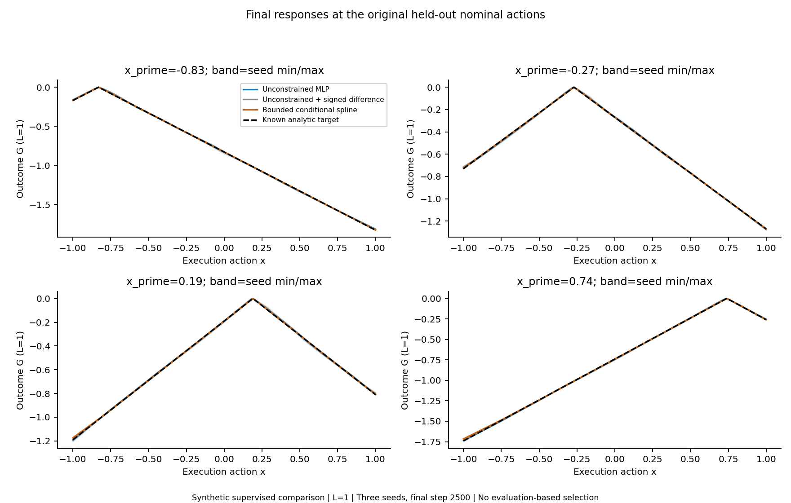
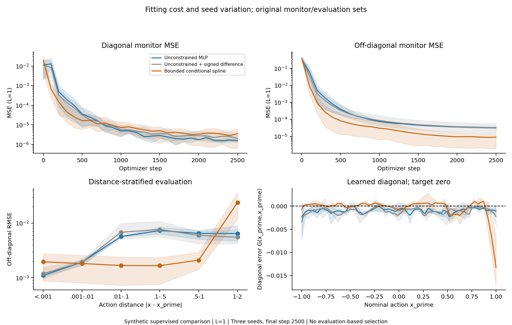
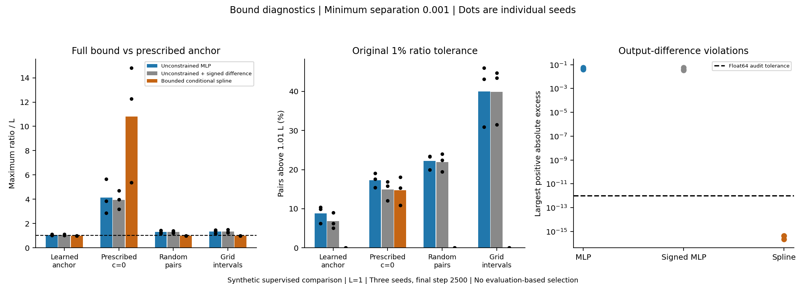
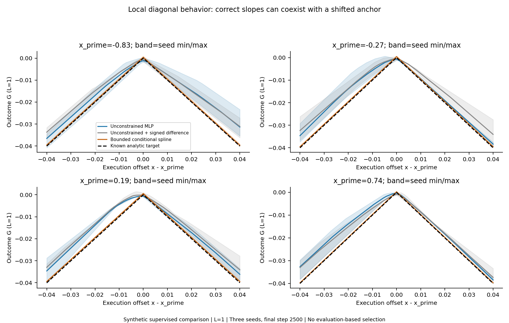
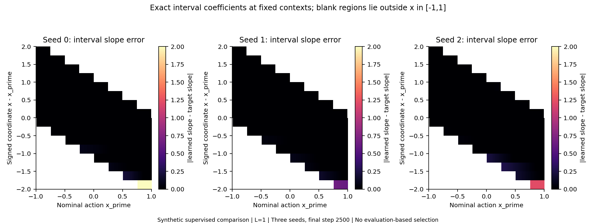

# Full action-Lipschitz conditional response: bounded follow-up

## Question and construction

Can a shared model jointly fit diagonal observations and a known compatible off-diagonal target while enforcing a full action bound? This isolated supervised diagnostic retains x,x_prime in [-1,1], c=0, L=1 and target -abs(x-x_prime). The two losses are mean(G(x_prime,x_prime)^2) and mean((G(x,x_prime)+abs(x-x_prime))^2), separately averaged with lambda_off=1. No third loss, discriminator, PointMaze training or actor-critic update is introduced. The original experiment at commit `752b6457debb65aeacc19979a97db833bbdb6149`, its code, report and verification were reviewed; all original files and checkpoints remain unchanged.

The new model uses signed coordinate t=x-x_prime. A single shared ReLU conditioner, 1-32-32-17, receives x_prime and emits one free intercept b(x_prime) plus 16 raw slopes. Each slope is clamped to [-1,1]. Uniform fixed knots k_j=-2+j/4 divide [-2,2] into 16 intervals. The final output is

`G(x,x_prime) = b(x_prime) + sum_j a_j(x_prime) * clamp(t-k_j, 0, 1/4)`,

where a_j=clamp(raw_j,-1,1). This is the integral form of continuous linear interpolation. The intercept is located at t=-2, not on the diagonal. All predictions use the same coefficient vector and basis. There is no absolute-difference input, target-shaped initialization, diagonal branch, residual multiplier forcing equality, separate diagonal/off heads or discriminator. The signed coordinate is a deliberate architectural input, so the original unconstrained signed-difference MLP is included as well as the original two-input MLP.

## Guarantee, expressivity and precision

Fix x_prime. The coefficients are then constants, the output is continuous at each knot, and its derivative with respect to x inside interval j is exactly a_j. Splitting any [x1,x2] at knots and summing interval changes gives |G(x1,x_prime)-G(x2,x_prime)| <= sum_j |a_j| * interval_length_j <= |x1-x2|. This is the full arbitrary-action condition for the final emitted function, not just a radius about x_prime. It holds in real arithmetic for every finite parameter setting and hence every training iterate, including initialization. No evaluation sample or gradient penalty is needed for this argument. No bound in x_prime is asserted or required here.

The target is exactly representable: a constant b=-2, eight slopes +1 followed by eight slopes -1 give -abs(t). A constant output coefficient vector can be represented by the conditioner. This assignment is used only in a numerical representation test, never as a training initializer or feature. The diagonal value remains b+sum_{j<8} a_j/4 and must be learned. The constraint therefore does not impose a positive approximation-error floor on this particular target.

There is still a strong inductive bias: execution-action slopes are constant between the prescribed signed-coordinate knots, and the target corner happens to align with the zero knot for every x_prime. Generic corners between knots or curved responses would incur interpolation error at this fixed resolution. Finer bounded-slope interpolation can approximate continuous action-Lipschitz functions on compact domains under suitable conditional approximation, but no such general approximation claim is empirically tested here. This architecture is not a generic high-dimensional transition network.

All new training and emitted outputs use float64; knots and interval width are exactly representable dyadic numbers. The analytic bound concerns real arithmetic with the stored coefficients, not a proof that a quantized machine map obeys an exact real-domain inequality bit for bit. Addition, subtraction and reduction can yield tiny positive numerical excesses. We predeclare an absolute excess audit tolerance of 1e-12 for this bounded-scale float64 experiment; this is a diagnostic tolerance, not an outward-rounded formal arithmetic certificate. Legacy float32 outputs are preserved and assigned a separate 1e-6 absolute audit tolerance. The original ratio threshold 1.01 L and minimum separation 0.001 are unchanged for all comparisons. Baseline excesses are orders of magnitude larger than either numerical tolerance.

## Fixed optimization and controls

Train only three new models, seeds 0/1/2, at L=1. Each uses the original 2,500 Adam steps, cosine learning rate 0.001 to 0.0001, zero weight decay, diagonal batch 128 and off batch 256. Reuse the exact original data generator and seeds: 8,192 explicit diagonal examples and 32,768 balanced near/far off examples per seed. The RNG calls and sizes generating minibatch indices are identical to the checked original implementation; the new index-stream hashes are independently regenerated by verification. Float32 action values are promoted to float64 for the new network and target arithmetic, without changing the sampled values.

Both loss terms update the shared trunk, free intercept and left-interval coefficient rows. Right-interval output rows have zero direct diagonal gradient because their basis lengths vanish at t=0; they receive off-diagonal gradients. No parameter is frozen. Hard slope saturation can produce zero local derivatives through the clamp, so remaining optimization errors cannot be interpreted as a representational impossibility. Every parameter tensor changed during each run; this does not claim every scalar parameter received a nonzero gradient at every step.

The spline has 1,681 trainable parameters, versus 1,185 for the original MLP and 1,217 for the signed MLP. Initial functions are not matched across different architectures; the same seed convention uses ordinary random linear-layer initialization. Capacity, local basis, signed-coordinate structure, saturation and float64 arithmetic all change. This is a construction comparison, not a causal isolation of constraint enforcement alone.

Reuse six baseline checkpoints/results, covering two joint-fitting arms and three seeds at L=1. Before reuse, their saved checkpoint hashes, every saved evaluation array and every original metric reproduce exactly. No baseline is retrained and no scaled L copies are counted as new evidence. The original held-out pairs, 201-by-201 grid, four displayed nominal actions and monitor set are unchanged. They were inspected previously and are not a newly untouched test set. The final step is always selected; no tuning, checkpoint search or extra optimization follows evaluation.

## Fitting results

Values are native outcome RMSE at L=1, reported as mean +/- sample standard deviation across three seeds. The independent evaluation has 4,096 diagonal points, 16,384 balanced off pairs, 16,384 uniform-square pairs, 32,768 arbitrary-action triples and the unchanged dense grid.

- Unconstrained MLP: diagonal RMSE 0.00132126 +/- 0.000104; diagonal maximum absolute errors by seed [0.003115, 0.007331, 0.003917]; off RMSE 0.00548129 +/- 0.00038; grid RMSE 0.00692668 +/- 0.000471.
- Unconstrained + signed difference: diagonal RMSE 0.00142166 +/- 0.000312; diagonal maximum absolute errors by seed [0.003188, 0.005918, 0.004137]; off RMSE 0.0055084 +/- 0.0017; grid RMSE 0.00677388 +/- 0.00212.
- Bounded conditional spline: diagonal RMSE 0.00185569 +/- 0.000915; diagonal maximum absolute errors by seed [0.016998, 0.006299, 0.015993]; off RMSE 0.00917159 +/- 0.0046; grid RMSE 0.0126729 +/- 0.00638.

The constrained model retains approximate diagonal fitting without an enforced anchor, with worse maximum errors in two seeds. It has a fitting cost on average: off and grid RMSE increase, and variation across seeds is larger. Seed 1 improves over the plain MLP while seeds 0 and 2 worsen. The signed baseline helps distinguish the input feature from the richer spline construction, but does not remove all architectural confounding.





Distance-bin errors and per-seed physical metrics are saved in results.json. The small float32 diagonal train/evaluation coincidences from the original split remain unchanged; verification additionally reports RMSE after excluding exact coincident values.

## Constraint results and diagonal-anchor interpretation

For learned-anchor and arbitrary-action pairs, report |G1-G2|/|x1-x2|. The prescribed-c ratio uses |G(x,x_prime)-0|/|x-x_prime|. The largest positive absolute excess is max(0, max(|G1-G2|-|x1-x2|)); signed maxima are also saved. Grid-adjacent ratio maxima equal arbitrary-pair maxima on that grid by telescoping, but their violation fraction counts only adjacent intervals.

### Unconstrained MLP

- anchored_learned_value: maximum ratios [1.038936, 1.046806, 1.105191]; positive absolute excesses [0.021655, 0.024423, 0.014306]; percent above the 1% ratio tolerance [9.899, 6.248, 10.375].
- anchored_prescribed_c: maximum ratios [2.861915, 5.659945, 3.849055]; positive absolute excesses [0.021817, 0.02662, 0.015247]; percent above the 1% ratio tolerance [19.066, 15.386, 17.545].
- arbitrary_random_pairs: maximum ratios [1.180774, 1.279535, 1.450696]; positive absolute excesses [0.039978, 0.045692, 0.05645]; percent above the 1% ratio tolerance [23.309, 23.45, 19.983].
- grid_adjacent_pairs: maximum ratios [1.197419, 1.372536, 1.460144]; positive absolute excesses [0.0019742, 0.0037254, 0.0046014]; percent above the 1% ratio tolerance [46.0, 43.132, 30.908].

### Unconstrained + signed difference

- anchored_learned_value: maximum ratios [1.035556, 1.042119, 1.106074]; positive absolute excesses [0.022038, 0.017784, 0.022528]; percent above the 1% ratio tolerance [9.014, 5.1, 6.277].
- anchored_prescribed_c: maximum ratios [3.175087, 4.69964, 3.985776]; positive absolute excesses [0.023555, 0.017644, 0.023395]; percent above the 1% ratio tolerance [15.767, 12.065, 16.937].
- arbitrary_random_pairs: maximum ratios [1.200795, 1.293834, 1.419113]; positive absolute excesses [0.038969, 0.033547, 0.057161]; percent above the 1% ratio tolerance [22.424, 19.452, 23.975].
- grid_adjacent_pairs: maximum ratios [1.246282, 1.300592, 1.499332]; positive absolute excesses [0.0024628, 0.0030059, 0.0049933]; percent above the 1% ratio tolerance [44.771, 43.498, 31.48].

### Bounded conditional spline

- anchored_learned_value: maximum ratios [1.0, 1.0, 1.0]; positive absolute excesses [2.2204e-16, 4.4409e-16, 4.4409e-16]; percent above the 1% ratio tolerance [0.0, 0.0, 0.0].
- anchored_prescribed_c: maximum ratios [14.80724, 5.367416, 12.27006]; positive absolute excesses [0.017069, 0.0063567, 0.016213]; percent above the 1% ratio tolerance [15.277, 10.923, 18.123].
- arbitrary_random_pairs: maximum ratios [1.0, 1.0, 1.0]; positive absolute excesses [2.2204e-16, 4.4409e-16, 3.3307e-16]; percent above the 1% ratio tolerance [0.0, 0.0, 0.0].
- grid_adjacent_pairs: maximum ratios [1.0, 1.0, 1.0]; positive absolute excesses [2.2204e-16, 2.2204e-16, 2.2204e-16]; percent above the 1% ratio tolerance [0.0, 0.0, 0.0].

Enforcement eliminates genuine action-bound violations in all three new models: learned-anchor, random-pair and grid checks show at most 4.44e-16 positive absolute excess, below the predeclared 1e-12 tolerance. Direct interval-coefficient inspection gives maximum slope magnitude exactly 1 in every seed. The interval endpoint identity is accurate to at most 4.44e-16. These finite audits validate the implementation; the earlier integration argument supplies the continuum guarantee for all fixed x_prime, including unprobed values.

Prescribed-c ratios still reach about 14.8, 5.37 and 12.3 in the new models. They are not violations of the full output-difference bound. When d(x_prime)=G(x_prime,x_prime) is nonzero, the valid lower envelope is d(x_prime)-|x-x_prime|, not necessarily -|x-x_prime|. Predictions below the analytic c=0 envelope can follow directly from negative diagonal fitting error. The largest shortfalls below the learned-anchor envelope are only roundoff (<=4.44e-16); shortfalls below the c=0 envelope reach approximately 0.0171, 0.00636 and 0.0162. These values do not indicate discovery of a better admissible pessimistic response.



## Corner behavior and fitting-cost diagnosis

At the four originally chosen held-out nominal actions and offsets 1e-4, 0.001, 0.01 and 0.04, the new left/right slopes closely match +1/-1. At offset 1e-4, all reported slopes are exactly +1/-1 up to evaluation precision except the seed-1 left slope at x_prime=-0.83, which is about 0.9953. Unlike the original unassisted MLP, the signed knot grid permits a corner precisely on the diagonal. It does not fix the corner height: learned vertical offsets remain visible and measurable.



A posthoc descriptive location audit (no new training or selection) splits the existing grid at |x_prime|=0.8.

- Seed 0: central nominal-region grid RMSE 0.00267498; outer nominal-region grid RMSE 0.0423285; 90.17% of feasible audited interval slopes are saturated at magnitude 1.
- Seed 1: central nominal-region grid RMSE 0.00196688; outer nominal-region grid RMSE 0.0135006; 87.33% of feasible audited interval slopes are saturated at magnitude 1.
- Seed 2: central nominal-region grid RMSE 0.00544891; outer nominal-region grid RMSE 0.0263115; 86.00% of feasible audited interval slopes are saturated at magnitude 1.

Raw coefficient inspection finds [25, 0, 0] wrong-sign saturated intervals out of 1,800 feasible audited intervals in seeds 0/1/2. At x_prime=1, the first interval has raw coefficients [-1.52642, 0.38961, -0.22902], where the target slope is +1. A wrong-sign coefficient below -1 has zero direct derivative through the slope clamp. Shared-conditioner gradients from other coefficients can still move it, so it is not a frozen parameter. This is concrete evidence of a local optimization obstacle in seed 0, not proof of its sole cause or an intrinsic approximation limit.

Larger errors are concentrated near the nominal-action boundaries. The coefficient plot identifies intervals whose learned slopes still differ from the known target; saturation is often correct because the optimum has slope magnitude 1. This fixed grid does not exclude the exact target, so the observed loss cannot be explained as a mandatory approximation floor from the Lipschitz constraint. Finite-data coverage, optimizer dynamics, conditional generalization and clamp saturation may matter, but this single bounded experiment does not isolate their contributions. No hyperparameter or architecture sweep was launched.



## Decision and limitations

The answer is yes for structural enforcement with retained approximate fitting, with a measurable and seed-dependent fitting cost. A shared model can learn the diagonal height while remaining action-Lipschitz throughout training. It needs neither a discriminator nor a forced diagonal anchor. The guarantee applies to action differences, not to correctness of the diagonal height, supervised target, environment dynamics or causal interpretation.

This is a useful controlled basis for a subsequent scalar experiment that removes known off-diagonal labels and defines a pessimistic objective. It separates an enforceable feasible class from objective discovery. Such a later test must still examine free-intercept drift and the tradeoff against diagonal error: the full action bound alone does not pin the absolute outcome. The current evidence does not justify moving directly to PointMaze or alternating actor-critic training. No causal identification, real-environment L estimation or worst-case Q recovery is claimed. The subsequent experiment is not run here.

## Runtime, checks and reproduction

The three new runs and their saved evaluation took 17.35 seconds on CPU with one thread. Per-seed training times were [5.46, 5.529, 5.933] seconds. The old experiment recorded 116.5 seconds for all 27 scale/arm/seed runs including evaluation and writing; it did not record comparable per-arm timing, so no architecture speedup is claimed.

Five focused tests cover arbitrary-action pairs under large coefficient-network changes, exact target representability, knot continuity and one-sided slopes, additive shared gradients with a freely movable diagonal, and checkpoint roundtrip. A separate five-step smoke passed. Verification reloads all three final checkpoints and exactly reproduces every saved metric and array, checks minibatch hashes/data hashes and the two loss terms, audits interval bounds, and confirms all prior artifact hashes are unchanged. All new losses and gradients were finite. Checkpoints stay local and ignored; configurations, metrics, evaluation arrays and English figures/report are prepared for version control.

```bash
python -m scripts.test_synthetic_lipschitz_response
python -m scripts.synthetic_lipschitz_response --out-dir artifacts/synthetic_lipschitz_response/smoke --smoke
python -m scripts.synthetic_lipschitz_response --out-dir artifacts/synthetic_lipschitz_response/l1_s012
python -m scripts.check_synthetic_lipschitz_response --run-dir artifacts/synthetic_lipschitz_response/l1_s012
python -m scripts.report_synthetic_lipschitz_response --run-dir artifacts/synthetic_lipschitz_response/l1_s012
```

Use a fresh output directory. Python, NumPy, PyTorch and Matplotlib versions and source hashes are recorded. Baseline reuse requires the six local L=1 checkpoints under artifacts/synthetic_shared_response/l025_1_4_s012; their expected hashes are in its completion.json. No remote server or PointMaze dataset is needed.
