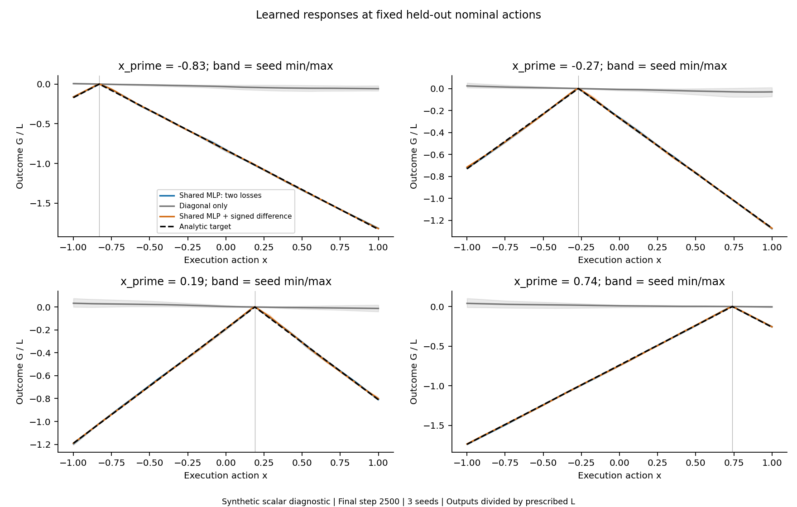
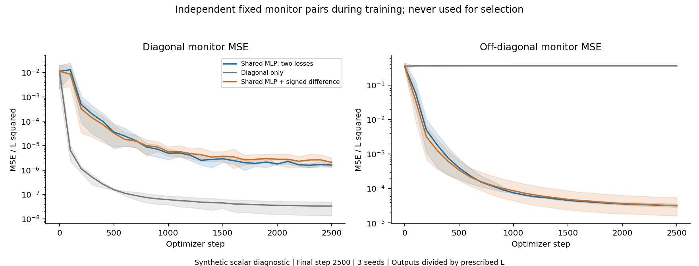
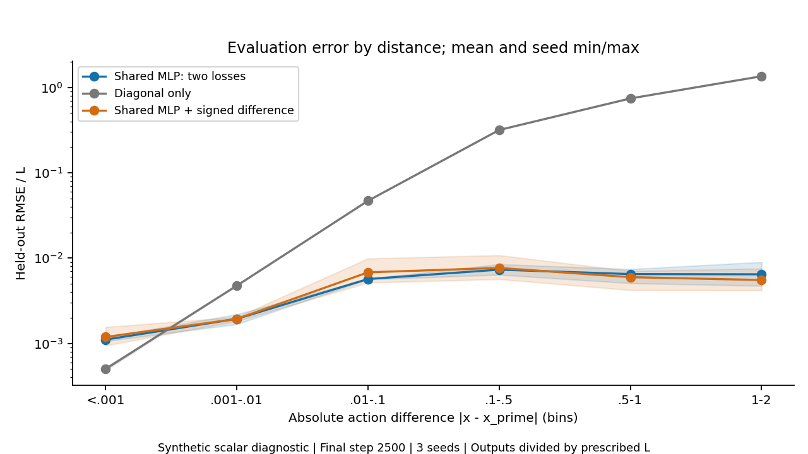
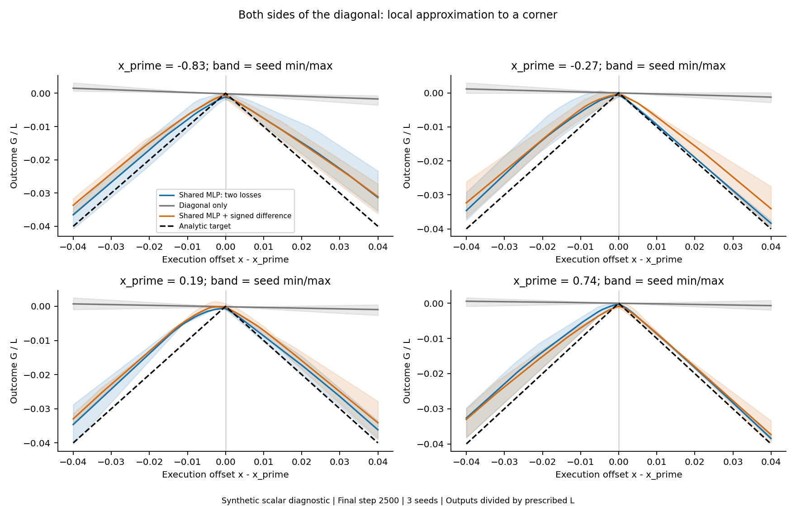
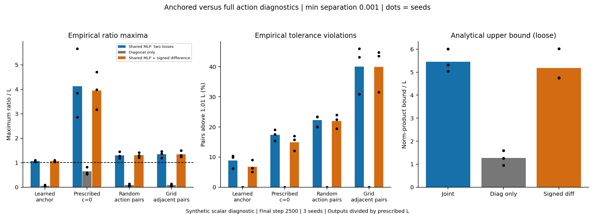

# Shared neural response: synthetic two-loss diagnostic

## Scope and mathematical reference

This is an isolated scalar supervised experiment on x,x_prime in [-1,1], with c=0 and prescribed L in {0.25,1,4}. Smaller outcome is defined as worse only in this synthetic task. The known target is h(x,x_prime)=-L*abs(x-x_prime). For any response with h(x_prime,x_prime)=0 and action-Lipschitz constant at most L, h(x,x_prime)>=-L*abs(x-x_prime). The target attains this lower envelope everywhere and satisfies the full bound by the reverse triangle inequality. Its one-sided x derivatives at x=x_prime are +L and -L, so Lipschitz continuity does not require differentiability everywhere.

The anchored comparison holds x_prime fixed and compares x with x_prime. The full condition compares any x1,x2 with the same x_prime. An anchored bound alone does not imply the full condition. The analytic target satisfies both. This construction neither identifies L from diagonal data nor identifies a real environment mechanism.

## Existing work reviewed and isolation

Reviewed `ett/anchored_transition.py`, `ett/rollout_return.py`, `ett/bias_ablation.py`, and the bias-ablation report at commit `eefe8d3`. Existing ETT uses an action-difference radius and an explicit equality/fallback branch; its constraints do not guarantee full action-Lipschitzness or causal validity. Its return-search experiments froze the diagonal backbone. This new diagnostic imports none of that training machinery and leaves all old results and methods unchanged. No PointMaze run, critic investigation, discriminator, failure bank, hidden signal, actor or critic training is involved.

## Fixed design and loss scaling

The primary network is Linear(2,32)-ReLU-Linear(32,32)-ReLU-Linear(32,1). Inputs are [x,x_prime]. There is no equality branch, diagonal label, special head, enforced anchor or action-distance output multiplier. The signed ablation adds x-x_prime as a third input, never its absolute value. It starts from the identical primary function by copying all common weights and setting only the extra input column to zero; those new weights learn normally. The primary/control have 1,185 parameters and the signed variant has 1,217.

Write G=L*f. Physical losses are separately averaged MSE_diag=mean(G(x_prime,x_prime)^2) and MSE_off=mean((G(x,x_prime)+L*abs(x-x_prime))^2). Joint arms minimize MSE_diag+1*MSE_off. Backward uses this total divided by L squared, the same positive numerical scaling for both terms. There are exactly two terms, and every shared parameter can receive gradients from both; the diagonal-only control sets the off weight to zero. No regularization or Lipschitz loss is added. The output factor L does not force diagonal equality.

Each of 27 runs uses 2,500 Adam steps, diagonal batch 128, off batch 256, no weight decay, and a predetermined cosine learning rate from 0.001 to 0.0001. The final step is always saved. Three seeds govern initialization, training data and minibatches. All arms within a seed share data and minibatch indices. No settings/checkpoints are selected using monitors or final grids. The three positive power-of-two L scalings produce exactly identical normalized predictions for each arm/seed, verified after reload. These are three independent seeds, not nine independent repetitions, and a steeper physical target is not a harder shape under this normalization.

Per seed, explicitly sample 8,192 uniform diagonal examples and 32,768 off pairs. Half the off pairs have log-uniform distance [1e-4,0.1] with random sign and uniform x_prime before rejection; half are uniform independent actions conditioned on distance>=0.1. Out-of-domain proposals are rejected, never clipped. The accepted near distribution is slightly boundary-dependent. Independent evaluation uses 4,096 diagonal pairs, 16,384 balanced off pairs, an additional 16,384 uniform-square pairs, 32,768 arbitrary-action triples and a 201 by 201 grid (spacing 0.01). Monitoring uses another independent fixed sample. Independent seeds, fixed anchors and all generation rules are recorded in config.json. Independent continuous draws can coincide after float32 conversion: one of 4,096 diagonal evaluation values matches a training value in seed 0, and none in seeds 1 or 2. Verification additionally reports diagonal RMSE after excluding exact coincidences; the primary seed-0 value changes from 0.001291904 to 0.001291873. The training budget or model was not changed for this sensitivity check.

## Fitting results

All errors below are RMSE/L, mean +/- sample standard deviation over three seeds. Physical RMSE is L times these values; physical MSE is L squared times normalized MSE. Each saved result also reports native units. The known optimum has zero fitting error.

- Shared MLP: two losses: diagonal 0.00132126 +/- 0.000104; balanced off 0.00548129 +/- 0.00038; uniform-square off 0.00682864; dense grid 0.00692668.
- Diagonal only: diagonal 0.000177351 +/- 4.85e-05; balanced off 0.61211 +/- 0.00154; uniform-square off 0.812139; dense grid 0.816507.
- Shared MLP + signed difference: diagonal 0.00142166 +/- 0.000312; balanced off 0.0055084 +/- 0.0017; uniform-square off 0.00666154; dense grid 0.00677388.

The unassisted shared network fits both regions approximately under this fixed budget; diagonal equality is learned, not exact. The diagonal-only control fits its observed region but leaves substantial off-diagonal error. More generally every -k*abs(x-x_prime) for arbitrary k shares the same diagonal, so diagonal data cannot determine this continuation or L.







## Feature ablation and the corner

- Seed 0: signed minus primary diagonal RMSE/L = +3.00355e-05; off RMSE/L = -0.000849912.
- Seed 1: signed minus primary diagonal RMSE/L = -0.000265088; off RMSE/L = -0.0012836.
- Seed 2: signed minus primary diagonal RMSE/L = +0.000536246; off RMSE/L = +0.00221486.

The signed feature improves off-diagonal error in seeds 0 and 1 but worsens it in seed 2; its mean off RMSE is essentially unchanged, with greater seed variation. It does not give a consistent improvement here. These paired differences measure a modest feature/optimization change, including 32 additional parameters; they do not establish universal superiority of an input representation. The base network can represent the exact target: -ReLU(x-x_prime)-ReLU(x_prime-x). That construction is checked numerically but never supplied as a trained model or feature.

- Shared MLP: two losses: at offset 1e-4, mean left/right slopes divided by L = -0.0839/-0.3759; at offset 0.04 = 0.8470/-0.8839. Target slopes are +1/-1.
- Shared MLP + signed difference: at offset 1e-4, mean left/right slopes divided by L = -0.1977/-0.3609; at offset 0.04 = 0.8104/-0.8390. Target slopes are +1/-1.

Finite ReLU networks are piecewise linear. A fitted kink need not align with the exact diagonal at every held-out x_prime. Very small offsets may fall inside one linear region on both sides; low global MSE does not ensure the exact corner or anchor. Per-anchor values, signed errors and slopes at offsets 1e-4,0.001,0.01,0.04 are saved in results.json. The 1e-4 probes are descriptive corner probes and are excluded from Lipschitz ratio compliance checks.



## Empirical versus analytical bound diagnostics

All ratios use a minimum action separation of 0.001, and tolerance ratio/L <= 1.01 (absolute slope tolerance 0.01 L). The learned-anchor diagnostic is |G(x,x_prime)-G(x_prime,x_prime)|/|x-x_prime|. The prescribed-c diagnostic is |G(x,x_prime)-0|/|x-x_prime| and also exposes diagonal-anchor error. These differ when the learned diagonal is not zero. Arbitrary random pairs hold x_prime fixed and compare two execution actions. Grid adjacent ratios have the same maximum as all arbitrary pairs on that grid by telescoping; their violation fraction counts adjacent intervals, not all grid pairs. None of these samples certifies the continuum.

### Shared MLP: two losses

- Learned anchor: maxima/L by seed [1.03894, 1.04681, 1.10519]; above-tolerance percentages [9.899, 6.248, 10.375].
- Prescribed c: maxima/L by seed [2.86192, 5.65994, 3.84905]; above-tolerance percentages [19.066, 15.386, 17.545].
- Arbitrary random pairs: maxima/L by seed [1.18077, 1.27954, 1.4507]; above-tolerance percentages [23.309, 23.45, 19.983].
- Grid adjacent pairs: maxima/L by seed [1.19742, 1.37254, 1.46014]; above-tolerance percentages [46.0, 43.132, 30.908].
- Analytical norm-product upper bounds/L by seed: [5.3177, 6.004, 5.0411].

### Diagonal only

- Learned anchor: maxima/L by seed [0.09052, 0.04704, 0.02643]; above-tolerance percentages [0.0, 0.0, 0.0].
- Prescribed c: maxima/L by seed [0.58776, 0.52978, 0.82076]; above-tolerance percentages [0.0, 0.0, 0.0].
- Arbitrary random pairs: maxima/L by seed [0.13712, 0.08767, 0.04168]; above-tolerance percentages [0.0, 0.0, 0.0].
- Grid adjacent pairs: maxima/L by seed [0.13712, 0.08767, 0.04421]; above-tolerance percentages [0.0, 0.0, 0.0].
- Analytical norm-product upper bounds/L by seed: [1.2544, 1.5952, 0.9466].

### Shared MLP + signed difference

- Learned anchor: maxima/L by seed [1.03556, 1.04212, 1.10607]; above-tolerance percentages [9.014, 5.1, 6.277].
- Prescribed c: maxima/L by seed [3.17509, 4.69964, 3.98578]; above-tolerance percentages [15.767, 12.065, 16.937].
- Arbitrary random pairs: maxima/L by seed [1.2008, 1.29383, 1.41911]; above-tolerance percentages [22.424, 19.452, 23.975].
- Grid adjacent pairs: maxima/L by seed [1.24628, 1.30059, 1.49933]; above-tolerance percentages [44.771, 43.498, 31.48].
- Analytical norm-product upper bounds/L by seed: [4.7637, 6.0231, 4.7425].

Both joint-training arms violate the prescribed full bound even with the 1% tolerance in every seed. The primary model reaches sampled arbitrary-pair ratios of 1.18-1.45 L and grid maxima of 1.20-1.46 L. Thus the answer to empirical bound compliance is no, despite good fitting. The larger prescribed-c ratios near the diagonal also reflect nonzero anchor errors, not just excessive slopes.

The valid analytical global bound is L*||W3||_2*||W2||_2*||W1 v||_2, where v=(1,0) for the primary model and v=(1,0,1) for the signed feature. It follows from the 1-Lipschitz property of ReLU and holds with x_prime fixed. Biases do not enter it. Reported numbers are float64 norm evaluations, not outward-rounded numerical certificates. This bound can be much larger than the actual maximum slope because it ignores mutually incompatible activation patterns. Even the exact two-ReLU reference has norm product 2L although its true constant is L. No normalization or constraint makes our learned norm products <=L by construction.

Good target fitting is therefore distinct from empirical bound compliance and from enforcement. Inspect violations rather than interpreting a small MSE as proof of a bound; a low-slope diagonal-only model can comply while fitting the wrong response. Outcomes below the synthetic lower envelope indicate approximation/constraint violations, not discovery of a more valid pessimistic optimum. Their frequency (using outcome tolerance 0.01 L) and maximum shortfall are saved separately.



## Conclusion and limits before PointMaze

This bounded experiment supports representability and approximate joint learning of diagonal observations and a deliberately supplied compatible off-diagonal target with a single ordinary shared network. It gives no reason to require a discriminator for this example. It does not solve the choice or discovery of a pessimistic target: the correct off-diagonal labels were given by construction. Prescribed L is not a causal constant inferred from observational data.

Before applying the idea to PointMaze, one still needs a justified objective without known off-diagonal labels, a choice of distributional notion of action regularity for stochastic transitions, a treatment of multimodality, joint optimization under hard rewards and discrete sampling, and evidence against rollout drift, stopping shortcuts and broken history/geometry. This scalar fit establishes neither physical validity nor true ETT, failure-bank validity, nor worst-case Q recovery. Proceed only as a positive supervised representation diagnostic; it does not justify launching alternating PointMaze actor/transition training.

## Reproduction and completed checks

The 27-run CPU experiment took 116.5 seconds. Six numerical tests cover the analytic target, the distinction between anchored and full bounds, bounded/explicit sampling, matched initialization without forced diagonal equality, additive shared gradients/common scaling, and the exact ReLU reference with diagnostic calibration. A separate five-step smoke was run first. Checkpoint verification reloads every final model, exactly reproduces saved diagonal/off predictions, checks separate loss arithmetic, action bounds, final-step selection and normalized equality across L. Config, metrics, evaluation arrays and English figures/report are publishable; .pt checkpoints stay local and ignored.

```bash
python -m scripts.test_synthetic_shared_response
python -m scripts.synthetic_shared_response --out-dir artifacts/synthetic_shared_response/smoke --smoke
python -m scripts.synthetic_shared_response --out-dir artifacts/synthetic_shared_response/l025_1_4_s012
python -m scripts.check_synthetic_shared_response --run-dir artifacts/synthetic_shared_response/l025_1_4_s012
python -m scripts.report_synthetic_shared_response --run-dir artifacts/synthetic_shared_response/l025_1_4_s012
```

Use a fresh output directory; existing runs are never overwritten. This standalone experiment needs Python, NumPy, PyTorch and Matplotlib; training versions are recorded in config.json and the plotting version in report_provenance.json (it does not require the legacy PointMaze environment). Figures show normalized L=1 results because all three L arms coincide after normalization.
