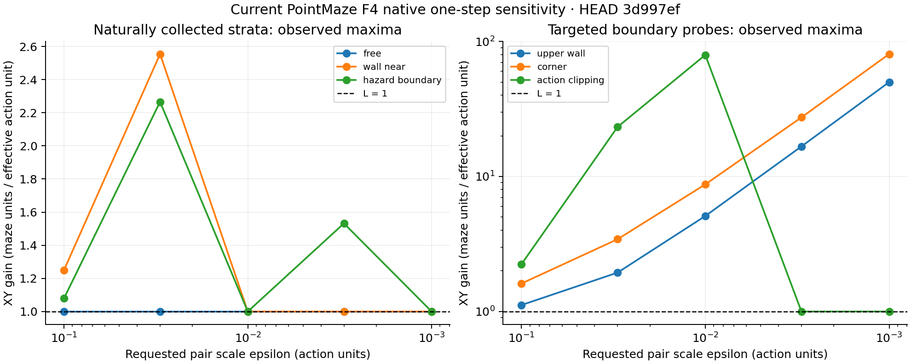

# Current PointMaze F4: L=1 matches free motion, not collision thresholds

**Fresh numerical measurements support L=1 as a local free-motion scale, but reject it as a global samplewise description of this native simulator.** Naturally collected wall/boundary pairs reached 2.555; deliberately straddled collision thresholds reached 80.726. This immediate visible failure comes from discrete collision rejection, not an F4 death-depth jump. Death-switching pairs had immediate gain approximately 1, followed by much larger multi-step separation.

Run at local/remote HEAD **3d997ef6dbf132b6a857108e7e08d2d6ddd514df**. The only commit since f85a5f4 adds the previous report; environment/model production code is unchanged. A [protocol](PROTOCOL.md) fixed the panel and budgets before execution. No training, production modifications, commit or push occurred.

Open [the complete filterable results](RESULTS.html) for every stratum/epsilon/event group's count, median, p90, p95, p99, p99.9, maximum and five exceedance fractions. Machine-readable counterparts: [native CSV](native_summary.csv), [model CSV](model_summary.csv). Natural and targeted results are separate throughout.

## 1. Mathematical object and ordinary motion

The current state is `[p_t,p_(t-1),p_(t-2),p_(t-3)]` in R8, newest first; goal is a separate repeated `(8.5,3.5)` block. Action is two-dimensional, legal requests in [-1,1]^2. Native alive motion adds Gaussian actuator noise with SD .01, clips to [-1,1], then makes ten dt=.1 substeps, checking X and then Y collisions separately. A proposed blocked coordinate update is rejected outright. Current hidden mask bits govern death at the final landing; three Bernoulli(.30) bits redraw afterward. Persistent `_dead` ignores subsequent actions and forces fixed XY and zero rewards. F4 still shifts. Original H=50, reward radius 2, gamma=.95 and `done=False` on death were retained. See [environment](../../crl/envs.py) and [audited driver](audit.py).

With all ten updates accepted, an alive unsaturated trajectory has `p_next = p + 10*.1*a_effective`, so **J=I and sigma_max(J)=1 maze unit per action unit**. With respect to requested action, saturation inserts diagonal derivatives 0 or 1. At fixed accepted/rejected substep pattern, coordinate gains are accepted-substep counts divided by ten; crossing the pattern boundary is the issue, not a locally large derivative inside that pattern. Already-dead physical gain is 0.

For every one of **4,800 paired native comparisons**, the six historical next-F4 coordinates were identical across branches. Therefore Euclidean next-F4 separation equaled newest-XY separation exactly on the saved float32 observations, differenced in float64. There is **no one-step sqrt(4) multiplier** from stacking history.

## 2. Native measured scales and tails

The natural bank used 80 original noisy teacher episodes plus 32 uniform-action episodes, each 50 steps. Before examining paired outcomes, 24 contexts were selected per overlapping visible/dead/waiting stratum; selected rows came from 83 source episodes. Targeted contexts were reached through actual native prefix steps with controlled setup noise/masks, not position teleportation. Eight noise tapes per target are repeated probes of the same constructed state, not eight independent environment contexts. The model Jacobian panel likewise contains repeated targeted state/action points.

Each context used two coordinate and two seeded random directions at epsilon **[.1,.03,.01,.003,.001]**. Native primary denominator is the **actual post-noise, post-clipping action difference**, and saved records also contain the legal requested-action denominator. In dead contexts this denominator is a hypothetical actuator input: the dynamics ignore it. Of 4,800 pairs, **38** had zero effective denominator and were excluded (12 natural, 26 targeted).

The following maxima are float64 physical ratios, in the epsilon order above; the full quantiles/exceedances are in the linked results:

- **Natural free, pre-hazard, hazard-interior and alive-waiting:** no reliable exceedance of 1 at any scale. Free/pre-hazard/waiting have 96 valid pairs per epsilon; hazard-interior has 96/96/95/92/92. The free-motion maximum differs from 1 by less than 1.7e-11 in float64.
- **Natural wall-near:** maxima **1.249, 2.555, 1.000, 1.000, 1.000**; 96 pairs per scale. At .1, p99=1.225 and 3/96 exceed 1+.002; at .03, p99=1.078 and 1/96 exceeds 1+.002. The interpolated p99 can lie far below a single extreme in a 96-pair sample.
- **Natural hazard-boundary:** maxima **1.079, 2.266, 1.000, 1.532, 1.000**; valid counts 96/96/95/95/95. At .003, p99=1.451 and 3/95 exceed 1+.002. These excesses involve collision branches, not immediate death jumps.
- **Already-dead:** all physical and visible one-step ratios are **0**, in both natural and targeted panels.
- **Targeted upper wall:** maxima **1.116, 1.941, 5.097, 16.694, 50.008**; 32 valid pairs per scale. **Targeted corner:** **1.612, 3.431, 8.740, 27.396, 80.726**, also 32 per scale. At the four smaller scales, 24/32 pairs exceed 1+.002 in each panel; some coordinate directions do not cross the relevant boundary.
- **Targeted actuator-boundary panel:** maxima **2.240, 23.273, 79.445, 1.000, 1.000**; counts 32/32/24/23/23. These trajectories also encounter walls. **Clipping alone is nonexpansive**; the large ratios again require collision-pattern changes. They are not evidence that clipping itself has gain >1.
- **Targeted free, pre-hazard, hazard-interior, entry-boundary and alive-waiting:** no reliable exceedance of 1, including branch pairs that differ in death outcome.

Every physical exceedance of **1.002** changed the instrumented collision accept/reject sequence. Same snapshot/action/tape replay, original RNG replay, and instrumented versus uninstrumented stepping matched exactly. A controlled change of one standard-normal actuator slot displaced free motion by .01 as expected. Both branches always retained the same initial mask and had identical post-step resampled masks. The largest difference between physical and float32-visible separation magnitudes was **7.42e-7 maze units**. Saved witnesses include the denominator-specific `2e-6/denominator` roundoff allowance; the boundary excesses are present in float64 and are not float32 artifacts.

## 3. Why the collision tail grows

This is a source-grounded discontinuity of the ideal real-arithmetic **discrete integrator**, supported by a cross-epsilon witness, not an inference from a large sampled maximum alone.

At reachable pre-state **(1.95,2.95)**, fix effective X action .8 and compare effective Y actions `.5 +/- epsilon/2`. The first X proposal enters wall cell (2,2) and is rejected. The first Y update either crosses Y=3 or falls just short. Consequently X moves on nine versus eight later substeps: final X is **2.67 versus 2.59**, a fixed .08 difference as epsilon shrinks. Y separation is epsilon. The resulting ratio is `sqrt(.08^2 + epsilon^2)/epsilon`. Fresh coordinate-direction measurements were **1.281, 2.848, 8.062, 26.685, 80.006**. The largest random-direction witness is the reported 80.726. Neither branch dies.

At **(.5,3.95)** with effective Y action around .5, a slightly smaller action permits one Y increment almost to 4; a slightly larger one rejects all increments at wall Y=4. The output jump tends to .05. Thus simply increasing a finite L cannot capture arbitrarily close pairs across these idealized collision thresholds. Literal floating-point/quantized implementation bounds are a separate numerical question; no global machine-level constant is certified here. [Saved witnesses](native_witnesses.json) and [fixed-direction plot](boundary_witnesses.png) preserve the actual outcomes.

These examples are unsaturated, so effective-action and requested-action differences agree. Their violation therefore also applies in the ETT's raw execution-action metric.

## 4. Death: immediate sensitivity versus persistence

There were **5 natural and 240 targeted death-switching pairs**; all had physical one-step gain approximately **1**. The current mask's death check follows movement, so it changes the hidden `_dead` event without adding an immediate coordinate/depth jump. The z-v1 argument does not apply to this F4 transition.

The prescribed continuation selected one first-encountered switching pair per context: **3 natural contexts and 16 targeted noise-tape cases**, all at epsilon=.1. After the differing first action, both branches received exactly `(1,0)` for three more steps and the same time-indexed future noise/mask tapes. No feedback policies diverged, and no trajectory crossed t=50.

F4 sensitivity ratios after **1/2/4 total steps** had natural medians **1.000 / 9.059 / 35.729**, with maxima **1.000 / 11.046 / 39.040**. Targeted medians were **1.000 / 9.055 / 28.358**, maxima **1.000 / 9.058 / 35.834**. These are selected-event **multi-step ratios**, not one-step constants or estimates of average death risk. Later F4 norms can exceed XY norms because separated positions populate several frames. Some initially alive branches subsequently die too; the saved separation is the consequence of the entire shared-tape native sequence. [Per-case results](continuation.json).

## 5. Unconstrained predictor and current constrained ETT

The trained **F4 deterministic_mse best checkpoint** was available. The differentiated function is *unprojected predicted next XY* = current XY + predicted displacement, with both observational action slots varied together and all stored normalizations inside differentiation. It is neither an actor/critic nor the old 2D MLP, and its Jacobian is not the full stochastic distribution's Lipschitz constant.

Across the deliberately balanced 240-query panel, Jacobian operator norm median/p90/p95/p99/p99.9/max was **.995 / 1.153 / 1.180 / 1.326 / 1.914 / 1.952**. This combined number describes the designed panel only. Natural free median/max was **.998/1.022**; wall-near **.997/1.952**; pre-hazard **1.056/1.198**; hazard-interior **1.110/1.231**; hazard-boundary **1.049/1.791**. Dead-state predictor sensitivity is not native death sensitivity. Finite-difference checks on 64 points at .003/.001 gave maximum Jacobian-column discrepancy **.000122/.000638**. [All predictor strata and validation](deterministic.json).

All four actual E26 final arrays (training norms Frobenius/spectral, seeds 0/1) were evaluated under **both** norm implementations on identical underlying parameters, states and randomness. At fixed s, goal, x' and generator key, only execution x varied. Exact anchor/atom equality and identical-key output replay verified the coupling. Actual diagonal calls retained their anchors exactly; paired probes separately used a center on x=x' and an off-diagonal behavior-action center. The centered endpoints generally are not themselves diagonal calls.

Across **20,480 paired constrained ETT comparisons**, maximum emitted ratio was **.656319**; none exceeded 1+.002. Effective gated matrix operator-norm maxima for F_s0/S_s0/F_s1/S_s1 were **.5226/.5454/.7381/.7380**. Raw block Frobenius norms were already below 1 (largest .8930); **0/8 blocks activated normalization in every checkpoint**. Frobenius and spectral decoding therefore gave **bit-identical ratio arrays** for each shared checkpoint. Projection frequencies ranged **.20%–8.01%** across condition/scale/checkpoint cells. This measured small response and the global <=1 proof are properties of the constrained construction; they are not evidence that native dynamics obey the same bound. [Matrices](matrices.json), [sample summaries](model_summary.json).

A separate **5,120-pair** comparison changed *both* x and x' along the observational diagonal, with the same key. At epsilon=.1 its observed maximum was **11.427**; at .001, **1.077**. Changing conditioning changes the anchor distribution and may change categorical/geometry branches. These values are outside the fixed-x' constraint's scope. Atom-switch frequency was zero in this panel; the audit did not instrument component identity to attribute the large diagonal sample difference to one specific branch. Do not relabel these as violations of the ETT's partial execution-action guarantee.

## 6. What scale is defensible?

**L=1 is a correct native free-flight local constant and a defensible smooth-regime approximation. It is a global model-family assumption when imposed everywhere on this ETT.** The current native collision thresholds are concrete immediate counterexamples to exact global samplewise matching. F4 history neither amplifies nor removes those one-step differences. Increasing L alone also does not supply death persistence.

Possible **descriptive empirical scales**, not recommended production changes or guarantees:

- L=1 covers all observed pairs (tolerance .002) in each natural free/pre-hazard/hazard-interior/waiting stratum at each tested epsilon. Dead gain is 0.
- L=1.25 covers **95/96** natural wall-near pairs at .03; L=2.6 covers **96/96** there. At natural hazard-boundary epsilon=.003, L=1.25 covers **92/95**, while L=1.6 covers **95/95**. These coverage fractions concern the specified finite stratum panels, not the teacher population, actor population, unseen episodes or finer scales.
- L=2.6 is an envelope for every measured natural stratum/epsilon cell, but fails the deliberate boundary probes. Even 80 is exceeded in the targeted .001 corner panel. There is no basis here for choosing a single larger globally valid production L.

Shared-noise native comparisons condition on individual full snapshots, including latent state, **not** a visible `(s,x')` ETT posterior. Their coupling is not optimal transport. This audit therefore does not estimate Wasserstein or TV constants, nor smoothness of death probability. The constrained model's proven coupling gives its own samplewise bound (and the corresponding same-conditioning Wasserstein upper bound), not a native distributional guarantee. No conditional ETT identification or policy-improvement claim follows.

## Cost, checks and limitations

Actual cost: **15,399 native step calls** = 5,600 collection + 17 targeted setup + 9,600 paired evaluation + 68 validation + 114 continuation. **52,272 model evaluations**, conservatively including the 240 Jacobian primal outputs: 51,200 primary ETT successors + 320 ETT validation successors + 512 deterministic finite-difference predictions + 240 primal predictions. **240 Jacobian evaluations** were also counted separately. All are below both the sealed audit caps and the user's caps. Model initialization/nominal draws are not successor calls. Actor/critic/nominal/transition training updates: **0**.

A direction-index shape error interrupted ETT panel assembly before its first successor call. The corrected phase resumed from saved contexts/counters, without repeating native or deterministic evaluations or changing the panel. [Original failure](failure.json), [original script](audit_before_index_fix.py), and [correction record](index_fix.json) are retained.

An independent saved-array pass recomputed all native ratios, checked history equality, compared both norm-mode ratio arrays, verified SVDs and cost arithmetic, and rechecked all 15 source/checkpoint hashes plus the protocol hash. The figures were visually inspected. Descriptive tails use few contexts, overlapping strata and repeated directions/noise; no confidence interval or global coverage certificate is claimed. The finite-difference check validates predictor arithmetic, not its accuracy as native dynamics. See [provenance](provenance.json), [verification](verification.json), [costs](costs.json) and [completion](completion.json).
