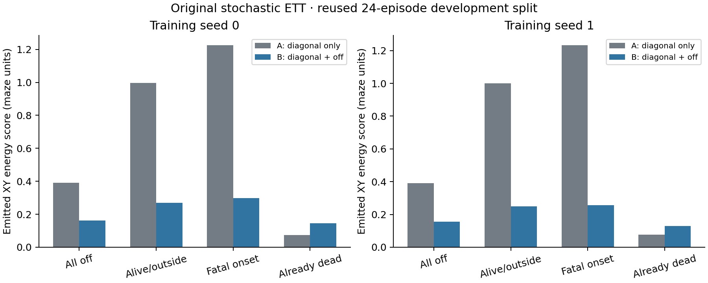

# Supervised original stochastic ETT: completed comparison

Date: 2026-09-14. Source HEAD: `6aef461cb633cc11b84d75f790fc608c7fd85205`.

**Real off-diagonal supervision substantially improves the original stochastic generator's aggregate one-step fit in both tested seeds, with a small diagonal degradation within the predeclared tolerance. It does not fit all conditional consequences: already-dead predictions worsen, and persistent absorption remains unresolved.** These are reused development episodes, not an untouched confirmation set.

## Fixed experiment and provenance

The [protocol](PROTOCOL.md) was saved before training. The compatible original diagonal and nominal weights were located in the PointMaze training worktree; no incompatible historical substitute or small mean network was used. The original `ett.pointmaze_region_pilot.Kernel` retains its atom/K3 diagonal, geometry, eight gates, and normalized action response. Inherited L=1 is a model-family constraint. The recent native collision audit rules out interpreting it as exact samplewise matching at every collision threshold.

Both arms start from the same zero 48-coordinate offset vector and inherited diagonal checkpoint. A learns the original 16 diagonal-head offsets; B learns those offsets and the original 32 response parameters. Each runs 120 Adam updates for each of seeds 0 and 1, with the same initialization, diagonal batches, perturbation directions, and random streams within seed. B uses lambda=1 throughout. Each update uses 128 rows per term, eight antithetic Gaussian parameter directions, and eight emitted samples per signed loss. The losses separately average diagonal and off-diagonal emitted-XY energy score in identical units. This is parameter-perturbation optimization of a smoothed objective, including discrete branch effects; it is not a claim of complete pathwise differentiation through the emitter.

The original paired data provide `(s, xb, xq, y)` unchanged. Generator argument order is `sample(theta, s, xq, xb, key, count)`. Exact equality of both action coordinates defines diagonal. Episodes 0–71 supply 3,860 diagonal and 10,540 off-diagonal training rows; episodes 72–95 supply 1,269 diagonal and 3,531 off-diagonal evaluation rows. All outcomes remain. Death labels only define evaluation strata. Half the collection prefixes are teacher prefixes and half blind prefixes with same-context shadow-teacher advice. This intervention population differs from the original nominal population and provides no observational-only identification claim.

All five checkpoints, including initialization, were evaluated on all 4,800 development rows with 64 fresh emitted samples per row, independent of training. Comparisons use common evaluation randomness. Intervals below are paired 95% intervals from 2,000 whole-episode bootstrap resamples of the original 24 evaluation episodes. They condition on the fitted seed; two training seeds do not establish broad seed robustness. RMSE is the square root of mean squared Euclidean error of the finite-sample predicted XY mean.

Exact input paths, checkpoint/source hashes, versions, and the original driver hash are in [provenance.json](provenance.json). The diagonal base is `artifacts/ett_distribution_matching/f4_p30_s01_guarded/s0_L0p25_lambda0/final.pkl`; nominal is `artifacts/nominal_policy/f4_p30_expert_only_mdn_k5_s0/best.pkl`. Their hashes were checked against the inherited rollout setup.

## One-step results

All values are in native maze-distance units; lower scores are better. Full diagonal/off-diagonal and subgroup metrics are in [one_step_metrics.csv](one_step_metrics.csv), [metrics.json](metrics.json), and [contrasts.json](contrasts.json).

- Seed 0, all off-diagonal: ES **0.39036 → 0.16255**, a **58.36% reduction**. B minus A is −0.22780, interval [−0.30037, −0.15149]. Mean XY RMSE **0.62164 → 0.25131**.
- Seed 1, all off-diagonal: ES **0.39093 → 0.15642**, a **59.99% reduction**. B minus A is −0.23451, interval [−0.30194, −0.16210]. Mean XY RMSE **0.62309 → 0.24459**.
- Diagonal, seed 0: ES **0.03242 → 0.03713**; degradation +0.00471, interval [+0.00085, +0.00964]. RMSE 0.15928 → 0.17254.
- Diagonal, seed 1: ES **0.03341 → 0.03854**; degradation +0.00513, interval [+0.00186, +0.00911]. RMSE 0.16104 → 0.17403.

Thus diagonal preservation means preservation within the predeclared 0.02 ES tolerance, not equality with A: the small degradation is systematic in these comparisons. Initial diagonal ES was 0.03798. B minus initialization is −0.00085 [−0.00266, +0.00060] for seed 0 and +0.00056 [−0.00238, +0.00325] for seed 1. Both seeds pass the fixed aggregate one-step gate, including both diagonal comparisons.

The following off-diagonal strata overlap and must not be added together:

- **Alive outside the goal region:** 444 rows across 24 episodes. ES 0.99785 → 0.26972 for seed 0 and 0.99991 → 0.25049 for seed 1. Mean RMSE 1.24300 → 0.36530 and 1.24616 → 0.33741. Improvements are not explained solely by the already-dead population.
- **Ordinary moving, nonfatal transitions:** 2,275 rows. ES 0.53417 → 0.16809 and 0.53352 → 0.16829; RMSE 0.71541 → 0.22580 and 0.71559 → 0.22358.
- **Fatal onset:** 62 rows across 23 episodes. ES 1.22524 → 0.29758 and 1.23248 → 0.25540; RMSE 1.35864 → 0.42597 and 1.37156 → 0.36437. Better onset XY prediction does not identify death. There are no diagonal fatal-onset evaluation rows, so no diagonal onset estimate is reported.
- **Already dead:** 1,194 rows across nine episodes. ES worsens: 0.07298 → 0.14499, difference +0.07201 [+0.04662, +0.10534], and 0.07555 → 0.12866, difference +0.05311 [+0.03707, +0.07466]. RMSE 0.26789 → 0.28321 and 0.27344 → 0.27346. Stationary emitted-sample fractions fall from 82.47% and 81.98% to zero in both B checkpoints, using the fixed 1e-7 displacement threshold. B still selects the raw atom branch roughly 74% of the time here; the subsequent action response moves its output. An atom indicator therefore does not certify stationary absorption.

Both prefix populations improve in aggregate: teacher-prefix off-diagonal ES is approximately 0.538 → 0.163 in both seeds; blind-prefix ES is 0.238 → 0.162 and 0.240 → 0.149. This does not remove the population distinction from historical nominal training.

Every evaluated emitted successor is native-legal and preserves the F4 history shift. A distribution with legal support can still have a mean in a wall: B's off-diagonal sample means are illegal for 3/3,531 rows (0.085%) in seed 0 and 2/3,531 (0.057%) in seed 1. Mean legality is reported separately from emitted-sample legality. Lower finite-sample ES is evidence of improved predictive distribution fit, not proof that every conditional distribution is recovered or calibrated.

## Evaluator correction, with original results preserved

The initial evaluator incorrectly used strict outer bounds `x < 9`, `y < 5`. Native collision semantics permit equality at the outer bounds when the clipped cell is free, and the original geometry intentionally permits X=9 endpoints. The initial gate therefore falsely failed the legality check. Native checks on the changed positions established the error.

Only saved-output legality classification was corrected to inclusive native bounds and clipped wall-cell lookup. No model, checkpoint, training configuration, sample, score, confidence interval, or decision threshold changed. Initial outputs and driver are preserved in [before_legality_correction](before_legality_correction/) and `run_before_legality_fix.py`; [legality_correction.json](legality_correction.json) records the correction. The corrected gate passed, allowing the previously specified rollout stage. No retraining or repeated one-step sampling occurred.

## Four-step continuation diagnostic

Before training, 144 roots and their four-step executed-action sequences were saved from the development episodes. Each model generated 64 paths per root. At each generated state, advice was freshly drawn from the frozen original state-goal K5 nominal. Logged native advice was not reused after generated-state divergence.

**These are different continuation laws:** the native reference follows recorded shadow-teacher contexts; generated paths use historical nominal advice. Movement, stationarity, XY means, and covariance are descriptive comparisons, not matched conditional ETT rollout accuracy. Full summaries are in [rollout_descriptive.json](rollout_descriptive.json), with per-model sampled paths saved separately.

For the 45 roots already dead in the native reference, all native continuations remain stationary. Under the declared generated continuation law, paths with any motion comprise 51.94% and 52.22% for A, versus **100% for both B checkpoints**. B's average step displacement increases from about 0.287 at step 1 to 0.420 at step 4. This exposes continued motion from these roots under that law and supplies no persistent-absorption success claim. The already-dead one-step regression is also present under the actual logged `(s, xb, xq)` conditioning, independently of the rollout population mismatch.

## Verification, deliverables, and interpretation

[Independent saved-array verification](verification.json) reconstructs energy scores and all 120 optimizer updates for each arm/seed, verifies the episode split, unchanged original sources/protocol and one-step samples, native legality, and F4 shifts. Diagonal gradients are nonzero on every update in both arms; B's off-diagonal gradients are also nonzero on every update. A's response stays zero. The diagonal term was active, not frozen or constant.

The run used **13,532,160 model successors**, within the predeclared 13,546,800 cap: 11,796,480 training, 1,536,000 evaluation, 15,360 invariant checks, and 184,320 rollout. A and B have equal update/direction/diagonal budgets; B uses twice A's training successor calls because it evaluates an additional term. No native transitions, actor updates, critic updates, or nominal updates were performed.

The four final offset checkpoints are [A seed 0](A_s0.npz), [B seed 0](B_s0.npz), [A seed 1](A_s1.npz), and [B seed 1](B_s1.npz). They contain `theta`, optimizer state, and trajectories; they require the hashed inherited Kernel/base weights, rather than constituting standalone new networks. [run.py](run.py) contains the experiment and [verify_saved.py](verify_saved.py) checks saved results without extra model calls. Preserve this completed directory; use a fresh output location for any new run.

The result establishes a useful supervised reference in the original generator family, with qualified diagonal preservation. It neither explains why unlabeled search failed nor establishes failure-only conditionals or actor benefit. The remaining failure is concentrated in already-dead stationary consequences; conditional inputs, expressivity, response geometry, and supervised optimization remain plausible issues rather than uniquely identified causes. No weight sweep, structural change, or actor usefulness experiment followed. Any settings adjusted from these development findings require confirmation on new complete episodes. No production sources were modified, and nothing was committed or pushed.
